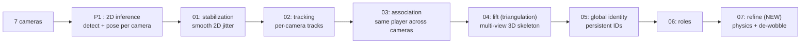

# Multi-camera 3D pose + identity, pipeline & progress
*Review, 2026-07-16*

## The system in one line
7 synchronised cameras for every player, a single **3D skeleton** and a **consistent identity across
all cameras** for the whole delivery, all on the calibrated ground plane.

## What each stage does (plain terms)
| Stage | What it does | The intuition |
|---|---|---|
| **P1 inference** | detect people, estimate 26-joint 2D pose per camera | the *eyes*, RTMDet detector + RTMPose |
| **01 stabilization** | smooth each joint's path over time | steady the shaky detections at the source |
| **02 tracking** | link boxes into tracks *within* one camera | follow each person in one view (pose, not colour, kit is identical) |
| **03 association** | match the same player *across* cameras | "these two blobs are the same human", done on the ground plane |
| **04 lift** | multi-view **triangulation** 3D skeleton | cross the camera views to rebuild the 3D body |
| **05 global identity** | persistent IDs across occlusion + hand-offs | "P007 stays P007"; two people can never share an ID in a frame |
| **06 roles** | bowler / striker / keeper / umpire | from pitch geometry; never changes identity |
| **07 refine (NEW)** | physics-valid bones, hip de-wobble, low-conf refill | make the final 3D physically believable |

## Two things worth clarifying
**Triangulation vs lifting.** *Triangulation* = combine 2D from **≥2 cameras** into a 3D point
geometrically (like two eyes giving depth), **this is what we do** (per joint, RANSAC + weighted linear
solve, robust to a bad camera). *Lifting* = infer 3D from a **single** view via a learned prior. Our
stage is *named* "04 lift" but is multi-view triangulation; true single-view lifting is future work for
the ~39% single-camera frames.

**Why the facing cameras are hard.** Our co-observing pairs face each other (~opposite sides) = **low
parallax**. The usual cross-camera geometry becomes unreliable there and two different players can look
alike, so identity is hardest on those pairs, the main reason agreement is ~0.9 and not ~1.0.

## Progress: V8.0 current (same 8 deliveries)
| Parameter | V8.0 | Current |
|---|---|---|
| Cross-camera agreement (mean) | 0.782 | **0.916 (+0.134)** |
| Worst-clip agreement | 0.477 | **0.831 (+0.354)** |
| Visible teleport markers (total) | 422 | **0 (-422)** |
| Distinct IDs / clip (roster ≈ 11) | 12.6 | **10.6** |
| Same-camera collisions | 0 | 0 |

*Biggest gains on the previously-worst clips (14_6: 0.477 to 0.906). Full breakdown in
[CONSOLIDATED_RESULTS.md](CONSOLIDATED_RESULTS.md).*

## What changed to get there
- **Cap fix**, recovered the facing-pair "one player split into two IDs" loss (the agreement jump).
- **Teleport gate**, kills the visible ghost-marker jumps (422 to 0).
- **Partial-ghost drop**, removes head-only / cut-off single-camera ghosts.
- **New refine stage**, physics-valid, de-wobbled 3D.
- *(The hip-projection / robust-triangulation work you asked for was metric-neutral, kept as options;
 the visible wins came from the gate + refine. Stated honestly.)*

## Roadmap (biggest levers first)
1. **Detector recall** (dark/distant players), the front-end ceiling.
2. **Single-view 3D lift**, the ~39% single-camera coverage gap.
3. **Splittable clustering / 3D tracking**, the root fix behind residual teleports.
4. **Identity ground truth**, to report real MOTA/IDF1/HOTA instead of proxies.

Full status of every change (accepted / rejected / neutral / open): [CHANGES_LOG.md](CHANGES_LOG.md).
