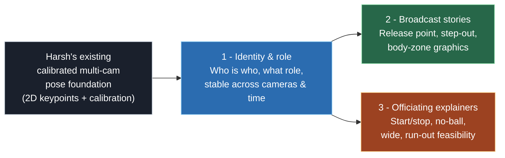
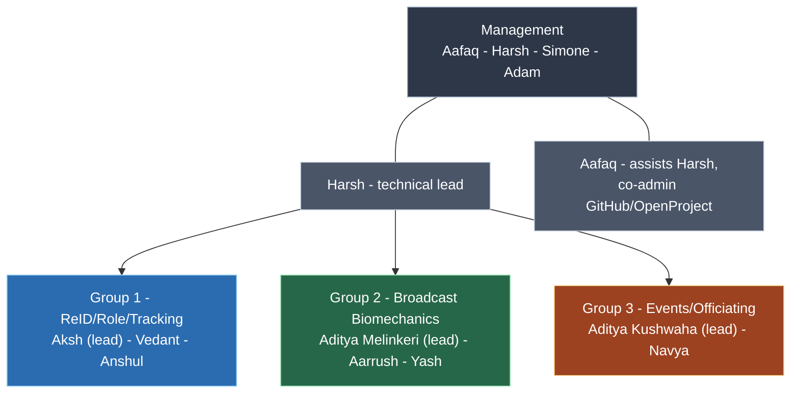
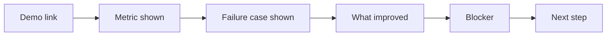

# 01 - Programme Overview

The mission, the people, the camera rig, and the way of working.

Primary sources: [`Programme_Brief.xlsm`](../00_Shared/Programme_Brief.xlsm),
[`Decision_Log.xlsm`](../00_Shared/Decision_Log.xlsm). Every factual claim below links to
its source spreadsheet; see the [sourcing convention](README.md#sourcing-and-citation) in
the README.

---

## 1. The mission

> *"Use Harsh's existing calibrated multi-camera pose foundation to solve identity/role
> tracking, produce cricket broadcast story prototypes, and validate event/officiating
> explainers over a two-month sprint."*
>
> - [Programme_Brief.xlsm](../00_Shared/Programme_Brief.xlsm), "Programme Brief" sheet, *Objective* row

The objective breaks into three deliverables, one per group:



*Source for the three-deliverable split: [Programme_Brief.xlsm](../00_Shared/Programme_Brief.xlsm),
"Programme Brief" sheet, *Objective* and *Intern structure* rows.*

### Output policy (frozen decision)

> *"JSON/demo overlays first; Unreal visualisation sprint to follow once underlying data is
> trusted."*
>
> - [Programme_Brief.xlsm](../00_Shared/Programme_Brief.xlsm), "Programme Brief" sheet, *Output target* row;
> reaffirmed in [Decision_Log.xlsm](../00_Shared/Decision_Log.xlsm), "Decision Log" sheet (2026-06-08).

```
   Phase 1 (this sprint)              Phase 2 (later)
   +--------------------+            +--------------------+
   | JSON payloads      |  data      | Unreal Engine      |
   | + demo overlays    | -------->  | broadcast visuals  |
   | + measured accuracy |  trusted  |                    |
   +--------------------+            +--------------------+
   "Is the data correct?"            "Make it presentable."
```

> **Inferred - not in the source files.** The two-phase diagram above is our restatement of
> the documented "JSON first, Unreal later" decision; the "is the data correct / make it
> presentable" framing is our wording, not a quote.

---

## 2. The people



| Role | Who | Notes |
|------|-----|-------|
| Technical lead | Harsh | Reviews approach, not every small PR |
| Lead support / admin | Aafaq | Co-admins GitHub and OpenProject |
| Management | Aafaq, Harsh, Simone, Adam | Sign-offs, dataset, framing decisions |
| Group 1 | Aksh (lead), Vedant, Anshul | Brief states 4 interns; 3 named [Open] |
| Group 2 | Aditya Melinkeri (lead), Aarrush, Yash | |
| Group 3 | Aditya Kushwaha (lead), Navya | Brief states 3 interns; 2 named [Open] |

*Source: [Programme_Brief.xlsm](../00_Shared/Programme_Brief.xlsm), "Programme Brief" sheet
(*Senior CV guidance*, *Management team*, *Intern structure*, *Intern names and group
allocation* rows). Leads also pre-filled in [Weekly_Demo_Log.xlsm](../00_Shared/Weekly_Demo_Log.xlsm).*

> **Issue to discuss -** the *Intern structure* row states "Group 1 ... (4 interns)" and
> "Group 3 ... (3 interns)", but the *Intern names* row lists only 3 and 2 names respectively.
> Headcount needs reconciling. (source:
> [Programme_Brief.xlsm](../00_Shared/Programme_Brief.xlsm), *Intern structure* vs *Intern
> names* rows; also flagged in
> [Open_Questions_and_TODOs.xlsm](../00_Shared/Open_Questions_and_TODOs.xlsm), *Intern
> allocation* row.)

Working agreement: the company creates the GitHub repository (Harsh and Aafaq as admins);
interns work via pull requests linked to OpenProject IDs; Harsh reviews approach while
Aafaq assists day-to-day. *Source:
[Decision_Log.xlsm](../00_Shared/Decision_Log.xlsm), "Decision Log" sheet (GitHub and review
rows); [Programme_Brief.xlsm](../00_Shared/Programme_Brief.xlsm), *GitHub* row.*

Coordinates (from [Programme_Brief.xlsm](../00_Shared/Programme_Brief.xlsm), links rows):
- OpenProject: https://qstatqc.com/projects/pose-estimation/work_packages
- OpenProject board: https://qstatqc.com/projects/pose-estimation/boards/128
- Drive root: https://drive.google.com/drive/folders/1YgBCS4jP7mOzgOnOcEFaryowZvG5vE5_
- GitHub repository URL: [Open] - management input required

---

## 3. The camera rig

Six to seven calibrated, stabilised, and synchronised cameras; 4-5 see each wicket; two
down-the-wicket views per end; four run-out side-on cameras; an optional seventh at 45 degrees for
the whole pitch. Coverage is limited to the DRS views - roughly a 10-15 yard radius around
each wicket, with no full-field context. *Source:
[Programme_Brief.xlsm](../00_Shared/Programme_Brief.xlsm), "Programme Brief" sheet (*Camera
setup* and *Coverage scope* rows); reaffirmed in
[Decision_Log.xlsm](../00_Shared/Decision_Log.xlsm), "Decision Log" sheet (Camera setup row).*

```
                       Down-the-wicket (12 o'clock end)
                              +---+
                              |CAM|  <- sees straight down the pitch
                              +---+
                                |
       run-out side-on          |          run-out side-on
          +---+                 v               +---+
          |CAM|        +=================+      |CAM|
          +---+        |   Wicket area    |      +---+
                       |  (popping        |
          +---+        |   crease,        |      +---+
          |CAM|        |   stumps)        |      |CAM|
          +---+        +=================+      +---+
       run-out side-on          ^          run-out side-on
                                |
                              +---+
                              |CAM|  <- sees straight down the pitch
                              +---+
                       Down-the-wicket (6 o'clock end)

            (optional 7th camera at 45 deg sees the whole pitch)

   - 6-7 cameras total          - 4-5 cameras see each wicket
   - 2 down-the-wicket per end  - 4 run-out side-on cameras
   - all calibrated/synced      - coverage = 10-15 yd DRS radius only
```

> **Inferred - not in the source files.** The diagram is our sketch of the documented rig
> description; exact camera placement/angles are not specified in the brief beyond the text
> cited above.

### Implications for Group 1

> **Inferred - not in the source files.** The table below is our analysis of how the
> documented rig affects Group 1's work, not a statement copied from a sheet.

| Rig property (documented) | Consequence for ReID/tracking (inferred) |
|--------------|-------------------------------|
| Cameras calibrated and synchronised | Geometry (epipolar, triangulation) is available for association; the strongest tool here. |
| Tight DRS views only | People enter and leave frame frequently, producing late entry/exit failures. |
| Side-on run-out cameras overlap | Players occlude one another. |
| No full-field context | Global field position is unavailable; role logic must work locally. |
| Similar kits (same team) | Appearance-based ReID is weak; geometry and role priors carry the load. |

The "similar kits / occlusion / tight views / side-on overlap / late entry-exit / no
full-field context" risks are themselves documented in
[01_Group_ReID_Role_Tracking/Problem_Statement.xlsm](../01_Group_ReID_Role_Tracking/Problem_Statement.xlsm),
"Problem" sheet, *Known risks* row (see [03](03_Group1_Problem_And_Architecture.md#8-known-risks)).

---

## 4. The dataset

| Dataset | Purpose | Status |
|---------|---------|--------|
| DS-001 | Control dataset for the sprint (new capture, 6-7 cameras, both wickets, calibrated) | Capture date, owner, Drive link [Open] |
| DS-002 | Blind validation subset, withheld from interns until validation week | To be labelled late; Harsh/Aafaq |
| DS-003 | Prior-year reference (Wankhede/Goa/BPL/OptiTrack) | Reference only; not a success metric |

*Source: [Data_Catalogue.xlsx](../00_Shared/Data_Catalogue.xlsx), "Data Catalogue" sheet
(DS-001/DS-002/DS-003 rows).*

> *"New dataset will be provided ... current sprint should not depend on prior-year clips
> except as reference."*
> - [Decision_Log.xlsm](../00_Shared/Decision_Log.xlsm), "Decision Log" sheet (2026-06-08).

> **Issue to discuss -** ground truth (hand labels for ID/role/event accuracy) has no named
> owner, which blocks validation for every group. (source:
> [Open_Questions_and_TODOs.xlsm](../00_Shared/Open_Questions_and_TODOs.xlsm), *Ground truth
> availability* row.)

---

## 5. Weekly cadence

The programme replaces daily admin with one demo row per group per week in
[`Weekly_Demo_Log.xlsm`](../00_Shared/Weekly_Demo_Log.xlsm). Columns: Week, Group, Intern
Lead, Demo Link, Metric Shown, Failure Case Shown, What Improved, Blocker, Next Step.



*Source: [Weekly_Demo_Log.xlsm](../00_Shared/Weekly_Demo_Log.xlsm), "Weekly Demo Log" sheet
(header row). The failure-case column is required every week.*

### Sprint rhythm (8 weeks)

> **Inferred - not in the source files.** The week-by-week rhythm below is our synthesis of
> the documented sprint duration plus the validation/handover artifacts. Only the items with
> explicit citations underneath are documented.

```
 W1     W2     W3     W4*        W5     W6*        W7     W8**
 |      |      |      |          |      |          |      |
 set    build  build  mid-sprint integ  validation harden final handover
 up     core   core   demo +     rate         (blind   +     + showcase
                      story        and        subset   help
                      matrix       roles      DS-002)  downstream
```

- Sprint duration: "8 weeks / 2 months" - [Programme_Brief.xlsm](../00_Shared/Programme_Brief.xlsm), *Sprint duration* row.
- Story matrix updated after W4 and W8 - [Story_Readiness_Matrix.xlsm](../00_Shared/Story_Readiness_Matrix.xlsm), "Readiness Matrix" header note.
- Validation results sheets exist for Week-6 validation and Week-8 handover - each group's `Validation_Results.xlsx` / `Final_Handover.xlsx` header notes.

> **Issue to discuss -** the schedule is internally inconsistent: the brief states 8 weeks
> from 1 June to 18 July (about 7 weeks), while the open-questions sheet refers to 18 July as
> "Week 6". The week-to-date mapping needs fixing. (source:
> [Programme_Brief.xlsm](../00_Shared/Programme_Brief.xlsm), *Sprint start/end* rows;
> [Open_Questions_and_TODOs.xlsm](../00_Shared/Open_Questions_and_TODOs.xlsm), *Sprint dates*
> row.) On a strict Monday-1-June count, 15 June is the start of Week 3 (our calculation).

---

## 6. Decisions already frozen

| Decision | Reason | Impacts |
|----------|--------|---------|
| New dataset will be provided | Avoid dependence on prior-year clips | All |
| Camera setup confirmed (6-7, tight DRS, calibrated/synced) | - | All |
| No current player tracking output | Group 1 builds ReID/role/track from detections | Group 1 |
| Use stable anonymous IDs | Names linked later | Group 1 |
| JSON/demo overlays first, Unreal later | Validate accuracy first | Groups 2/3 |
| Company creates GitHub; PRs linked to OpenProject | - | All |
| Harsh reviews approach (not every PR); Aafaq assists | - | All |
| Officiating explainer framing | TODO - management to confirm before no-ball/wide/run-out demos | Group 3 |

*Source: [Decision_Log.xlsm](../00_Shared/Decision_Log.xlsm), "Decision Log" sheet (all rows,
dated 2026-06-08; the officiating-framing row is marked TBC).*

---

Next: [02_Shared_Contract_And_Schema.md](02_Shared_Contract_And_Schema.md) - the JSON
contract shared by all three groups.
