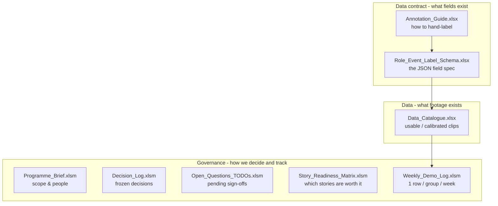
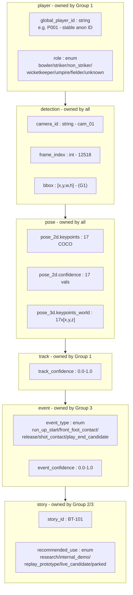
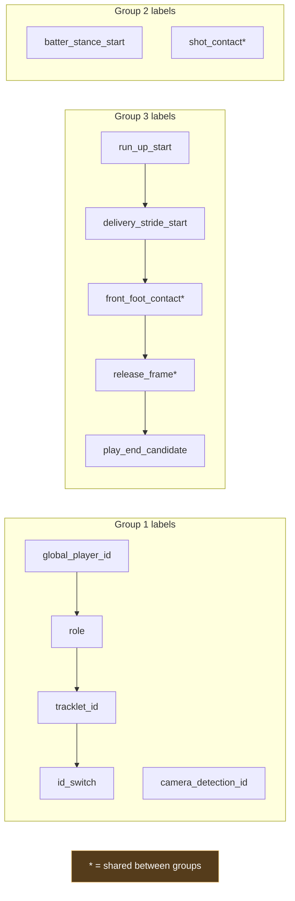
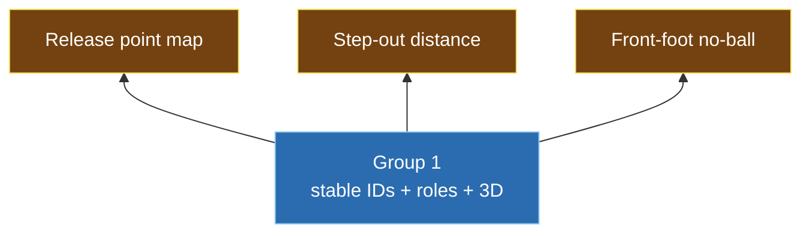

# 02 - The Shared Contract & Schema (`00_Shared`)

`00_Shared` is the interface between the three groups: as long as every group reads and
writes the same fields, the groups can work independently and still integrate.

Every claim links to its source spreadsheet; see the
[sourcing convention](README.md#sourcing-and-citation) in the README.

---

## The shared files



> **Inferred - not in the source files.** The grouping/arrows above are our organisation of
> the folder; the individual files and their stated purpose are documented (table below).

| File | Type | Purpose | Maintained by |
|------|------|---------|---------------|
| [Programme_Brief.xlsm](../00_Shared/Programme_Brief.xlsm) | Governance | Scope, people, rig, links | Management |
| [Data_Catalogue.xlsx](../00_Shared/Data_Catalogue.xlsx) | Data | Which clips are usable/calibrated/labelled | All + management |
| [Role_Event_Label_Schema.xlsx](../00_Shared/Role_Event_Label_Schema.xlsx) | Contract | The shared JSON field spec | All |
| [Annotation_Guide.xlsx](../00_Shared/Annotation_Guide.xlsx) | Contract | How to produce hand labels | All + management |
| [Decision_Log.xlsm](../00_Shared/Decision_Log.xlsm) | Governance | Record decisions once | Management |
| [Open_Questions_and_TODOs.xlsm](../00_Shared/Open_Questions_and_TODOs.xlsm) | Governance | Pending decisions | Management |
| [Story_Readiness_Matrix.xlsm](../00_Shared/Story_Readiness_Matrix.xlsm) | Governance | Score and prioritise stories | G2/G3 + management |
| [Weekly_Demo_Log.xlsm](../00_Shared/Weekly_Demo_Log.xlsm) | Governance | Weekly demo cadence | All |

*Purpose text paraphrases each file's own header/intro row.*

---

## 1. The data contract - `Role_Event_Label_Schema`

Every model output, JSON payload, annotation, and validation refers to these fields.
"Owner" is the *Owner Group* column in the sheet - the group that produces the field.



### Full field table (verbatim from the schema sheet)

| Entity | Field | Type | Allowed / Example | Required | Owner |
|--------|-------|------|-------------------|----------|-------|
| player | `global_player_id` | string | P001 | Yes | G1 |
| player | `role` | enum | bowler\|striker\|non_striker\|wicketkeeper\|umpire\|fielder\|unknown | Yes | G1/G3 |
| detection | `camera_id` | string | cam_01 | Yes | All |
| detection | `frame_index` | int | 12518 | Yes | All |
| detection | `bbox` | array | [x,y,w,h] | Recommended | G1 |
| pose_2d | `keypoints` | array | 17 COCO keypoints | Yes | All |
| pose_2d | `confidence` | array | 17 confidence values | Yes | All |
| pose_3d | `keypoints_world` | array | 17 x [x,y,z] | Yes | All |
| track | `track_confidence` | float | 0.0-1.0 | Yes | G1 |
| event | `event_type` | enum | run_up_start\|front_foot_contact\|release\|shot_contact\|play_end_candidate | Yes | G3 |
| event | `event_confidence` | float | 0.0-1.0 | Yes | G3 |
| story | `story_id` | string | BT-101 | Yes | G2/G3 |
| story | `recommended_use` | enum | research\|internal_demo\|replay_prototype\|live_candidate\|parked | Yes | G2/G3 |
| source | `FMPose3D` | url | https://xiu-cs.github.io/FMPose3D/ | Reference | G1 |
| source | `SAM3D` | url | https://ai.meta.com/research/sam3d/ | Reference | G1 |

*Source: [Role_Event_Label_Schema.xlsx](../00_Shared/Role_Event_Label_Schema.xlsx), "Role
Event Schema" sheet (all field rows, including the *Owner Group* column).*

### Ownership as a pipeline

```
  Group 1 fills  -> player.* , bbox, track_confidence, pose_3d (assoc.)
       |
       v
  Group 3 fills  -> event.*  (keyed to a global_player_id + frame_index)
       |
       v
  Group 2/3 fill -> story.*  (a finished story referencing players + events)
```

> **Inferred - not in the source files.** The ordering above is our reading of the field
> ownership; the schema lists owners per field but does not draw this pipeline. The
> conclusion that `global_player_id` and `role` (Group 1) are referenced by every downstream
> event and story follows from the owner columns.

---

## 2. The Annotation Guide

[`Annotation_Guide.xlsx`](../00_Shared/Annotation_Guide.xlsx) defines every hand label;
these labels become the ground truth used to grade the models.



| Label | Group | Definition | Format | Note |
|-------|-------|------------|--------|------|
| `global_player_id` | G1 | Stable anon ID across cameras and time | P001, P002... | Manual seed first, automated later |
| `camera_detection_id` | G1 | Per-camera detection id | cam03_det_01234 | From detector |
| `role` | G1/G3 | Cricket role | enum | Rule-based and geometry first |
| `tracklet_id` | G1 | Short continuous segment | trk_0001 | Used to evaluate stitching and ID switches |
| `id_switch` | G1 | Where identity changes incorrectly | true/false + notes | Log as a failure case |
| `run_up_start` | G3 | First frame of run-up | frame index | Definition to confirm with Harsh [Open] |
| `delivery_stride_start` | G3 | Final delivery stride start | frame index | Auto start/stop |
| `front_foot_contact` | G2/G3 | Front foot lands | frame + foot position | Critical for release/no-ball |
| `release_frame` | G2/G3 | Ball leaves hand | frame index | Approximate acceptable; needs confidence |
| `batter_stance_start` | G2 | Reference stance pre-delivery | frame + ankles | Step-out reference |
| `shot_contact` | G2/G3 | Bat/ball contact (or closest) | frame + confidence | No frame-accurate ground truth currently |
| `play_end_candidate` | G3 | Candidate end of play | frame index | Auto stop |
| `front_foot_no_ball_visualisation` | G3 | Foot-to-crease overlay | distance + confidence | Confirm explainer-only [Open] |
| `wide_line_explainer` | G3 | Candidate wide reference line | line + confidence | No decision language |
| `runout_stumping_feasibility` | G3 | Is bat/foot/bails/crease visible? | qualitative | No frame-accurate ground truth |

*Source: [Annotation_Guide.xlsx](../00_Shared/Annotation_Guide.xlsx), "Annotation Guide"
sheet (all label rows).*

> **Issue to discuss -** the guide's own *management_confirmed_definitions* row says
> *"MANAGEMENT INPUT REQUIRED: confirm before annotation begins"* - annotation should not
> start until definitions are signed off. (source:
> [Annotation_Guide.xlsx](../00_Shared/Annotation_Guide.xlsx), *management_confirmed_definitions* row.)

---

## 3. The Story Readiness Matrix

| Story ID | Story | Owner | Priority | Broadcast | Insight | Pose dep. | Feasibility | Risk | Recommended use |
|----------|-------|-------|----------|:--:|:--:|:--:|:--:|:--:|-----------------|
| BT-101 | Bowler release point map | G2 | Must attempt | 5 | 5 | 5 | 4 | 3 | Replay prototype |
| BT-102 | Average release point | G2 | Must attempt | 5 | 5 | 5 | 4 | 3 | Replay prototype |
| BT-R104 | Release consistency / crease usage | G2 | Must attempt | 5 | 5 | 5 | 4 | 3 | Replay prototype |
| BT-T203 | Batter step-out distance | G2 | Showcase candidate | 5 | 4 | 5 | 4 | 3 | Replay prototype |
| BT-C176/184 | Body-height scoring zones | G2 | If scoring metadata | 4 | 5 | 4 | 3 | 3 | Post-over/replay |
| G3-STARTSTOP | Automatic delivery start/stop | G3 | Must attempt | 4 | 4 | 4 | 4 | 3 | Internal demo/utility |
| DRS-R312 | Front-foot no-ball visualisation | G3 | Showcase candidate | 5 | 4 | 4 | 3 | 4 | Explainer prototype [Open] |
| HERO-05 | Virtual wide-line explainer | G3 | R&D only | 4 | 4 | 3 | 2 | 4 | Research/internal |
| HERO-03 | Run-out red/green bar | G3 | R&D feasibility only | 5 | 4 | 2 | 2 | 5 | Research only |
| HERO-01 | Shot Index | G2 | R&D only | 5 | 4 | 2 | 2 | 3 | Research only |
| MGMT-TOP3 | Final showcase top 3 | Mgmt | Confirm at W1 [Open] | - | - | - | - | - | Rec: release pt, step-out, no-ball |

*Source: [Story_Readiness_Matrix.xlsm](../00_Shared/Story_Readiness_Matrix.xlsm), "Readiness
Matrix" sheet (all story rows, scores 1-5). The header notes scores are planning estimates,
updated after W4 and W8.*

### Recommended-use ladder

```
 research --> internal_demo --> replay_prototype --> live_candidate --> parked
```

*Values from the `recommended_use` enum in
[Role_Event_Label_Schema.xlsx](../00_Shared/Role_Event_Label_Schema.xlsx) (story row).
Ordering low -> high readiness is our interpretation.*

### Key observation

The recommended top-3 showcase stories - release point (G2), step-out distance (G2), and
front-foot no-ball (G3) - all score Pose Dependency 4-5/5, so every showcase story depends
directly on Group 1's identity, role, and 3D layer.



*Documented inputs: the top-3 recommendation -
[Programme_Brief.xlsm](../00_Shared/Programme_Brief.xlsm), *Top showcase stories* row, and
[Story_Readiness_Matrix.xlsm](../00_Shared/Story_Readiness_Matrix.xlsm), *MGMT-TOP3* row;
the Pose Dependency scores - same matrix, *Pose dep.* column. The "therefore all depend on
Group 1" conclusion is our analysis (inferred).*

---

## 4. Governance and tracking files

Frozen decisions are listed in
[01_Programme_Overview](01_Programme_Overview.md#6-decisions-already-frozen).

### Open questions (live blockers)

| Area | Question | Owner | Due |
|------|----------|-------|-----|
| Sprint dates | Actual Week 1 / Week 6 dates? | Simone | Before sharing |
| Dataset access | DS-001 Drive link/access | Harsh/Aafaq | Before W1 |
| Intern allocation | Final group membership | Aafaq | Before W1 |
| Officiating framing | Explainer vs decision-support? | Management | W1 planning |
| Ground truth | Who produces manual ID/role/event labels? | Harsh/Aafaq | W1 |
| FMPose3D/SAM3D scope | Time on new tech vs core ReID? | Harsh/Aafaq/Adam | W1 |
| OpenProject fields | Which custom fields (Group, Readiness, Demo Link...)? | Adam/Simone | Before Excel sync |

*Source: [Open_Questions_and_TODOs.xlsm](../00_Shared/Open_Questions_and_TODOs.xlsm), "Open
Questions" sheet (all rows). Consolidated with owners/severity in
[10_Meeting_Brief_And_Open_Questions.md](10_Meeting_Brief_And_Open_Questions.md).*

---

Next: [03_Group1_Problem_And_Architecture.md](03_Group1_Problem_And_Architecture.md) -
Group 1's pipeline in technical detail.
