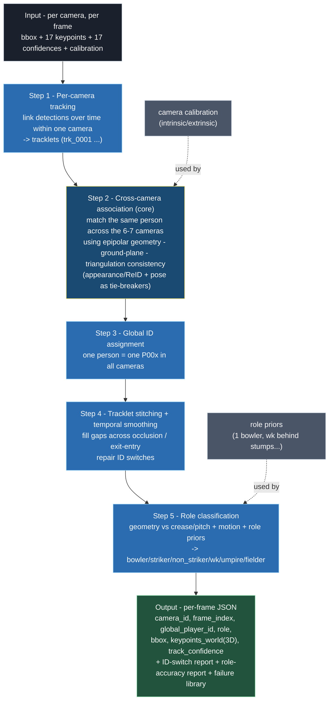
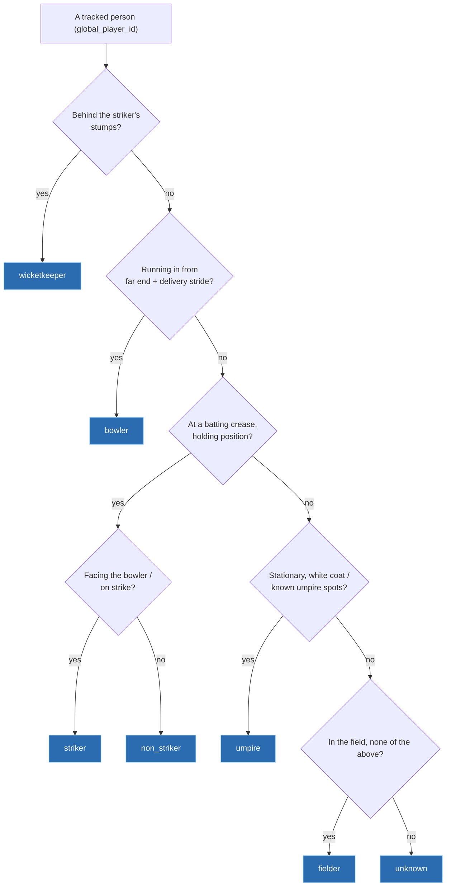

# 03 - Group 1 - Problem & Architecture

Group 1 is responsible for ReID, role classification, and stable tracks - the foundation
the rest of the sprint builds on. This document covers the problem, the proposed
architecture, inputs/outputs, and deliverables. The weekly plan is in
[06_Group1_Week_By_Week_Plan.md](06_Group1_Week_By_Week_Plan.md).

Primary source:
[`01_Group_ReID_Role_Tracking/Problem_Statement.xlsm`](../01_Group_ReID_Role_Tracking/Problem_Statement.xlsm),
"Problem" sheet. See the [sourcing convention](README.md#sourcing-and-citation).

---

## 1. The problem

> *"Build a robust multi-camera association and tracking layer that assigns stable anonymous
> IDs and cricket role labels across calibrated, synchronised DRS camera views."*
> - [Problem_Statement.xlsm](../01_Group_ReID_Role_Tracking/Problem_Statement.xlsm), *Objective* row.

> *"Stable identity unlocks 3D tracking, bowler/batter-specific stories, event detection,
> no-ball/run-out explainers, and future player name linking."*
> - [Problem_Statement.xlsm](../01_Group_ReID_Role_Tracking/Problem_Statement.xlsm), *Why it matters* row.

The task is not to identify real people: stable anonymous IDs are sufficient and names are
linked later. *Source:
[Programme_Brief.xlsm](../00_Shared/Programme_Brief.xlsm), *ID requirement* row;
[Decision_Log.xlsm](../00_Shared/Decision_Log.xlsm), "Use stable anonymous IDs" (2026-06-08).*

---

## 2. Inputs, outputs, deliverables

```mermaid
flowchart LR
    subgraph GIVEN["Given (Harsh's pipeline + rig)"]
      I1["6-7 calibrated / stabilised /<br/>synchronised DRS clips"]
      I2["RTMPose 2D keypoints<br/>+ per-keypoint confidence"]
      I3["Per-camera person detections<br/>(bbox)"]
      I4["Camera calibration<br/>(intrinsic + extrinsic)"]
      I5["No player tracker output"]
    end
    subgraph BUILD["Deliverables"]
      O1["ReID baseline<br/>(cross-camera association)"]
      O2["Role classifier"]
      O3["Stable tracklet JSON"]
      O4["ID-switch report"]
      O5["Role-accuracy report"]
      O6["Failure-case library"]
    end
    GIVEN ==> BUILD
```



| | Inputs (given) | Deliverables |
|---|----------------|--------------|
| Documented | Calibrated/stabilised/synchronised clips from 6-7 cameras; no current player tracker; RTMPose/detections from existing pipeline | ReID baseline, role classifier, stable tracklet JSON, ID-switch report, role-accuracy report, failure-case library |

*Source: [Problem_Statement.xlsm](../01_Group_ReID_Role_Tracking/Problem_Statement.xlsm),
*Inputs* and *Outputs* rows.*

> *"No player tracking output is currently available ... Group 1 must build/validate
> association and tracking from detections."*
> - [Programme_Brief.xlsm](../00_Shared/Programme_Brief.xlsm), *Player tracker availability* row;
> reaffirmed in [Decision_Log.xlsm](../00_Shared/Decision_Log.xlsm) (2026-06-08).

---

## 3. Proposed architecture (inferred - to confirm)

> **Inferred - not in the source files.** The source documents the *approach* in one line
> (quoted below) and lists the inputs/outputs above. The five-step pipeline, the geometry
> explainers (section 4), the role decision tree (section 5), and the JSON record (section 6) are our proposed
> design for the team to react to - not specifications taken from a sheet.

Documented approach (the only architectural statement in the source):

> *"Rule-based + geometry-first baseline; add temporal smoothing, tracklet stitching,
> pose/appearance features and role priors. Investigate FMPose3D/SAM3D/FreeMocap/OpenSim
> only as bounded R&D."*
> - [Problem_Statement.xlsm](../01_Group_ReID_Role_Tracking/Problem_Statement.xlsm), *Approach* row.

Our proposed pipeline consistent with that approach:



Geometry comes first; machine-learning methods are added only if time allows. Because the
cameras are calibrated and synchronised, geometry is the most reliable signal - stronger
than appearance, since players wear the same kit (kit similarity is a documented risk, section 8).

---

## 4. Cross-camera association

> **Inferred - not in the source files.** Standard multi-view geometry, included to explain
> the documented "epipolar/ground-plane/triangulation consistency" method
> ([Experiment_Log.xlsx](../01_Group_ReID_Role_Tracking/Experiment_Log.xlsx), W2 row).

### 4a. Epipolar geometry - are two detections the same person?

A point seen in Camera A must lie along a predictable line (the epipolar line) in Camera B.
A detection in B that sits on that line is geometrically consistent and likely the same
person.

```
   Camera A                         Camera B
   +-----------+                    +-----------+
   |     . p   |  same 3D point     |   \        |
   |           | --------------->   |    \ epipolar
   |           |   must lie on      |     \ line |
   |           |   this line in B   |   .  \ p'  |  <- p' on the line => match
   +-----------+                    +-----------+
```

### 4b. Triangulation - where in 3D is the person?

Once matched across two or more cameras, intersect the rays to obtain the 3D world
position. Reproject that point back into every camera and measure the pixel error; low
reprojection error indicates a correct association.

```
        Camera A ray \           / Camera B ray
                      \         /
                       \       /
                        \     /
                         \   /
                          \ /
                           O   <- triangulated 3D point (x,y,z)
                          /|\
              reproject /  |  \ reproject
                      /    |    \
                  [camA]  ...   [camB]   measure pixel error at each
```

This doubles as a validation signal: the documented metric "Reprojection effect - does
association improve triangulation/reprojection?"
([Validation_Results.xlsx](../01_Group_ReID_Role_Tracking/Validation_Results.xlsx)) tests
whether the IDs improve the 3D consumed by Groups 2 and 3.

### 4c. Tie-breakers when geometry is ambiguous

When two players are geometrically close (side-on overlap), add appearance/ReID features,
pose-configuration similarity, temporal continuity, and role priors - consistent with the
documented approach ("pose/appearance features and role priors").

---

## 5. Role classification (inferred decision tree)

> **Inferred - not in the source files.** The source says only "rule-based and geometry
> first" with role priors ([Problem_Statement.xlsm](../01_Group_ReID_Role_Tracking/Problem_Statement.xlsm),
> *Approach* row). The decision tree below is our illustration; confirm exact rules with
> Harsh. The `run_up_start` and several event definitions are explicitly to be confirmed
> ([Annotation_Guide.xlsx](../00_Shared/Annotation_Guide.xlsx)).



Available roles (the enum, documented in the schema):
`bowler - striker - non_striker - wicketkeeper - umpire - fielder - unknown`. *Source:
[Role_Event_Label_Schema.xlsx](../00_Shared/Role_Event_Label_Schema.xlsx), `role` field.*

---

## 6. Output consumed by Groups 2 and 3 (inferred example)

> **Inferred - not in the source files.** The fields are documented in the schema; this
> concrete JSON layout is an illustrative example, not a fixed format. Freezing the exact
> format is a meeting item (see [09](09_Cross_Group_Dependencies.md)).

```jsonc
{
  "camera_id": "cam_01",
  "frame_index": 12518,
  "players": [
    {
      "global_player_id": "P001",      // Group 1 owns this (stable anon)
      "role": "bowler",                // Group 1 owns this
      "bbox": [x, y, w, h],            // Group 1
      "track_confidence": 0.94,        // Group 1
      "pose_2d": { "keypoints": [[x,y] x17], "confidence": [c x17] },  // from RTMPose
      "pose_3d": { "keypoints_world": [[x,y,z] x17] }  // triangulated (association enables this)
    }
    // one entry per tracked person
  ]
}
```

The three report artifacts are documented deliverables (section 2): ID-switch report,
role-accuracy report, failure-case library.

---

## 7. Validation metrics

| # | Metric | Definition | Target |
|---|--------|------------|--------|
| 1 | Cross-camera association accuracy | % correct associations vs manual labels | [Open] set target |
| 2 | ID switches per delivery | number of wrong identity switches | [Open] set threshold |
| 3 | Role classification accuracy | % role labels correct | [Open] set target |
| 4 | Track completeness | % frames with a continuous track | (no target in sheet) |
| 5 | Reprojection effect | does association improve triangulation? | (qualitative) |

*Source: [Validation_Results.xlsx](../01_Group_ReID_Role_Tracking/Validation_Results.xlsx),
"Validation" sheet (all metric rows).*

> **Issue to discuss -** targets 1-3 are marked "MANAGEMENT INPUT REQUIRED" in the sheet;
> "accurate" is unmeasurable until thresholds are set. (source:
> [Validation_Results.xlsx](../01_Group_ReID_Role_Tracking/Validation_Results.xlsx), *Target
> / Threshold* column.)

---

## 8. Known risks

> *"Similar kits, occlusion, tight DRS views, side-on overlap, late entry/exit, lack of
> full-field context."*
> - [Problem_Statement.xlsm](../01_Group_ReID_Role_Tracking/Problem_Statement.xlsm), *Known risks* row.

> **Inferred - not in the source files.** The effects and mitigations below are our analysis
> of the documented risks.

| Risk (documented) | Effect on ReID (inferred) | First-line mitigation (inferred) |
|------|----------------|------------------------|
| Similar kits | Appearance ReID near-useless | Geometry + role priors |
| Occlusion | Lost detections, broken tracks | Tracklet stitching + temporal smoothing |
| Tight DRS views | Frequent enter/exit | Robust re-entry handling |
| Side-on overlap | Two players merge | Multi-view disambiguation (other cameras) |
| Late entry/exit | New tracklets mid-clip | Stitching + ID re-assignment |
| No full-field context | Global field position unavailable | Role logic from local geometry |

---

## 9. Final deliverable: handover

At Week 8, complete every section of
[`Final_Handover.xlsx`](../01_Group_ReID_Role_Tracking/Final_Handover.xlsx), "Final
Handover" sheet: problem statement, method used, datasets used, best demo, measured results,
failure cases, recommended next step, code handover (GitHub), OpenProject links.

---

## 10. Bounded R&D

Investigate only as bounded R&D: [FMPose3D](https://xiu-cs.github.io/FMPose3D/),
[SAM 3D](https://ai.meta.com/research/sam3d/), FreeMocap, OpenSim. *Source:
[Problem_Statement.xlsm](../01_Group_ReID_Role_Tracking/Problem_Statement.xlsm), *Approach* row;
FMPose3D/SAM3D listed as reference sources in
[Role_Event_Label_Schema.xlsx](../00_Shared/Role_Event_Label_Schema.xlsx); W4 investigation
in [Experiment_Log.xlsx](../01_Group_ReID_Role_Tracking/Experiment_Log.xlsx).*

> **Issue to discuss -** the time split between new-tech R&D and core ReID is unresolved.
> (source: [Open_Questions_and_TODOs.xlsm](../00_Shared/Open_Questions_and_TODOs.xlsm),
> *FMPose3D/SAM3D scope* row.)

---

## Dependencies

How Group 1's output feeds Groups 2 and 3 (and the manual-ID bridge) is detailed in
[09_Cross_Group_Dependencies.md](09_Cross_Group_Dependencies.md).

Next: [04_Group2_Problem_And_Architecture.md](04_Group2_Problem_And_Architecture.md).
