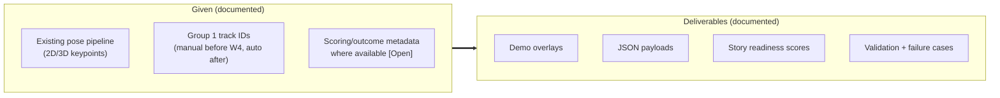
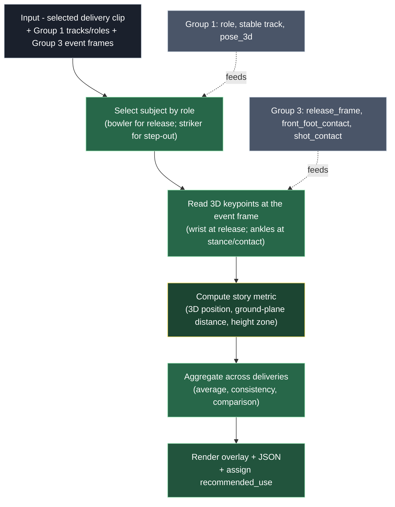
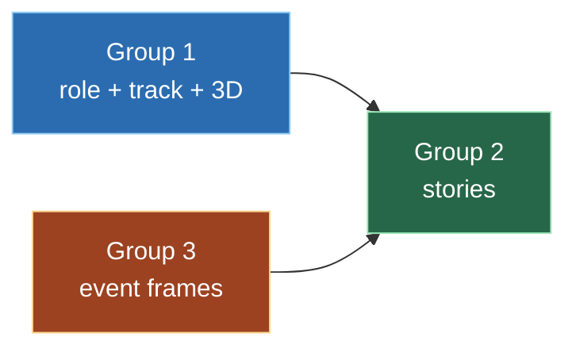

# 04 - Group 2 - Problem & Architecture

Group 2 is responsible for Broadcast Biomechanics Stories - turning trusted pose and
tracking data into broadcast-ready story prototypes. This document covers the problem, the
proposed approach, inputs/outputs, and deliverables. The weekly plan is in
[07_Group2_Week_By_Week_Plan.md](07_Group2_Week_By_Week_Plan.md).

Primary source:
[`02_Group_Broadcast_Biomechanics/Problem_Statement.xlsm`](../02_Group_Broadcast_Biomechanics/Problem_Statement.xlsm),
"Problem" sheet. See the [sourcing convention](README.md#sourcing-and-citation).

---

## 1. The problem

> *"Use stable pose/tracking data to produce broadcast-ready cricket story prototypes
> focused on release point, stance, step-out distance and body-zone analysis."*
> - [Problem_Statement.xlsm](../02_Group_Broadcast_Biomechanics/Problem_Statement.xlsm), *Objective* row.

> *"These are the strongest near-term broadcast graphics because they are understandable,
> cricket-relevant and do not require decision-grade officiating accuracy."*
> - [Problem_Statement.xlsm](../02_Group_Broadcast_Biomechanics/Problem_Statement.xlsm), *Why it matters* row.

> **Inferred - not in the source files.** Group 2 consumes Group 1's identity/role/3D layer
> and Group 3's event timing, then computes metrics and renders them; it does not build
> trackers or detect events. This division follows from the inputs row (below) and the field
> ownership in the schema, but is our framing.

---

## 2. Inputs, outputs, deliverables



> *"Existing pose pipeline, Group 1 track IDs when available, controlled/manual IDs before
> Week 4, scoring/outcome metadata where available."*
> - [Problem_Statement.xlsm](../02_Group_Broadcast_Biomechanics/Problem_Statement.xlsm), *Inputs* row.

> *Deliverables: "Demo overlays, JSON payloads, story readiness scores, validation/failure
> cases."*
> - [Problem_Statement.xlsm](../02_Group_Broadcast_Biomechanics/Problem_Statement.xlsm), *Outputs* row.

Priority stories (documented): *"Release point, average release point, release consistency,
bowler comparison, step-out distance, body-height scoring zones."*
- [Problem_Statement.xlsm](../02_Group_Broadcast_Biomechanics/Problem_Statement.xlsm),
*Priority stories* row. Story IDs and scores: see
[02 - Story Readiness Matrix](02_Shared_Contract_And_Schema.md#3-the-story-readiness-matrix).

Group 2 has two upstream dependencies - Group 1 (who/where) and Group 3 (when); see
[09_Cross_Group_Dependencies.md](09_Cross_Group_Dependencies.md).

---

## 3. Proposed processing model (inferred - to confirm)

> **Inferred - not in the source files.** The source lists priority stories and
> inputs/outputs; the processing model and the per-story computations (section 4) are our proposed
> design for discussion, not specifications from a sheet.



---

## 4. The stories, computed (inferred methods)

> **Inferred - not in the source files.** The story names/IDs are documented (Story Matrix);
> the computation methods below are our proposed approach. Confirm with the team.

### 4a. Release point (BT-101) - average (BT-102) - consistency (BT-R104)

Proposed method: the release point is the 3D position of the bowler's bowling-hand wrist at
the release frame.

```
   bowler (role=bowler, stable track)            [from Group 1]
            |
   release_frame                                 [from Group 3]
            |
   pose_3d.keypoints_world[wrist]  ->  release point (x, y, z)
            |
   repeat over many deliveries
            |
            v
   release point map   ->  average = BT-102 ; spread = BT-R104 ; per-bowler = comparison
```

| Story (documented ID) | Proposed definition (inferred) | Key inputs |
|-------|------------|-----------|
| Release point map (BT-101) | 3D wrist position at release, per delivery | bowler role + track + `pose_3d` wrist + `release_frame` |
| Average release point (BT-102) | mean release point over deliveries | several deliveries per bowler |
| Release consistency (BT-R104) | spread of release points / crease usage | as above |
| Bowler comparison | release maps for two or more bowlers | as above, per bowler |

### 4b. Step-out distance (BT-T203)

Proposed method: ground-plane distance from the striker's stance position to the advanced
position at contact.

```
   striker (role=striker, stable ankle track)    [from Group 1]
   batter_stance_start -> stance ankle midpoint on ground plane = A
   shot_contact        -> advanced ankle position on ground plane = B
            v
   step-out distance = distance(A, B) along the pitch (ground plane)
```

> **Issue to discuss -** the stance/contact reference for step-out is not yet defined.
> (source: [Validation_Results.xlsx](../02_Group_Broadcast_Biomechanics/Validation_Results.xlsx),
> *Step-out distance error* row: "define stance/contact reference".)

### 4c. Body-height scoring zones (BT-C176/184)

Proposed method: classify contact height relative to the batter's body height into bands,
then relate bands to outcomes (needs scoring metadata).

> **Issue to discuss -** the body-zone story needs outcome/scoring metadata that may not be
> available, and has a sample-size risk. (source: Story Matrix priority "if scoring metadata
> available" - [Story_Readiness_Matrix.xlsm](../00_Shared/Story_Readiness_Matrix.xlsm);
> risks row - [Problem_Statement.xlsm](../02_Group_Broadcast_Biomechanics/Problem_Statement.xlsm).)

### 4d. Shot Index (HERO-01) - R&D only

Documented as R&D only; needs bat/ball contact and ball speed, for which no precise ground
truth currently exists. *Source:
[Story_Readiness_Matrix.xlsm](../00_Shared/Story_Readiness_Matrix.xlsm), *HERO-01* row.*

---

## 5. Validation metrics

| # | Metric | Definition | Target |
|---|--------|------------|--------|
| 1 | Release point error | 3D wrist/release position vs manual label | [Open] set target |
| 2 | Release frame error | frame difference vs manual label | (no target in sheet) |
| 3 | Step-out distance error | distance vs manual measurement | [Open] define stance/contact reference |
| 4 | Body-height zone accuracy | % correct zone assignment | (no target in sheet) |
| 5 | Story readiness | research / internal demo / replay prototype / live candidate | per story |

*Source: [Validation_Results.xlsx](../02_Group_Broadcast_Biomechanics/Validation_Results.xlsx),
"Validation" sheet (all rows).*

---

## 6. Known risks

> *"Release-frame ambiguity, body-zone sample size, lack of scoring metadata, no precise
> bat/contact ground truth."*
> - [Problem_Statement.xlsm](../02_Group_Broadcast_Biomechanics/Problem_Statement.xlsm), *Known risks* row.

> **Inferred - not in the source files.** Effects/mitigations below are our analysis.

| Risk (documented) | Effect (inferred) | Mitigation / note (inferred) |
|------|--------|-------------------|
| Release-frame ambiguity | Wrong frame moves the release point | Tighten with Group 3; report confidence |
| Body-zone sample size | Few deliveries per zone | Add sample-size warnings to graphics |
| Lack of scoring metadata | Body-zone story may stall | Confirm metadata availability early [Open] |
| No precise bat/contact GT | Shot Index unvalidated | Keep as R&D only |
| Upstream ID/role errors | Metric computed on wrong player | Depends on Group 1 quality (see [09](09_Cross_Group_Dependencies.md)) |

---

## 7. Final deliverable: handover

At Week 8, complete every section of
[`Final_Handover.xlsx`](../02_Group_Broadcast_Biomechanics/Final_Handover.xlsx), "Final
Handover" sheet: problem statement, method, datasets, best demo, measured results, failure
cases, recommended next step, code handover, OpenProject links.

---

## Dependencies



- From Group 1: `role` (bowler/striker), stable track, `pose_3d.keypoints_world`.
- From Group 3: `release_frame`, `front_foot_contact`, `shot_contact`.
- Before W4: Group 1 manual/controlled IDs (the manual-ID bridge).

Full detail in [09_Cross_Group_Dependencies.md](09_Cross_Group_Dependencies.md).

Next: [05_Group3_Problem_And_Architecture.md](05_Group3_Problem_And_Architecture.md).
