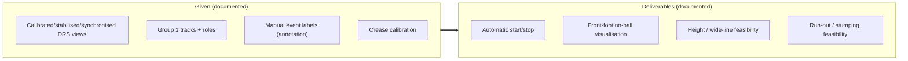
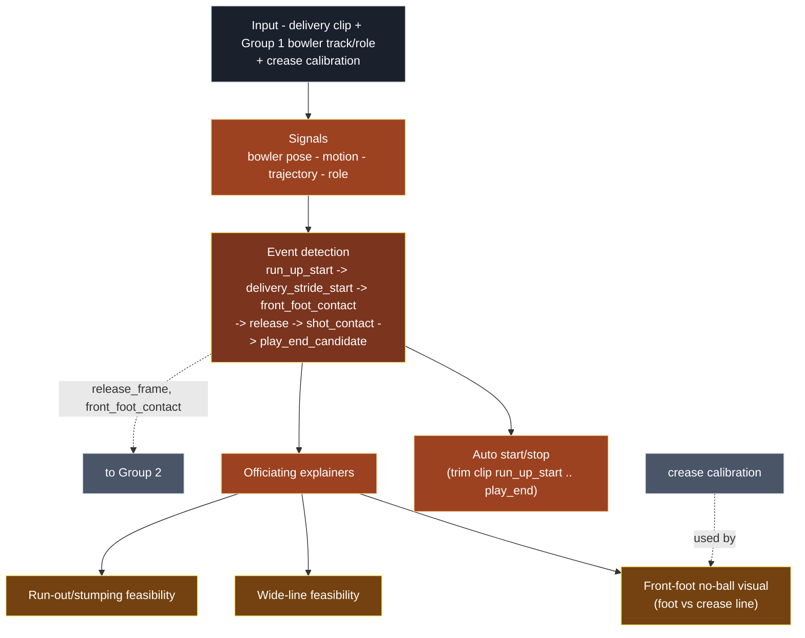
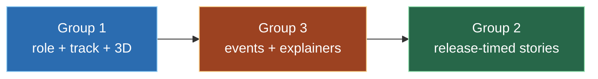

# 05 - Group 3 - Problem & Architecture

Group 3 is responsible for Event Detection and Officiating Explainers - detecting delivery
events and prototyping officiating-style explainers. This document covers the problem, the
proposed approach, inputs/outputs, and deliverables. The weekly plan is in
[08_Group3_Week_By_Week_Plan.md](08_Group3_Week_By_Week_Plan.md).

Primary source:
[`03_Group_Event_Officiating_Explainers/Problem_Statement.xlsm`](../03_Group_Event_Officiating_Explainers/Problem_Statement.xlsm),
"Problem" sheet. See the [sourcing convention](README.md#sourcing-and-citation).

---

## 1. The problem

> *"Use pose, role labels and stable tracking to detect delivery events and prototype
> officiating-style broadcast explainers."*
> - [Problem_Statement.xlsm](../03_Group_Event_Officiating_Explainers/Problem_Statement.xlsm), *Objective* row.

> *"Event timing enables automatic start/stop and creates the foundation for no-ball,
> wide-line and run-out/stumping explainers."*
> - [Problem_Statement.xlsm](../03_Group_Event_Officiating_Explainers/Problem_Statement.xlsm), *Why it matters* row.

Group 3 consumes Group 1's identity/role/track layer, produces the event timeline (when
things happen), and renders explainers. Its event frames are also consumed by Group 2 (see
[09](09_Cross_Group_Dependencies.md)).

---

## 2. The framing constraint (read first)

> *"TODO: management must confirm explainer-only vs decision-support framing before Week 1
> ends."*
> - [Problem_Statement.xlsm](../03_Group_Event_Officiating_Explainers/Problem_Statement.xlsm), *Important constraint* row;
> also [Decision_Log.xlsm](../00_Shared/Decision_Log.xlsm) (officiating framing, TBC) and
> [Programme_Brief.xlsm](../00_Shared/Programme_Brief.xlsm), *Officiating language* row.

> **Issue to discuss -** until this is confirmed, no-ball/wide/run-out outputs must be
> presented as explainers/visualisations, not umpiring decisions, and must avoid
> decision-grade language. This gates the no-ball showcase story. (sources cited above; see
> [10_Meeting_Brief_And_Open_Questions.md](10_Meeting_Brief_And_Open_Questions.md).)

---

## 3. Inputs, outputs, deliverables



> *Inputs: "Calibrated/stabilised/synchronised DRS views, Group 1 tracks, manual event
> labels, crease calibration."* - *Priority outputs: "Automatic start/stop, front-foot
> no-ball visualisation, height/wide-line feasibility, run-out/stumping feasibility."*
> - [Problem_Statement.xlsm](../03_Group_Event_Officiating_Explainers/Problem_Statement.xlsm), *Inputs* and *Priority outputs* rows.

Story IDs and scores: see
[02 - Story Readiness Matrix](02_Shared_Contract_And_Schema.md#3-the-story-readiness-matrix).

---

## 4. Proposed processing model (inferred - to confirm)

> **Inferred - not in the source files.** Two stages - detect the event timeline, then render
> explainers anchored to those events - is our proposed design. The events themselves and
> the inputs are documented; the pipeline shape and per-output methods (section 6) are ours.



---

## 5. The event timeline

The core asset Group 3 produces; each event is a frame index plus confidence attached to a
player. The event types and the `event_type`/`event_confidence` fields are documented in the
schema; the per-event detection signals are inferred.


| Event (documented) | Definition (documented) | Detection signal (inferred) | Notes |
|-------|------------|------------------|-------|
| `run_up_start` | first frame of bowler run-up | bowler motion onset | definition to confirm with Harsh [Open] |
| `delivery_stride_start` | final delivery stride begins | stride/gait change | useful for auto start |
| `front_foot_contact` | front foot lands | foot landing in pose/trajectory | critical for no-ball; shared with G2 |
| `release` | ball leaves the hand | arm/wrist motion peak | shared with G2; approximate acceptable |
| `shot_contact` | bat/ball contact (or closest) | batter pose / timing | no frame-accurate GT currently |
| `play_end_candidate` | candidate end of play | motion settling | useful for auto stop |

*Event names/definitions: [Role_Event_Label_Schema.xlsx](../00_Shared/Role_Event_Label_Schema.xlsx)
(`event_type`) and [Annotation_Guide.xlsx](../00_Shared/Annotation_Guide.xlsx) (label rows);
W1 schema list in [Experiment_Log.xlsx](../03_Group_Event_Officiating_Explainers/Experiment_Log.xlsx).*

---

## 6. The outputs, computed (inferred methods)

> **Inferred - not in the source files.** Output names/IDs are documented (Story Matrix); the
> computation methods are our proposed approach.

### 6a. Automatic start/stop (G3-STARTSTOP)

Trim a delivery clip from `run_up_start` to `play_end_candidate` using pose, role, and
trajectory signals.

### 6b. Front-foot no-ball visualisation (DRS-R312)

Proposed method: compare the bowler's front-foot landing position to the popping crease line
using crease calibration and the ground plane.

```
   front_foot_contact (event)
        |
   front-foot keypoint -> ground-plane position = F
   popping crease line (from crease calibration) = L
        v
   foot-to-crease distance = signed distance(F, L)
        v
   overlay: foot, crease line, distance   (EXPLAINER framing only [Open])
```

### 6c. Height / wide-line feasibility (HERO-05) - R&D only

Assess whether a candidate wide reference line can be drawn from the batter's start position
and movement. Research only; no decision language. *Source:
[Story_Readiness_Matrix.xlsm](../00_Shared/Story_Readiness_Matrix.xlsm), *HERO-05* row.*

### 6d. Run-out / stumping feasibility (HERO-03) - R&D only

Assess whether bat/foot/bails/crease timing is visible enough to be useful; no frame-accurate
ground truth exists. *Source:
[Story_Readiness_Matrix.xlsm](../00_Shared/Story_Readiness_Matrix.xlsm), *HERO-03* row.*

---

## 7. Validation metrics

| # | Metric | Definition | Target |
|---|--------|------------|--------|
| 1 | Start/stop frame error | frame difference vs manual label | [Open] set target |
| 2 | Front-foot contact frame error | frame difference vs manual label | (no target in sheet) |
| 3 | Foot-to-crease distance error | distance error vs manual review | (no target in sheet) |
| 4 | Height/wide-line feasibility | qualitative/quantitative confidence | management to confirm framing [Open] |
| 5 | Run-out/stumping feasibility | visibility and timing feasibility | no frame-accurate ground truth |

*Source: [Validation_Results.xlsx](../03_Group_Event_Officiating_Explainers/Validation_Results.xlsx),
"Validation" sheet (all rows).*

---

## 8. Known risks

> *"No frame-accurate ground truth currently available, tight views, foot-grounding
> ambiguity, bat/bails visibility."*
> - [Problem_Statement.xlsm](../03_Group_Event_Officiating_Explainers/Problem_Statement.xlsm), *Known risks* row.

> **Inferred - not in the source files.** Effects/mitigations below are our analysis.

| Risk (documented) | Effect (inferred) | Mitigation / note (inferred) |
|------|--------|-------------------|
| No frame-accurate ground truth | Event timing hard to validate | Manual labels; report confidence |
| Tight views | Events leave frame | Use multiple cameras |
| Foot-grounding ambiguity | No-ball distance noisy | Multi-view + crease calibration |
| Bat/bails visibility | Run-out/stumping uncertain | Keep as feasibility R&D |
| Framing unconfirmed | No-ball showcase blocked | Resolve explainer-only framing [Open] |
| Upstream ID/role errors | Events attach to wrong player | Depends on Group 1 quality (see [09](09_Cross_Group_Dependencies.md)) |

---

## 9. Final deliverable: handover

At Week 8, complete every section of
[`Final_Handover.xlsx`](../03_Group_Event_Officiating_Explainers/Final_Handover.xlsx),
"Final Handover" sheet: problem statement, method, datasets, best demo, measured results,
failure cases, recommended next step, code handover, OpenProject links.

---

## Dependencies



- From Group 1: `role=bowler`, stable track over the delivery, 3D pose.
- To Group 2: `release_frame`, `front_foot_contact`, `shot_contact`.
- Before W4: Group 1 manual/controlled IDs (the manual-ID bridge).

Full detail in [09_Cross_Group_Dependencies.md](09_Cross_Group_Dependencies.md).

Next: [06_Group1_Week_By_Week_Plan.md](06_Group1_Week_By_Week_Plan.md).
