# 06 - Group 1 - Week-by-Week Plan

What to build each week, and what to record in the demo log. **5-week R&D plan.**

The earlier cycle assigned player IDs **entirely by hand**. Our central goal this cycle is
**ReID**: assign each player a stable anonymous ID and hold it *across the 7 camera angles*
(spatial association) and *across frames* (temporal tracking), so the manual step is replaced
by an automated, validated pipeline.

- The plan is grounded in the documented experiments in
  [`Experiment_Log.xlsx`](../01_Group_ReID_Role_Tracking/Experiment_Log.xlsx) ("Experiment
  Log" sheet) and the Group 1 strategy in [`../grp_1/plan.md`](../grp_1/plan.md); it
  re-sequences them into a 5-week cycle. The week structure itself is **our plan** - confirm
  it in the planning meeting.
- This is an R&D plan: model, association, and smoothing choices are outcomes to be benchmarked
  on our own footage, not decisions fixed here (see
  [`../grp_1/plan.md`](../grp_1/plan.md) §11 backlog).

Architecture context: [03_Group1_Problem_And_Architecture.md](03_Group1_Problem_And_Architecture.md).

---

## Overview

The two axes of ReID drive the schedule: first hold an ID **across frames** within each camera
(tracking), then hold it **across the 7 camera angles** (cross-camera association), then stitch
both into one stable global ID per player, classify roles, validate, and hand over.

```mermaid
gantt
    title Group 1 - 5-week ReID plan
    dateFormat  X
    axisFormat  W%s

    section ReID build
    W1 Manual-ID baseline + player detection   :done,   w1, 0, 1
    W2 Per-camera tracking (ReID across frames) :active, w2, 1, 1
    W3 Cross-camera association (across angles)  :        w3, 2, 1
    W4 Tracklet stitching + role classifier      :        w4, 3, 1
    section Close-out
    W5 Validation + handover/showcase            :crit,  w5, 4, 1
```

| Wk | Theme | ReID axis | Headline deliverable |
|----|-------|-----------|----------------------|
| 1 | Manual-ID baseline + player detection | baseline | Per-camera player detections; hand-assigned `global_player_id` seeds on DS-001 |
| 2 | Per-camera tracking | across frames | Per-camera tracklets that keep an ID through occlusion |
| 3 | Cross-camera association | across angles | Same player matched across the 7 calibrated views |
| 4 | Tracklet stitching + role classifier | both | One stable global ID per player + role labels |
| 5 | Validation + handover | - | Completed `Validation_Results.xlsx` + `Final_Handover.xlsx` + best demo |

---

## Week 1 - Manual-ID baseline + player detection

The starting line is the prior **manual** process: reproduce it as a baseline, then stand up
the per-camera player detection that the automated ReID pipeline will build on.

- Reproduce the manual-ID baseline. *Experiment Log:* *"Reproduce/manual-ID baseline"*,
  method *"Use prior manual ID tool and new dataset"*.
- Produce per-camera **player** detections (today the dataset detects the ball only - player
  detection, pose, and tracking are Group 1's to build; see
  [`../grp_1/plan.md`](../grp_1/plan.md) §3.3, §4).
- Hand-assign `global_player_id` seeds on DS-001 - the manual-ID bridge that lets Groups 2 and
  3 start (see [09 - Manual-ID bridge](09_Cross_Group_Dependencies.md#5-the-manual-id-bridge)).
- R&D: short-list the 2D detector/pose model on our footage
  ([`../grp_1/plan.md`](../grp_1/plan.md) §4).

> **Issue to discuss -** Week-1 cannot start without DS-001 access, and ground-truth ownership
> is unassigned. (source:
> [Open_Questions_and_TODOs.xlsm](../00_Shared/Open_Questions_and_TODOs.xlsm), *Dataset access*
> and *Ground truth availability* rows.)

---

## Week 2 - Per-camera tracking (ReID across frames)

Hold an ID for one player **across frames** within a single camera - the temporal axis of ReID.

- Track each detected player per camera so the same ID survives motion and brief occlusion.
- R&D candidates to benchmark (no winner pre-judged): DeepSORT (appearance + Kalman motion),
  PipeTrack, and a projection-matrix-assisted motion prior
  ([`../grp_1/plan.md`](../grp_1/plan.md) §4).
- Metric to show: ID switches per delivery within a camera; track completeness
  ([03 - section 7](03_Group1_Problem_And_Architecture.md#7-validation-metrics)).

---

## Week 3 - Cross-camera association (ReID across angles)

Match the same player **across the 7 calibrated camera angles** - the spatial axis of ReID.
Geometry first, not appearance, because the kits are identical and views are tight and side-on.

- Experiment Log: *"Geometry-first association"*, method
  *"Epipolar/ground-plane/triangulation consistency"*.
- Use the calibrated `projection_matrices` (§3.2 of [`../grp_1/plan.md`](../grp_1/plan.md)) so a
  player in one view back-projects and triangulates consistently with the others.
- Metric to show: cross-camera association accuracy
  ([03 - section 7](03_Group1_Problem_And_Architecture.md#7-validation-metrics)).

> **Issue to discuss -** documented risks for this step: *"Similar kits, occlusion, tight DRS
> views, side-on overlap, late entry/exit, lack of full-field context."* (source:
> [Problem_Statement.xlsm](../01_Group_ReID_Role_Tracking/Problem_Statement.xlsm), Known risks
> row.)

---

## Week 4 - Tracklet stitching + role classifier

Combine the two axes into **one stable global ID per player**, then label roles.

- Experiment Log: *"Tracklet stitching"*, method *"Temporal continuity with role priors"*.
- Stitch per-camera tracklets (W2) and cross-camera matches (W3) into a single
  `global_player_id` that persists across the whole delivery and all views.
- Lock the role classifier (bowler, striker, and so on); role priors also help disambiguate
  stitching.
- Mid-cycle: update [`Story_Readiness_Matrix`](../00_Shared/Story_Readiness_Matrix.xlsm).
- Handoff: Groups 2 and 3 switch from manual IDs to **automated** IDs - "before Week 4" is
  documented for Group 2 (see
  [09](09_Cross_Group_Dependencies.md#5-the-manual-id-bridge)).
- Metrics to show: ID switches per delivery (across cameras); role classification accuracy.

---

## Week 5 - Validation + handover/showcase

Validate the ReID pipeline on the blind subset and complete the handover.

- Run on blind subset DS-002; compute the validation metrics; complete
  [`Validation_Results.xlsx`](../01_Group_ReID_Role_Tracking/Validation_Results.xlsx).
  *The sheet's own header states it is "for Week 6 validation and Week 8 handover"; we fold
  both into Week 5.*
- Expand the failure-case library with before/after metrics; pair with G2 (release point) and
  G3 (no-ball) on integration.
- Complete every section of
  [`Final_Handover.xlsx`](../01_Group_ReID_Role_Tracking/Final_Handover.xlsx), "Final
  Handover" sheet:

*Sections from [Final_Handover.xlsx](../01_Group_ReID_Role_Tracking/Final_Handover.xlsx),
"Final Handover" sheet (Section/Prompt rows).*

> **Issue to discuss -** validation needs ground-truth labels, a ready DS-002, and agreed
> targets - all currently open. (source:
> [Validation_Results.xlsx](../01_Group_ReID_Role_Tracking/Validation_Results.xlsx) targets;
> [Data_Catalogue.xlsx](../00_Shared/Data_Catalogue.xlsx) DS-002 row;
> [Open_Questions_and_TODOs.xlsm](../00_Shared/Open_Questions_and_TODOs.xlsm) ground-truth row.)

---

## Weekly Demo Log entries

One row per week in [`Weekly_Demo_Log.xlsm`](../00_Shared/Weekly_Demo_Log.xlsm): Week, Demo
Link, Metric Shown, Failure Case Shown, What Improved, Blocker, Next Step. Group 1 lead:
Aksh (with Vedant and Anshul). *Source:
[Weekly_Demo_Log.xlsm](../00_Shared/Weekly_Demo_Log.xlsm), "Weekly Demo Log" sheet (header
row; Group 1 lead pre-filled).*

---

## Deliverables checklist

This maps the documented deliverables (from
[Problem_Statement.xlsm](../01_Group_ReID_Role_Tracking/Problem_Statement.xlsm), *Outputs*
row) onto the 5-week ReID plan.

| Deliverable (documented output) | First appears | Final form |
|-------------|:-------------:|------------|
| Manual seed IDs | W1 | Superseded by auto IDs at W4 |
| Per-camera tracklets (ReID across frames) | W2 | Stitched at W4 |
| Cross-camera association (ReID across angles) | W3 | Validated W5 |
| Stable global-ID tracklet JSON | W4 | Main artifact for G2/G3 |
| Role classifier + role-accuracy report | W4 | Validated W5 |
| ID-switch report | W2-W4 | Final W5 |
| Failure-case library | W2-W5 | Final W5 |
| Validation results | W5 | W5 |
| Final handover doc + code | W5 | W5 |

Next: [07_Group2_Week_By_Week_Plan.md](07_Group2_Week_By_Week_Plan.md).
