# 07 - Group 2 - Week-by-Week Plan

What to build each week, and what to record in the demo log.

- Weeks 1-4 are **documented** in
  [`Experiment_Log.xlsx`](../02_Group_Broadcast_Biomechanics/Experiment_Log.xlsx)
  ("Experiment Log" sheet) - quotes below are from its *Experiment* and *Method / Dataset*
  columns.
- Weeks 5-8 are **inferred**; confirm them in the planning meeting.

Architecture context: [04_Group2_Problem_And_Architecture.md](04_Group2_Problem_And_Architecture.md).

---

## Overview

> **Inferred - not in the source files.** The Gantt schedules the documented W1-4 experiments
> plus the validation/handover artifacts.

```mermaid
gantt
    title Group 2 - 8-week plan (W1-4 documented, W5-8 inferred)
    dateFormat  X
    axisFormat  W%s

    section Documented (Experiment_Log)
    W1 Select clean clips           :done,   w1, 0, 1
    W2 Release point baseline       :active, w2, 1, 1
    W3 Step-out + stance baseline   :        w3, 2, 1
    W4 Body-zone prototype          :crit,   w4, 3, 1
    section Inferred
    W5 Aggregate + comparison       :        w5, 4, 1
    W6 Validation                   :crit,   w6, 5, 1
    W7 Readiness scoring + polish   :        w7, 6, 1
    W8 Handover + showcase          :crit,   w8, 7, 1
```

| Wk | Theme | Status | Headline deliverable |
|----|-------|:------:|----------------------|
| 1 | Select clean clips | Documented | Curated release/stance clips |
| 2 | Release point baseline | Documented | First release point on manual IDs |
| 3 | Step-out + stance baseline | Documented | Step-out distance v1 |
| 4 | Body-zone prototype | Documented | Body-zone prototype; mid-sprint demo |
| 5 | Aggregate + comparison | Inferred | Avg release, consistency, comparison |
| 6 | Validation | Inferred | Completed validation sheet |
| 7 | Readiness scoring + polish | Inferred | Readiness scores + overlays |
| 8 | Handover + showcase | Documented | Completed handover + best demo |

---

## Weeks 1-4 (documented)

*All quotes from [Experiment_Log.xlsx](../02_Group_Broadcast_Biomechanics/Experiment_Log.xlsx),
"Experiment Log" sheet (W1-W4 rows).*

### Week 1 - Select clean release/stance clips
- Experiment: *"Select clean release/stance clips"*.
- Method/Dataset: *"Use new calibrated dataset"*.
- Proposed deliverable (inferred): a curated clip shortlist for release and step-out work.

> **Issue to discuss -** depends on DS-001 access. (source:
> [Open_Questions_and_TODOs.xlsm](../00_Shared/Open_Questions_and_TODOs.xlsm), *Dataset
> access* row.)

### Week 2 - Release point baseline
- Experiment: *"Release point baseline"*.
- Method/Dataset: *"Controlled IDs/manual IDs if needed"*.
- Depends on Group 1 IDs/role and Group 3 `release_frame` (a manual release frame can be
  used if Group 3 is not ready) - see [09](09_Cross_Group_Dependencies.md).
- Metric: release point error; release frame error.

### Week 3 - Step-out and stance baseline
- Experiment: *"Step-out and stance baseline"*.
- Method/Dataset: *"Ankle/foot landmarks and stance reference"*.
- Metric: step-out distance error.

> **Issue to discuss -** the stance/contact reference is undefined. (source:
> [Validation_Results.xlsx](../02_Group_Broadcast_Biomechanics/Validation_Results.xlsx),
> *Step-out distance error* row: "define stance/contact reference".)

### Week 4 - Body-zone scoring prototype (mid-sprint)
- Experiment: *"Body-zone scoring prototype"*.
- Method/Dataset: *"Needs outcome/scoring metadata"*.
- Mid-sprint: update [`Story_Readiness_Matrix`](../00_Shared/Story_Readiness_Matrix.xlsm).
- Handoff (inferred): switch from Group 1 manual IDs to automated IDs as they land.

> **Issue to discuss -** the body-zone story needs scoring/outcome metadata that may not be
> available. (source:
> [Story_Readiness_Matrix.xlsm](../00_Shared/Story_Readiness_Matrix.xlsm), *BT-C176/184*
> priority "if scoring metadata available";
> [Open_Questions_and_TODOs.xlsm](../00_Shared/Open_Questions_and_TODOs.xlsm) / meeting brief.)

---

## Weeks 5-8 (inferred - to confirm)

> **Inferred - not in the source files.** The Experiment Log only specifies W1-4. The plan
> below is reconstructed from the validation sheet (Week-6) and handover sheet (Week-8).

### Week 5 - Aggregate + comparison
- Average release point (BT-102), release consistency (BT-R104), bowler comparison - needs
  several clean deliveries per bowler.

### Week 6 - Validation
- Compute release point error, release frame error, step-out error, zone accuracy; complete
  [`Validation_Results.xlsx`](../02_Group_Broadcast_Biomechanics/Validation_Results.xlsx).

> **Issue to discuss -** needs ground-truth labels and agreed targets. (source:
> [Validation_Results.xlsx](../02_Group_Broadcast_Biomechanics/Validation_Results.xlsx)
> targets; [Open_Questions_and_TODOs.xlsm](../00_Shared/Open_Questions_and_TODOs.xlsm)
> ground-truth row.)

### Week 7 - Readiness scoring + polish
- Assign `recommended_use` per story; refine overlays; document failures.

### Week 8 - Handover + showcase
Complete every section of
[`Final_Handover.xlsx`](../02_Group_Broadcast_Biomechanics/Final_Handover.xlsx), "Final
Handover" sheet (problem statement, method, datasets, best demo, measured results, failure
cases, recommended next step, code handover, OpenProject links). Showcase candidates:
release point and step-out distance (see
[02 - Story Matrix](02_Shared_Contract_And_Schema.md#3-the-story-readiness-matrix)).

---

## Weekly Demo Log entries

One row per week in [`Weekly_Demo_Log.xlsm`](../00_Shared/Weekly_Demo_Log.xlsm): Week, Demo
Link, Metric Shown, Failure Case Shown, What Improved, Blocker, Next Step. Group 2 lead:
Aditya Melinkeri (with Aarrush and Yash). *Source:
[Weekly_Demo_Log.xlsm](../00_Shared/Weekly_Demo_Log.xlsm), "Weekly Demo Log" sheet.*

---

## Deliverables checklist

> **Inferred - not in the source files.** Maps the documented outputs
> ([Problem_Statement.xlsm](../02_Group_Broadcast_Biomechanics/Problem_Statement.xlsm),
> *Outputs* / *Priority stories* rows) onto the week plan.

| Deliverable | First appears | Final form |
|-------------|:-------------:|------------|
| Curated clip shortlist | W1 | input to all stories |
| Release point (BT-101) | W2 | validated W6 |
| Step-out distance (BT-T203) | W3 | validated W6 |
| Body-height zones (BT-C176/184) | W4 | if metadata available |
| Average release / consistency / comparison | W5 | showcase material |
| Validation results | W6 | W6 |
| Story readiness scores | W7 | W8 |
| Final handover doc + code | W8 | W8 |

Next: [08_Group3_Week_By_Week_Plan.md](08_Group3_Week_By_Week_Plan.md).
