# 08 - Group 3 - Week-by-Week Plan

What to build each week, and what to record in the demo log.

- Weeks 1-4 are **documented** in
  [`Experiment_Log.xlsx`](../03_Group_Event_Officiating_Explainers/Experiment_Log.xlsx)
  ("Experiment Log" sheet) - quotes below are from its *Experiment* and *Method / Dataset*
  columns.
- Weeks 5-8 are **inferred**; confirm them in the planning meeting.

Architecture context: [05_Group3_Problem_And_Architecture.md](05_Group3_Problem_And_Architecture.md).

---

## Overview

> **Inferred - not in the source files.** The Gantt schedules the documented W1-4 experiments
> plus the validation/handover artifacts.

```mermaid
gantt
    title Group 3 - 8-week plan (W1-4 documented, W5-8 inferred)
    dateFormat  X
    axisFormat  W%s

    section Documented (Experiment_Log)
    W1 Define event schema          :done,   w1, 0, 1
    W2 Manual label events          :active, w2, 1, 1
    W3 Start/stop detector baseline :        w3, 2, 1
    W4 No-ball visual baseline      :crit,   w4, 3, 1
    section Inferred
    W5 Event timeline + handoff     :        w5, 4, 1
    W6 Validation                   :crit,   w6, 5, 1
    W7 Feasibility studies + polish :        w7, 6, 1
    W8 Handover + showcase          :crit,   w8, 7, 1
```

| Wk | Theme | Status | Headline deliverable |
|----|-------|:------:|----------------------|
| 1 | Define event schema | Documented | Agreed event definitions |
| 2 | Manual label events | Documented | Labelled event examples |
| 3 | Start/stop detector baseline | Documented | Auto start/stop v1 |
| 4 | No-ball visual baseline | Documented | Front-foot no-ball v1; mid-sprint demo |
| 5 | Event timeline + handoff | Inferred | Full event timeline to G2 |
| 6 | Validation | Inferred | Completed validation sheet |
| 7 | Feasibility studies + polish | Inferred | Wide-line + run-out feasibility |
| 8 | Handover + showcase | Documented | Completed handover + best demo |

---

## Weeks 1-4 (documented)

*All quotes from [Experiment_Log.xlsx](../03_Group_Event_Officiating_Explainers/Experiment_Log.xlsx),
"Experiment Log" sheet (W1-W4 rows).*

### Week 1 - Define event label schema
- Experiment: *"Define event label schema"*.
- Method/Dataset: *"run_up_start, front_foot_contact, release, play_end"*.
- Align definitions to the shared schema
  ([Role_Event_Label_Schema.xlsx](../00_Shared/Role_Event_Label_Schema.xlsx),
  [Annotation_Guide.xlsx](../00_Shared/Annotation_Guide.xlsx)).

> **Issue to discuss -** the explainer-only framing and the `run_up_start` definition are
> both unconfirmed and block this week. (source:
> [Problem_Statement.xlsm](../03_Group_Event_Officiating_Explainers/Problem_Statement.xlsm),
> *Important constraint* row; [Annotation_Guide.xlsx](../00_Shared/Annotation_Guide.xlsx),
> `run_up_start` row.)

### Week 2 - Manual label event examples
- Experiment: *"Manual label event examples"*.
- Method/Dataset: *"New dataset clips"*.
- Output also seeds the shared event ground truth (see
  [09 - Shared infrastructure](09_Cross_Group_Dependencies.md#8-shared-infrastructure)).

### Week 3 - Start/stop detector baseline
- Experiment: *"Start/stop detector baseline"*.
- Method/Dataset: *"Pose/role/trajectory signals"*.
- Depends on Group 1 bowler role + track (manual IDs acceptable pre-W4).
- Metric: start/stop frame error.

### Week 4 - No-ball visualisation baseline (mid-sprint)
- Experiment: *"No-ball visualisation baseline"*.
- Method/Dataset: *"Front foot + crease"*.
- Mid-sprint: update [`Story_Readiness_Matrix`](../00_Shared/Story_Readiness_Matrix.xlsm).
- Metric: front-foot contact frame error; foot-to-crease distance error.
- Handoff (inferred): begin passing `release_frame` / `front_foot_contact` to Group 2.
- Constraint: explainer-only framing only [Open].

---

## Weeks 5-8 (inferred - to confirm)

> **Inferred - not in the source files.** The Experiment Log only specifies W1-4. The plan
> below is reconstructed from the validation sheet (Week-6) and handover sheet (Week-8).

### Week 5 - Event timeline + handoff
- Add release and shot_contact detection; package the event JSON; deliver release/front-foot
  frames to Group 2 (Group 2's release-point story depends on this - see
  [09](09_Cross_Group_Dependencies.md#4-the-cross-handoff-group-3-to-group-2)).

### Week 6 - Validation
- Compute all five metrics on the labelled set / blind subset; complete
  [`Validation_Results.xlsx`](../03_Group_Event_Officiating_Explainers/Validation_Results.xlsx).

> **Issue to discuss -** needs ground-truth labels and agreed targets; no frame-accurate
> ground truth currently exists for some outputs. (source:
> [Validation_Results.xlsx](../03_Group_Event_Officiating_Explainers/Validation_Results.xlsx);
> [Problem_Statement.xlsm](../03_Group_Event_Officiating_Explainers/Problem_Statement.xlsm),
> *Known risks* row.)

### Week 7 - Feasibility studies + polish
- Wide-line feasibility (HERO-05) and run-out/stumping feasibility (HERO-03); keep R&D items
  clearly labelled with no decision language; refine overlays.

### Week 8 - Handover + showcase
Complete every section of
[`Final_Handover.xlsx`](../03_Group_Event_Officiating_Explainers/Final_Handover.xlsx),
"Final Handover" sheet. Showcase candidate: front-foot no-ball visualisation (subject to the
framing confirmation in [05 - section 2](05_Group3_Problem_And_Architecture.md#2-the-framing-constraint-read-first)).

---

## Weekly Demo Log entries

One row per week in [`Weekly_Demo_Log.xlsm`](../00_Shared/Weekly_Demo_Log.xlsm): Week, Demo
Link, Metric Shown, Failure Case Shown, What Improved, Blocker, Next Step. Group 3 lead:
Aditya Kushwaha (with Navya). *Source:
[Weekly_Demo_Log.xlsm](../00_Shared/Weekly_Demo_Log.xlsm), "Weekly Demo Log" sheet.*

---

## Deliverables checklist

> **Inferred - not in the source files.** Maps the documented priority outputs
> ([Problem_Statement.xlsm](../03_Group_Event_Officiating_Explainers/Problem_Statement.xlsm),
> *Priority outputs* row) onto the week plan.

| Deliverable | First appears | Final form |
|-------------|:-------------:|------------|
| Event definitions | W1 | aligned to schema |
| Labelled event examples | W2 | event ground truth |
| Automatic start/stop (G3-STARTSTOP) | W3 | validated W6 |
| Front-foot no-ball visual (DRS-R312) | W4 | validated W6 |
| Event frames to Group 2 | W5 | feeds release-point story |
| Validation results | W6 | W6 |
| Wide-line + run-out feasibility | W7 | R&D write-ups |
| Final handover doc + code | W8 | W8 |

Next: [09_Cross_Group_Dependencies.md](09_Cross_Group_Dependencies.md).
