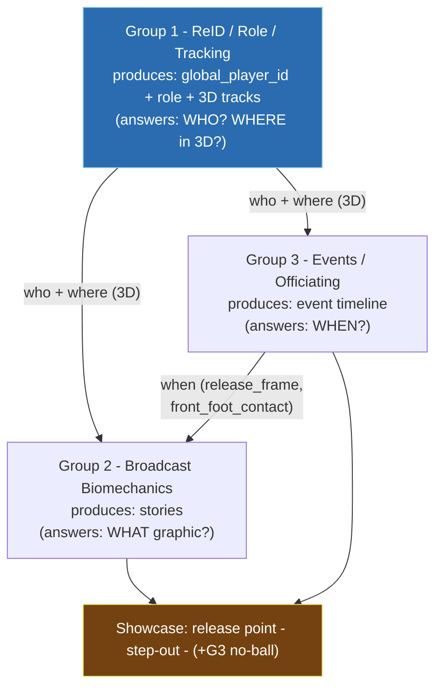
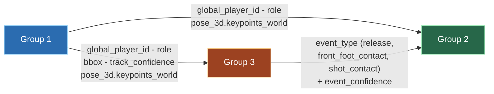
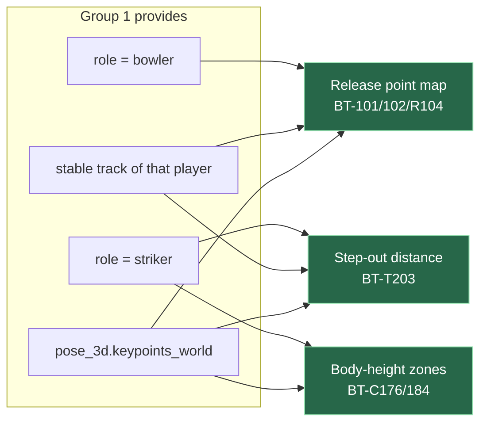
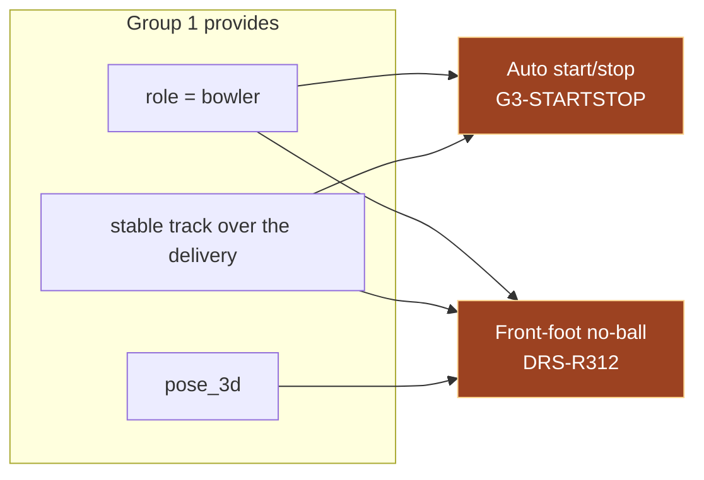
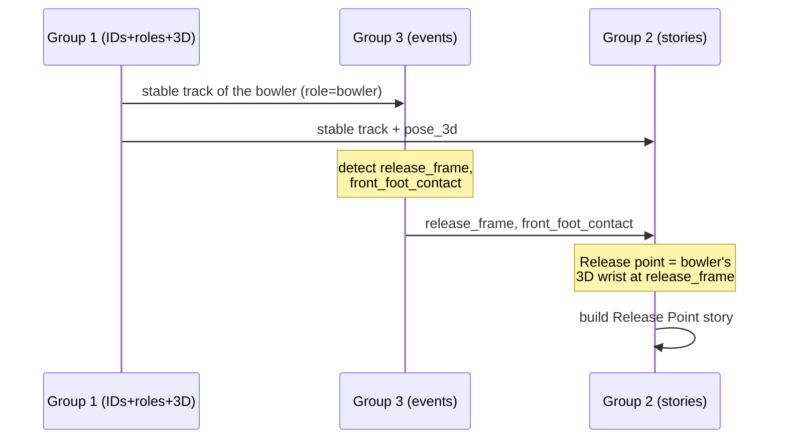
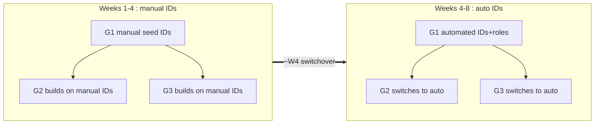
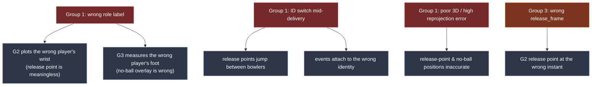
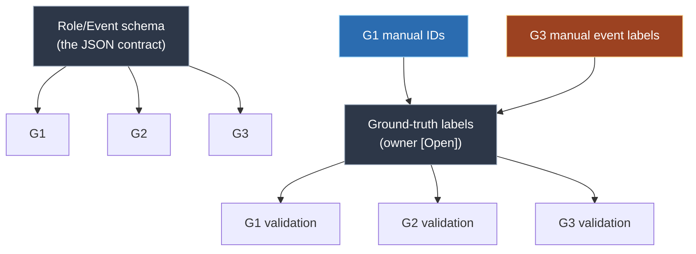
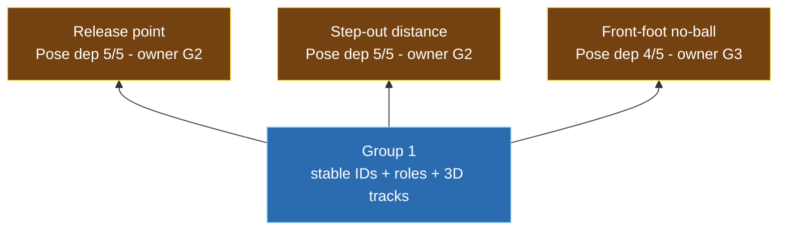

# 09 - Cross-Group Dependencies

How the three groups' work interlocks: the dependency chain, the exact fields that flow
across each edge, what breaks downstream when something upstream is wrong, the manual-ID
bridge, the critical path, and the interface contracts to agree at the meeting.

Documented edges are cited to the source spreadsheets; analysis (failure chains, scheduling,
"what breaks if wrong") is labelled inferred. See the
[sourcing convention](README.md#sourcing-and-citation).

---

## 1. The layered chain

| Layer | Group | Question it answers | Owns (schema) |
|-------|-------|---------------------|---------------|
| Foundation | G1 | Who? Where in 3D? | `global_player_id`, `role`, `bbox`, `track_confidence`, pose_3d association |
| Timing | G3 | When? | `event_type`, `event_confidence` |
| Story | G2 | What is the broadcast graphic? | `story_id`, `recommended_use` |

*Owner column from
[Role_Event_Label_Schema.xlsx](../00_Shared/Role_Event_Label_Schema.xlsx), "Role Event
Schema" sheet. The WHO/WHEN/WHAT framing is our summary (inferred).*

---

## 2. Field-level interface (what actually flows on each edge)

Every arrow above carries specific schema fields. This is the contract the groups must keep
stable.

| Edge | Fields carried | Producer -> Consumer | Source |
|------|----------------|---------------------|--------|
| G1 -> G3 | `global_player_id`, `role`, `bbox`, `track_confidence`, `pose_3d.keypoints_world` | G1 -> G3 | G3 inputs: *"Group 1 tracks"* - [Problem_Statement.xlsm](../03_Group_Event_Officiating_Explainers/Problem_Statement.xlsm), *Inputs* row; field owners - [Role_Event_Label_Schema.xlsx](../00_Shared/Role_Event_Label_Schema.xlsx) |
| G1 -> G2 | `global_player_id`, `role`, `pose_3d.keypoints_world` | G1 -> G2 | G2 inputs: *"Group 1 track IDs when available, controlled/manual IDs before Week 4"* - [Problem_Statement.xlsm](../02_Group_Broadcast_Biomechanics/Problem_Statement.xlsm), *Inputs* row |
| G3 -> G2 | `event_type` in {release, front_foot_contact, shot_contact}, `event_confidence` | G3 -> G2 | `event_*` owner = G3; `release_frame`/`front_foot_contact`/`shot_contact` shared G2/G3 - [Role_Event_Label_Schema.xlsx](../00_Shared/Role_Event_Label_Schema.xlsx); [Annotation_Guide.xlsx](../00_Shared/Annotation_Guide.xlsx) |

> **Inferred - not in the source files.** Which *specific* fields ride each edge (e.g. that
> Group 2 needs `pose_3d.keypoints_world` for the wrist, or that Group 3 passes
> `front_foot_contact`) is our reading of the documented inputs plus the schema; the sheets
> state "Group 1 tracks" / "event frames" rather than enumerating fields. Freezing this list
> is an interface-contract item (section 9).

---

## 3. Per-pair deep dive

### 3a. Group 1 -> Group 2 (identity, role, 3D pose)

| Group 2 story | Needs from Group 1 | Also needs |
|----------|---------------|-----------|
| Release point map (BT-101/102/R104) | `role=bowler` + stable track + 3D (wrist) | `release_frame` from G3 |
| Step-out distance (BT-T203) | `role=striker` + stable ankle track + 3D | stance/contact reference [Open] |
| Body-height zones (BT-C176/184) | correct batter's 3D skeleton | scoring metadata [Open] |

*Documented: G2 consumes "Group 1 track IDs" -
[Problem_Statement.xlsm](../02_Group_Broadcast_Biomechanics/Problem_Statement.xlsm), *Inputs*
row; story IDs - [Story_Readiness_Matrix.xlsm](../00_Shared/Story_Readiness_Matrix.xlsm).
Inferred: the specific keypoints (wrist/ankles) per story.*

### 3b. Group 1 -> Group 3 (identity, role, track)

| Group 3 output | Needs from Group 1 | Also needs |
|-----------|---------------|-----------|
| Auto start/stop (G3-STARTSTOP) | `role=bowler` + bowler's track + motion | manual event labels |
| Front-foot no-ball (DRS-R312) | `role=bowler` + stable track of the correct foot | crease calibration; explainer framing [Open] |
| Wide/run-out feasibility | tracks + roles | no frame-accurate ground truth |

*Documented: G3 consumes "Group 1 tracks" + "crease calibration" -
[Problem_Statement.xlsm](../03_Group_Event_Officiating_Explainers/Problem_Statement.xlsm),
*Inputs* row; outputs - same sheet, *Priority outputs* row.*

### 3c. The cross-handoff: Group 3 -> Group 2

This edge is easy to miss: Group 2's flagship release-point story also depends on Group 3's
event timing, not just on Group 1.

- `release_frame`, `front_foot_contact`, `shot_contact` are shared labels (schema owner =
  G2/G3), but the event timeline is Group 3's responsibility (`event_type`/`event_confidence`
  owner = G3). *Source:
  [Role_Event_Label_Schema.xlsx](../00_Shared/Role_Event_Label_Schema.xlsx);
  [Annotation_Guide.xlsx](../00_Shared/Annotation_Guide.xlsx).*
- Therefore the work should be sequenced **G1 -> G3 -> G2** for any release-timed story
  (inferred).

---

## 4. The cross-handoff Group 3 to Group 2

> **Inferred - not in the source files.** Because the release-point metric is "wrist at the
> release frame," and the release frame is a Group 3 event, Group 2 cannot finalise the
> release-point story until Group 3 supplies the frame. Sequence: Group 1 (who/where) -> > Group 3 (when) -> Group 2 (story). The dependency on both groups is documented; the
> sequencing recommendation is ours.

---

## 5. The manual-ID bridge

Before Group 1's automation is ready, Groups 2 and 3 run on Group 1's manual/controlled IDs.

| Phase | Weeks | G2 & G3 run on... | Group 1 delivers... |
|-------|:-----:|-----------------|-------------------|
| Bridge | W1-W4 | manual / controlled IDs | manual seeds, then automated v1 |
| Switchover | ~W4 | Group 1 automated IDs + roles | trustworthy auto output |
| Mature | W5-W8 | Group 1 validated output | validated + hardened |

*Documented: "controlled/manual IDs before Week 4" -
[Problem_Statement.xlsm](../02_Group_Broadcast_Biomechanics/Problem_Statement.xlsm), *Inputs*
row; "Manual seed labels first; automated output later" -
[Annotation_Guide.xlsx](../00_Shared/Annotation_Guide.xlsx), `global_player_id` row. The "~W4
switchover" framing is inferred from the "before Week 4" wording.*

This bridge is why all three groups can start in parallel: Group 1's Week-1 manual IDs
unblock the others while its automation matures.

---

## 6. Critical-path timeline (all three groups)

> **Inferred - not in the source files.** The Gantt schedules each group's documented W1-4
> experiments (their `Experiment_Log.xlsx`) plus the validation/handover weeks. Week numbers
> are documented per experiment; absolute dates are an [Open] item (see
> [01 - section 5](01_Programme_Overview.md#5-weekly-cadence)).

```mermaid
gantt
    title Cross-group timeline - handoffs marked crit
    dateFormat X
    axisFormat W%s

    section Group 1 (foundation)
    Manual-ID baseline           :done, a1, 0, 1
    Geometry association         :active, a2, 1, 1
    Stitching                    :a3, 2, 1
    R&D gate + auto handoff       :crit, a4, 3, 1
    Integrate + roles            :a5, 4, 1
    Validation                   :crit, a6, 5, 1
    Failure reduction + support  :a7, 6, 1
    Handover + showcase          :crit, a8, 7, 1

    section Group 3 (timing)
    Define event schema          :b1, 0, 1
    Manual label events          :b2, 1, 1
    Start/stop detector          :b3, 2, 1
    No-ball visual baseline      :b4, 3, 1
    Events to G2                 :crit, b5, 4, 1
    Validation                   :b6, 5, 1

    section Group 2 (stories)
    Pick clean clips             :c1, 0, 1
    Release point baseline       :c2, 1, 1
    Step-out + stance            :c3, 2, 1
    Body-zone prototype          :c4, 3, 1
    Consume G1 auto + G3 events  :crit, c5, 4, 1
    Validation                   :c6, 5, 1
```

Two handoff moments gate the showcase:
1. ~W4 - Group 1 -> all groups: automated IDs and roles become trustworthy.
2. ~W4-5 - Group 3 -> Group 2: event frames flow to G2.

If the first slips, the second slips, and the showcase stories slip with them.

---

## 7. Failure propagation (what breaks downstream)

> **Inferred - not in the source files.** This analysis follows from the field ownership
> (Group 1 owns `global_player_id` and `role`, referenced by every event and story), but the
> sheets do not spell out these chains.

| If upstream is wrong | Downstream effect | Why |
|----------------------|-------------------|-----|
| G1 role label wrong | G2 plots wrong wrist; G3 watches wrong foot | role selects the subject of every story/event |
| G1 ID switch | release points jump bowlers; events mis-attached | identity is the key all outputs join on |
| G1 weak 3D (reprojection) | release/no-ball positions inaccurate | stories measure 3D positions |
| G3 release_frame wrong | G2 release point at wrong instant | release point = wrist *at that frame* |

There is also a soft feedback edge (inferred): failure cases found by Groups 2 and 3 feed
Group 1's failure-case library and Week-7 fixes.

---

## 8. Shared infrastructure

Some dependencies are shared resources rather than direct outputs.

- **Schema** is the interface; keep JSON conformant or downstream parsers break. *Source:
  [Role_Event_Label_Schema.xlsx](../00_Shared/Role_Event_Label_Schema.xlsx).*
- **Ground truth** is shared and currently unowned. Group 1 manual IDs seed ID/role truth;
  Group 3 manual event labels seed event truth. *Documented: manual labels -
  [Annotation_Guide.xlsx](../00_Shared/Annotation_Guide.xlsx); the seeding relationship is
  inferred.*

> **Issue to discuss -** without a named ground-truth owner there is no Week-6 validation for
> any group. (source:
> [Open_Questions_and_TODOs.xlsm](../00_Shared/Open_Questions_and_TODOs.xlsm), *Ground truth
> availability* row.)

---

## 9. Group 1 and the showcase

| Showcase story | Owner | Pose dependency | Depends on Group 1 |
|----------------|-------|:---------------:|:------------------:|
| Release point | G2 | 5/5 | Yes |
| Step-out distance | G2 | 5/5 | Yes |
| Front-foot no-ball | G3 | 4/5 | Yes |

*Pose-dependency scores: [Story_Readiness_Matrix.xlsm](../00_Shared/Story_Readiness_Matrix.xlsm),
*Pose dep.* column; top-3 recommendation:
[Programme_Brief.xlsm](../00_Shared/Programme_Brief.xlsm), *Top showcase stories* row +
matrix *MGMT-TOP3* row. The "all depend on Group 1" conclusion is our analysis.*

---

## 10. Interface contracts to agree (feeds the meeting)

> **Inferred - recommendations for discussion.** These are the concrete agreements that make
> the dependencies above safe; bring them to the meeting (see
> [10_Meeting_Brief_And_Open_Questions.md](10_Meeting_Brief_And_Open_Questions.md)).

| Contract | Between | What to agree |
|----------|---------|---------------|
| JSON field set & format | G1 -> G2/G3 | Exact fields, file format, location (conform to the schema) |
| Auto-ID handoff date | G1 -> G2/G3 | Confirm the ~W4 switchover from manual to auto IDs |
| Event frame format | G3 -> G2 | How `release_frame` / `front_foot_contact` are passed and identified |
| Ground-truth plan | All <-> Mgmt | Owner, tooling, timeline (blocks Week-6 validation) |
| Validation targets | All <-> Mgmt | Numeric thresholds in each `Validation_Results.xlsx` |

---

## 11. Dependency cheat-sheet

| If Group 1... | Then Group 2... | Then Group 3... |
|-------------|---------------|---------------|
| ships manual IDs (W1) | can start release/stance baselines | can start labelling events |
| ships auto IDs+roles (~W4) | switches to auto; scales to many deliveries | runs start/stop on real tracks |
| has wrong role labels | plots wrong player's wrist | measures wrong player's foot |
| has ID switches | release points jump between bowlers | events attach to wrong identity |
| improves reprojection/3D | release-point accuracy improves | no-ball foot position improves |
| slips past W4 | release-point story slips | no-ball explainer slips |

> **Inferred - not in the source files.** Summary of section 2-section 7.

Next: [10_Meeting_Brief_And_Open_Questions.md](10_Meeting_Brief_And_Open_Questions.md).
