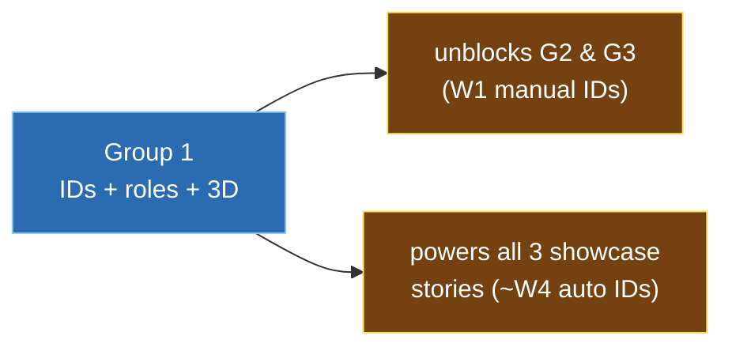
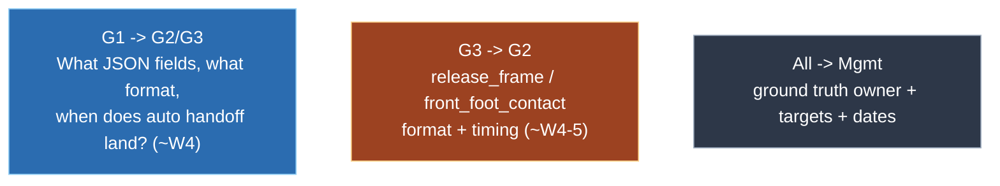

# 10 - Meeting Brief & Open Questions

The brief for the planning meeting. It consolidates every open decision ("MANAGEMENT INPUT
REQUIRED" / "TODO") from across the spreadsheets, with owners and severity, plus Group 1's
talking points and the cross-group interface contracts to agree.

Every row links to its source; see the [sourcing convention](README.md#sourcing-and-citation).

---

## Framing

Group 1 is the foundation and the critical path: each recommended top-3 showcase story -
release point, step-out distance, and front-foot no-ball - sits on Group 1's identity,
role, and 3D layer. The Week-1 manual IDs unblock the other groups; the ~Week-4 automated
IDs are the switchover deadline.

*Documented: top-3 - [Programme_Brief.xlsm](../00_Shared/Programme_Brief.xlsm), *Top showcase
stories* row; pose dependency - [Story_Readiness_Matrix.xlsm](../00_Shared/Story_Readiness_Matrix.xlsm).
The "critical path / Week-4 switchover" framing is our analysis - see
[09_Cross_Group_Dependencies.md](09_Cross_Group_Dependencies.md).*



---

## Open questions

Severity: High = blocks work; Med = blocks validation/showcase; Low = process.

| # | Area | Question | Owner | Severity | Affects | Source |
|---|------|----------|-------|:--------:|---------|--------|
| 1 | Schedule | Exact week-to-date mapping? Brief says 8 weeks (1 Jun-18 Jul) but Open-Qs calls 18 Jul "Week 6" | Simone | High | All | [Programme_Brief.xlsm](../00_Shared/Programme_Brief.xlsm) *Sprint* rows; [Open_Questions_and_TODOs.xlsm](../00_Shared/Open_Questions_and_TODOs.xlsm) *Sprint dates* |
| 2 | Dataset | DS-001 access, capture date, owner, Drive link | Harsh/Aafaq | High | All | [Data_Catalogue.xlsx](../00_Shared/Data_Catalogue.xlsx) DS-001; [Open_Questions_and_TODOs.xlsm](../00_Shared/Open_Questions_and_TODOs.xlsm) *Dataset access* |
| 3 | Ground truth | Who produces manual ID/role/event labels? | Harsh/Aafaq | High | All validation | [Open_Questions_and_TODOs.xlsm](../00_Shared/Open_Questions_and_TODOs.xlsm) *Ground truth* |
| 4 | G1 targets | Numeric targets: assoc. accuracy, ID-switches/delivery, role accuracy | Mgmt | Med | G1 | [01 Validation](../01_Group_ReID_Role_Tracking/Validation_Results.xlsx) |
| 5 | Blind set | Is DS-002 selected and labelled in time for W6? | Harsh/Aafaq | Med | All validation | [Data_Catalogue.xlsx](../00_Shared/Data_Catalogue.xlsx) DS-002 |
| 6 | R&D budget | Time on FMPose3D/SAM3D vs core ReID? | Harsh/Aafaq/Adam | Low | G1 | [Open_Questions_and_TODOs.xlsm](../00_Shared/Open_Questions_and_TODOs.xlsm) *FMPose3D/SAM3D scope* |
| 7 | Officiating framing | Explainer-only vs decision-support? (blocks no-ball/wide/run-out) | Mgmt | Med | G3 (showcase dependency) | [03 Problem](../03_Group_Event_Officiating_Explainers/Problem_Statement.xlsm) *Important constraint*; [Decision_Log.xlsm](../00_Shared/Decision_Log.xlsm) |
| 8 | Annotation defs | Confirm label definitions before annotation begins | Mgmt | Med | All | [Annotation_Guide.xlsx](../00_Shared/Annotation_Guide.xlsx) *management_confirmed_definitions* |
| 9 | Story targets (G2) | Release-point target, stance/contact reference for step-out | Mgmt | Low | G2 | [02 Validation](../02_Group_Broadcast_Biomechanics/Validation_Results.xlsx) |
| 10 | Headcount | Brief says G1=4 / G3=3 interns; only 3 / 2 named | Aafaq | Low | G1, G3 | [Programme_Brief.xlsm](../00_Shared/Programme_Brief.xlsm) *Intern* rows |
| 11 | OpenProject fields | Which custom fields (Group, Readiness, Demo/Data/GitHub link)? | Adam/Simone | Low | All | [Open_Questions_and_TODOs.xlsm](../00_Shared/Open_Questions_and_TODOs.xlsm) *OpenProject fields* |
| 12 | GitHub repo | Repository URL not yet provided | Aafaq | Low | All | [Programme_Brief.xlsm](../00_Shared/Programme_Brief.xlsm) *GitHub URL* |
| 13 | Scoring metadata | Available for the body-zone story? | Mgmt | Low | G2 | [02 Problem](../02_Group_Broadcast_Biomechanics/Problem_Statement.xlsm) *Inputs* |

---

## Already decided (do not reopen)

- New dataset will be provided (prior-year = reference only).
- Camera rig: 6-7 calibrated/stabilised/synchronised, tight DRS only.
- No player tracker exists; Group 1 builds it from detections.
- Stable anonymous IDs are sufficient (names later).
- JSON/overlays first; Unreal later.
- GitHub PRs linked to OpenProject; Harsh reviews approach, Aafaq assists.

*Source: [Decision_Log.xlsm](../00_Shared/Decision_Log.xlsm), "Decision Log" sheet (2026-06-08 rows).*

---

## Group 1 talking points

1. Group 1 is on the critical path. The ~W4 automated IDs gate G2's release point and G3's
   no-ball. Sequence work G1 -> G3 -> G2 (see [09](09_Cross_Group_Dependencies.md)).
2. Ground truth is needed and must be owned (Q3). Without manual labels there is no Week-6
   validation for any group. Group 1 can seed ID/role truth from the Week-1 manual IDs, but
   someone must own the full labelling effort.
3. Numeric targets are needed (Q4). Provide thresholds for association accuracy,
   ID-switches/delivery, and role accuracy.
4. Geometry-first is the plan. Similar kits make appearance ReID weak, so we rely on
   epipolar/triangulation. R&D (FMPose3D/SAM3D) stays bounded (Q6) unless it clearly beats
   geometry at the W4 gate.
5. The manual-ID bridge protects everyone. Group 1 ships manual IDs in W1 so G2/G3 start
   immediately, then switches them to automated IDs at ~W4.
6. Confirm the dataset (Q2). The W1 baseline cannot start without DS-001 access.

---

## Cross-group items to settle

The interface contracts are detailed in
[09 - section 10](09_Cross_Group_Dependencies.md#10-interface-contracts-to-agree-feeds-the-meeting).



| Item | From -> To | Decision needed |
|------|-----------|-----------------|
| JSON interface freeze | G1 -> G2/G3 | Confirm fields match the schema; agree file format and location |
| Auto-ID handoff date | G1 -> G2/G3 | Confirm ~W4 switchover |
| Event format | G3 -> G2 | How `release_frame`/`front_foot_contact` are passed |
| Ground-truth plan | All -> Mgmt | Owner, tooling, timeline |
| Targets and dates | All -> Mgmt | Q1, Q4, Q9 |

---

## Suggested agenda (60 min)

> **Inferred - a proposed agenda, not from a source file.**

| Time | Item | Output |
|------|------|--------|
| 0-10 | Confirm dates, dataset access, headcount (Q1, Q2, Q10) | calendar + DS-001 link |
| 10-20 | Ground-truth ownership + annotation defs (Q3, Q8) | named owner + start date |
| 20-30 | Set validation targets for all groups (Q4, Q9) | numbers in each Validation sheet |
| 30-40 | Freeze JSON interface + handoff dates (G1 -> G2/G3, G3 -> G2) | agreed schema + W4 handoff |
| 40-50 | Officiating framing decision (Q7) | explainer-only confirmed (or not) |
| 50-60 | R&D budget (Q6), OpenProject fields (Q11), GitHub (Q12) | time-box + repo URL |

---

## Decisions to leave with

```
[ ] Week-to-date calendar fixed (incl. W4 mid-demo, W6 validation, W8 showcase)
[ ] DS-001 accessible to Group 1
[ ] Ground-truth owner named + start date
[ ] Numeric validation targets set for G1 (assoc., ID-switch, role)
[ ] JSON interface frozen; auto-ID handoff date = ~W4
[ ] G3 -> G2 event handoff format agreed
[ ] Officiating explainer-only framing confirmed
[ ] R&D time-box for FMPose3D/SAM3D agreed
[ ] GitHub repo URL shared; OpenProject custom fields chosen
```

---

## Appendix - where each open item is recorded

| Item | File |
|------|------|
| Dates, dataset, allocation, framing, GT, R&D, OP fields | [Open_Questions_and_TODOs.xlsm](../00_Shared/Open_Questions_and_TODOs.xlsm) |
| Officiating framing TODO | [Decision_Log.xlsm](../00_Shared/Decision_Log.xlsm) |
| G1 targets | [Validation_Results.xlsx](../01_Group_ReID_Role_Tracking/Validation_Results.xlsx) |
| G2 targets / metadata | [02 Validation](../02_Group_Broadcast_Biomechanics/Validation_Results.xlsx) - [02 Problem](../02_Group_Broadcast_Biomechanics/Problem_Statement.xlsm) |
| G3 framing / examples | [03 Problem](../03_Group_Event_Officiating_Explainers/Problem_Statement.xlsm) |
| Annotation sign-off | [Annotation_Guide.xlsx](../00_Shared/Annotation_Guide.xlsx) |
| Top-3 confirmation | [Story_Readiness_Matrix.xlsm](../00_Shared/Story_Readiness_Matrix.xlsm) |
| Dataset details | [Data_Catalogue.xlsx](../00_Shared/Data_Catalogue.xlsx) |

Back to [README.md](README.md).
