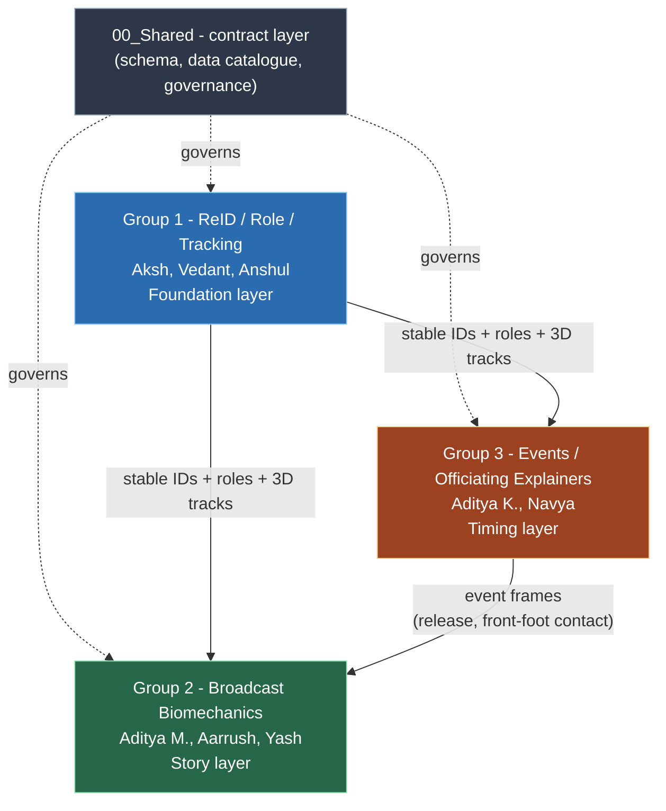

# Cricket Pose Stories Sprint - Working Documentation

A structured breakdown of the 8-week sprint: the programme, the shared data contract, each
group's problem/architecture and week-by-week plan, how the groups depend on one another,
and the open questions for the planning meeting.

These documents summarise and visualise the source spreadsheets in `00_Shared/`,
`01_Group_ReID_Role_Tracking/`, `02_Group_Broadcast_Biomechanics/`, and
`03_Group_Event_Officiating_Explainers/`. Where a figure is disputed, the spreadsheet takes
precedence. Every factual claim links to its source (see
[Sourcing and citation](#sourcing-and-citation)).

---

## How to use this folder

| # | Document | Section |
|---|----------|---------|
| 00 | [README.md](README.md) | Orientation, glossary, sourcing convention |
| 01 | [01_Programme_Overview.md](01_Programme_Overview.md) | **Programme overview** |
| 02 | [02_Shared_Contract_And_Schema.md](02_Shared_Contract_And_Schema.md) | **Shared contract & schema** |
| 03 | [03_Group1_Problem_And_Architecture.md](03_Group1_Problem_And_Architecture.md) | **Problem & architecture** - Group 1 (ReID/Role/Tracking) |
| 04 | [04_Group2_Problem_And_Architecture.md](04_Group2_Problem_And_Architecture.md) | **Problem & architecture** - Group 2 (Broadcast Biomechanics) |
| 05 | [05_Group3_Problem_And_Architecture.md](05_Group3_Problem_And_Architecture.md) | **Problem & architecture** - Group 3 (Events/Officiating) |
| 06 | [06_Group1_Week_By_Week_Plan.md](06_Group1_Week_By_Week_Plan.md) | **Week-by-week** - Group 1 |
| 07 | [07_Group2_Week_By_Week_Plan.md](07_Group2_Week_By_Week_Plan.md) | **Week-by-week** - Group 2 |
| 08 | [08_Group3_Week_By_Week_Plan.md](08_Group3_Week_By_Week_Plan.md) | **Week-by-week** - Group 3 |
| 09 | [09_Cross_Group_Dependencies.md](09_Cross_Group_Dependencies.md) | **Cross-group dependencies** (how each group's work affects the others) |
| 10 | [10_Meeting_Brief_And_Open_Questions.md](10_Meeting_Brief_And_Open_Questions.md) | **Meeting brief & open questions** |

For meeting preparation, read 09 and 10. For one group's full picture, read its
architecture doc (03/04/05) then its weekly plan (06/07/08).

---

## Programme structure

Group 1 establishes who each person is and where they are in 3D; Group 3 determines when the
key moments occur; Group 2 turns that into broadcast stories. A delay in Group 1 propagates
to both other groups (detail in
[09_Cross_Group_Dependencies.md](09_Cross_Group_Dependencies.md)).

*Source: [Programme_Brief.xlsm](../00_Shared/Programme_Brief.xlsm), "Programme Brief" sheet
(*Objective*, *Intern structure* rows); field flow -
[Role_Event_Label_Schema.xlsx](../00_Shared/Role_Event_Label_Schema.xlsx).*

---

## Mission summary

Build on Harsh's existing calibrated multi-camera pose foundation and, over 8 weeks:
Group 1 builds an identity/role/tracking layer from raw detections; Group 2 turns trusted
pose into broadcast story prototypes; Group 3 detects delivery events and prototypes
officiating-style explainers. Output policy: JSON payloads and demo overlays first; Unreal
visualisation later. *Source:
[Programme_Brief.xlsm](../00_Shared/Programme_Brief.xlsm), *Objective* and *Output target*
rows.*

---

## Sourcing and citation

This documentation is written to be verifiable against the source spreadsheets, so claims
can be checked rather than trusted.

- **Citation format.** Because the sources are binary spreadsheets (no deep links), a
  citation is a relative link to the file plus the sheet and row named in text - for example:
  *(source: [Programme_Brief.xlsm](../00_Shared/Programme_Brief.xlsm), "Programme Brief"
  sheet, Camera setup row)*. Verbatim text is shown in quotes.
- **Documented vs inferred.** Anything taken from a sheet is cited. Anything we added -
  proposed pipelines, computation methods, the Week 5-8 plans, failure analyses, schedules -
  is placed under an explicit **"Inferred - not in the source files"** note. Inferred content
  is for the team to react to, not fact.
- **Issue flags.** Inconsistencies and gaps are marked inline with a blockquote beginning
  **"Issue to discuss -"** and a source link, and are consolidated in
  [10_Meeting_Brief_And_Open_Questions.md](10_Meeting_Brief_And_Open_Questions.md).

### Status tags

| Tag | Meaning |
|-----|---------|
| [Confirmed] | Decided or frozen in the source spreadsheets |
| [Documented] | Stated explicitly in an Experiment, Validation, or Problem sheet |
| [Inferred] | Reconstructed by us; confirm before relying on it |
| [Open] | Marked "MANAGEMENT INPUT REQUIRED" or "TODO"; needs a decision |

---

## Glossary

### Cricket terms
| Term | Meaning |
|------|---------|
| DRS | Decision Review System. Here it denotes the tight camera views around the wicket (~10-15 yard radius). |
| Crease | The painted lines at each end of the pitch. The popping crease governs front-foot no-balls and run-out/stumping safety. |
| Wicket / stumps | The three vertical sticks plus two bails at each end. |
| Bails | The two crosspieces resting on the stumps; must be dislodged for a run-out, stumping, or bowled. |
| Striker / non-striker | The batter facing the current ball / the batter at the bowler's end. |
| Wicketkeeper | Fielder positioned directly behind the striker's stumps. |
| Run-up / delivery stride | The bowler's approach run / the final stride before release. |
| Release (point/frame) | The instant and 3D position at which the ball leaves the bowler's hand. |
| Front-foot contact | The frame the bowler's front foot lands; the reference for a no-ball. |
| Step-out distance | How far a batter advances down the pitch from their stance. |
| No-ball | Illegal delivery; here specifically front-foot over the crease. |
| Wide | Delivery too far from the batter to be played normally. |

### Computer-vision terms
| Term | Meaning |
|------|---------|
| Pose estimation | Detecting human body joints (keypoints) from images. |
| Keypoints (COCO-17) | The 17 standard body joints (nose, shoulders, elbows, wrists, hips, knees, ankles, etc.). |
| RTMPose | The real-time 2D pose model used as the baseline detector. |
| Confidence | A 0-1 score per keypoint indicating reliability. |
| Detection / bbox | A person found in a frame / their bounding box `[x, y, w, h]`. |
| ReID (re-identification) | Recognising that a person in camera A is the same person in camera B or at a later time. |
| Track / tracklet | A sequence of detections of one person over time / a short, certain segment of a track. |
| ID switch | A failure where two identities are swapped. |
| Global player ID | A stable anonymous label (P001, P002, ...) attached to one person across all cameras and time. |
| Calibration (intrinsic/extrinsic) | A camera's internal optics / its position and orientation in the world. Required for 3D. |
| Epipolar geometry | The rule that a point in one calibrated camera lies along a known line in another. Used for cross-camera matching. |
| Triangulation | Combining the same 2D point from two or more calibrated cameras to compute its 3D position. |
| Reprojection error | The pixel distance between a 3D point projected back into a camera and the original 2D detection. |
| Ground plane | The pitch surface; projecting feet onto it aids association and localisation. |
| Temporal smoothing | Reducing frame-to-frame jitter using neighbouring frames (moving average, Kalman, Savitzky-Golay). |
| Tracklet stitching | Joining short tracklets across gaps and occlusions into one continuous track. |
| Role prior | Prior knowledge that constrains role assignment (e.g. one bowler; the keeper stands behind the stumps). |

### Process terms
| Term | Meaning |
|------|---------|
| The contract / schema | [Role_Event_Label_Schema](../00_Shared/Role_Event_Label_Schema.xlsx) - the shared field definitions all groups read and write. |
| Ground truth | Hand-labelled correct answers used to measure accuracy. |
| Blind validation subset | A hidden dataset (DS-002) withheld until validation week. |
| Recommended use | A story's trust level: research, internal_demo, replay_prototype, live_candidate, or parked. |
| Manual-ID bridge | Using hand-assigned IDs early so Groups 2 and 3 are not blocked while Group 1 automation matures. |

<!-- Created by Aksh Shah -->
