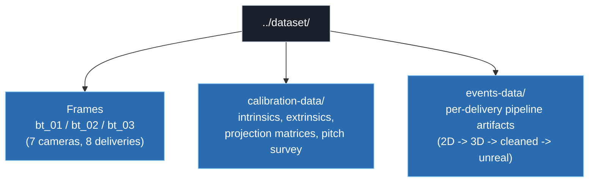
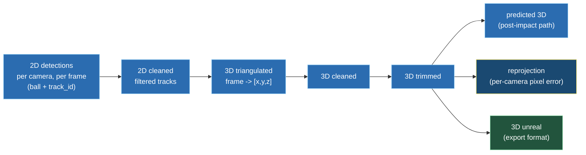
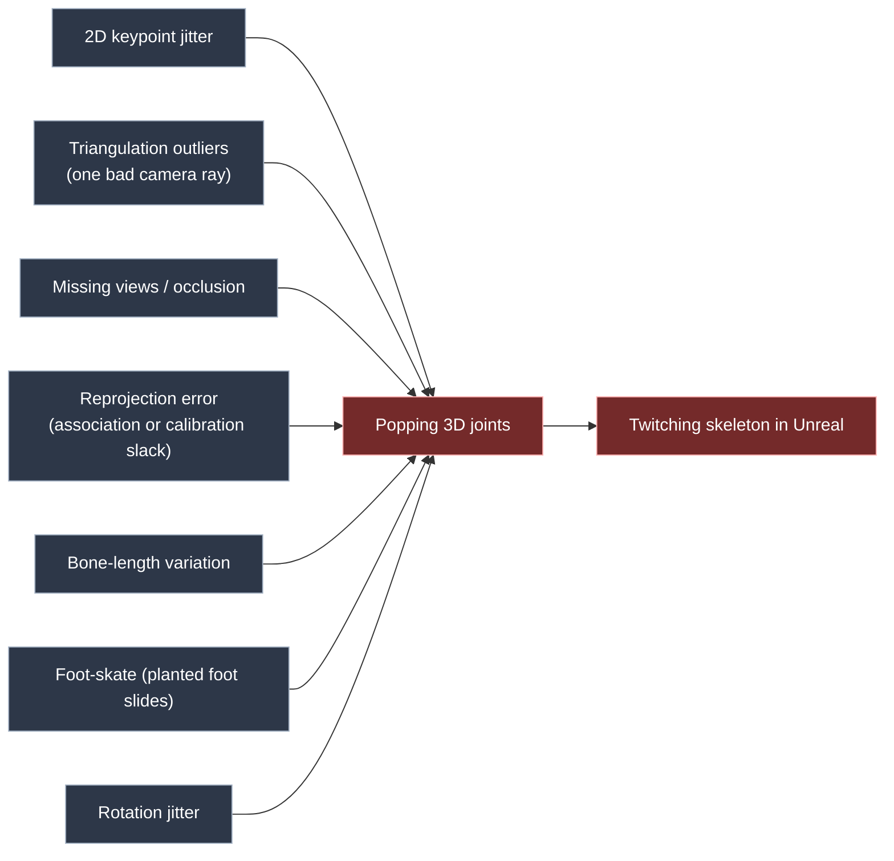
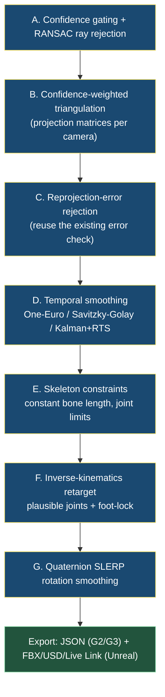
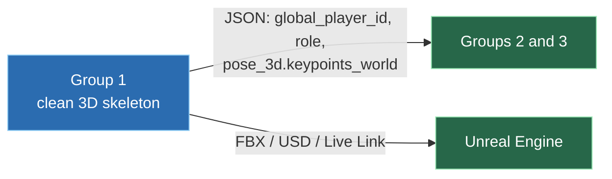

# Group 1: ReID, Role, Multi-Camera Tracking and Clean 3D Pose

Strategy and R&D plan for the 2026 cycle.
Group 1 lead: Aksh (with Vedant and Anshul).
Audience: founders and programme management.

---

## 1. Summary

Group 1 is the foundation layer. It answers who each player is (a stable anonymous ID), what
role they hold (bowler, striker, and so on), and where they are in 3D. Groups 2 and 3 build
every story and every officiating explainer on top of this layer, so its quality sets the
ceiling for the whole programme.
*Source: [`../docs/03_Group1_Problem_And_Architecture.md`](../docs/03_Group1_Problem_And_Architecture.md) §1;
[`../docs/09_Cross_Group_Dependencies.md`](../docs/09_Cross_Group_Dependencies.md) §1.*

The hard part of that mandate is producing a 3D skeleton clean enough to render smoothly. Raw
multi-view triangulation jitters: one noisy 2D keypoint, one missing camera view, or one
triangulation outlier makes a 3D joint pop between frames. That hurts twice. Group 2 reads its
metrics off 3D joint positions, and the final graphic is rendered in Unreal Engine, where any
jitter shows as a twitching limb.

We already hold a strong head start. The data in [`../dataset/`](../dataset/) is a working,
7-camera, calibrated ball-tracking pipeline for DRS. It detects a target in each camera,
triangulates it to 3D, cleans and trims the 3D track, predicts and reprojects it, then exports
a 3D file for Unreal (§3). That is exactly the pipeline shape Group 1 needs. The job is to
extend it from a single ball point to multiple human players and their joints, and to keep the
3D smooth enough for Unreal.

The approach is geometry first: detect and track people per camera, associate them across the
7 calibrated cameras, triangulate the joints, then remove noise in stages (confidence gating,
outlier rejection, temporal smoothing, skeleton constraints, inverse kinematics, rotation
smoothing) before exporting to both a JSON contract for Groups 2 and 3 and a rigged animation
for Unreal (§7, §8).

---

## 2. Mandate and scope

The documented objective:

> *"Build a robust multi-camera association and tracking layer that assigns stable anonymous
> IDs and cricket role labels across calibrated, synchronised DRS camera views."*
> [`Problem_Statement.xlsm`](../01_Group_ReID_Role_Tracking/Problem_Statement.xlsm), *Objective* row.

Identity is anonymous. Stable `P001`, `P002` IDs are enough; real names are linked later.
*Source: [`Programme_Brief.xlsm`](../00_Shared/Programme_Brief.xlsm), ID requirement row;
[`Decision_Log.xlsm`](../00_Shared/Decision_Log.xlsm), "Use stable anonymous IDs" (2026-06-08).*

Group 1 owns the 3D. Triangulated `pose_3d.keypoints_world` is a Group 1 field in the schema,
consumed by Groups 2 and 3.
*Source: [`Role_Event_Label_Schema.xlsx`](../00_Shared/Role_Event_Label_Schema.xlsx);
[`../docs/09_Cross_Group_Dependencies.md`](../docs/09_Cross_Group_Dependencies.md) §2.*

In scope: stable anonymous IDs, role labels, cross-camera association, tracking, triangulated
and smoothed 3D pose, and export to both the Groups 2/3 JSON and an Unreal animation. Out of
scope: real-name linking, event timing (Group 3), and story metrics or graphics (Group 2).

---

## 3. Input data: `../dataset/`

The dataset is one cricket match recording (`CCPL080626`) captured by 7 calibrated, time
synchronised cameras (`C01` to `C07`), with a working DRS ball-tracking pipeline already run
over it. It has three parts.

### 3.1 Frames

The 7 cameras are split across three capture groups: `bt_01` (cameras 01, 04), `bt_02`
(cameras 02, 05, 07), `bt_03` (cameras 03, 06). Each group holds the same 8 deliveries
(`CCPL080626M1_1_14_1` to `_7`, plus `CCPL080626M2_1_12_1`). Each delivery is 600 JPG frames
per camera at 2560x1440, named by absolute frame number (for example
`frame_camera01_000212334.jpg`), which is how the cameras stay synchronised.
*(The `bt_*` grouping is read directly from the folder layout; that it denotes a capture or
processing batch is inferred.)*

### 3.2 Calibration data

In [`../dataset/calibration-data/CCPL080626/calibration_data/`](../dataset/calibration-data/CCPL080626/calibration_data/):

| File | Contents |
|---|---|
| `Bundle_Adjusted_intrinsics.json` | Per camera `camera_matrix`, distortion (zero here), focal length in mm. Focal lengths are long (about 27k to 43k px), i.e. tight telephoto broadcast lenses. |
| `Bundle_Adjusted_extrinsics.json` | Per camera 3D `camera_locations` and the 3x4 `projection_matrices`. |
| `camera_calibration_config.json` | Per camera world position, world rotation, sensor and focal parameters (7 cameras). |
| `pitch_calibration_config.json` | 3D world coordinates of pitch and crease landmark points. |
| `CPL08626_coord_aligned.csv` | Surveyed reference points in world coordinates (stump bases, pitch markers, laser line). |
| `crop_mech.json` | Per camera crop windows used to extract regions of interest from the full frame. |
| `reference_frames/Camera01..07.jpg` | One reference still per camera. |

The `projection_matrices` are the practical handle for cross-camera work: with a 3x4 matrix
per camera, a 3D world point projects to each image directly, and several 2D observations
back-project and triangulate to one 3D point. This is the "projection-matrix" route we want to
benchmark for player association and triangulation (§4).

### 3.3 Events data (the existing pipeline)

Each delivery folder under [`../dataset/events-data/`](../dataset/events-data/) holds the full
chain the current ball pipeline produces. This is the template Group 1 reuses and extends.

| Artifact (per delivery) | What it holds |
|---|---|
| `*_2D.json` | Per frame, per camera detections: normalised `coords`, `confidence_score`, `class_name` (currently `ball`), `track_id`, plus `selected_track_ids` (the chosen track per camera). |
| `*_2D_cleaned.json` | The filtered 2D tracks used downstream. |
| `*_3D.json` | Triangulated 3D positions, keyed by frame id to `[x, y, z]`. |
| `*_3D_cleaned.json`, `*_3D_trimmed.json` | Smoothed and trimmed 3D track. |
| `*_3D_unreal.json` | The 3D track in the coordinate and format Unreal ingests. |
| `*_predicted_3D.json` | Predicted continuation of the path (for the DRS "would it hit the stumps" question). |
| `*_reprojection.json`, `*_predicted_3D_reprojection.json` | The 3D reprojected back into each camera with the per-camera pixel `error` (for example about 4 px). |
| `*_speed.json` | Per-frame speed. |
| `*_EVENTS.json` | The DRS result: `release_frame` and `release_point`, `bounce_frame` and `bounce_point`, `impact_frame` and `impact_point`, `ball_speed`, `decision`, and the line/overlap percentages. |

Two points matter for Group 1:

1. The detections today are the ball only (`class_name` is always `ball`); there are no player
   detections yet. Producing per-camera player detection, pose, and tracking is precisely
   Group 1's job. *(That this dataset is the substrate for the player task is our reading of
   the mandate against the data; inferred.)*
2. The cleaning, reprojection-error, and Unreal-export stages already exist and work for one
   point. Extending them from a single ball point to many human joints per player is the core
   of our 3D pose and noise-removal work (§8).

---

## 4. Models

The 2D keypoint front-end feeds everything 3D. We select from the benchmarked models in
[`../docs/full.md`](../docs/full.md); those numbers are real and cited there. The fit column
is our reading for this setting (7 calibrated cameras, identical kits, frequent side-on
occlusion).

| Model | Native | Headline accuracy | Speed signal | Fit for this rig |
|---|---|---|---|---|
| RTMPose-m | 2D body | COCO AP 74.6 | TRT-FP16 2.29 ms | Balanced real-time top-down baseline |
| RTMPose-l | 2D body | COCO AP 75.8 | TRT-FP16 3.46 ms | More accuracy when latency allows |
| RTMO-l | 2D body, one-stage | body7 AP 74.8; CrowdPose Hard 65.3 | 141 FPS V100 | Cost does not grow with player count; strongest under occlusion |
| DWPose-l | 2D whole-body | Whole AP 66.5 | ONNX | Hands and feet help release-wrist and no-ball-foot detail |
| RTMW-l/x | 2D whole-body | Whole AP 70.1 / 70.2 | ONNX | Highest whole-body AP if hand and foot detail is needed |
| Sapiens family | dense whole-body (+depth) | up to Whole AP 74.4 | Heavy | Accuracy ceiling for offline analysis, not a real-time default |

*Metrics from [`../docs/full.md`](../docs/full.md). The fit column is ours (inferred). Final
model choice is an R&D outcome made on our own footage, not fixed here.*

Native-3D models are a secondary line. The programme records FMPose3D, SAM3D, FreeMocap, and
OpenSim as a bounded-R&D list in
[`../docs/03_Group1_Problem_And_Architecture.md`](../docs/03_Group1_Problem_And_Architecture.md) §10,
citing [`Problem_Statement.xlsm`](../01_Group_ReID_Role_Tracking/Problem_Statement.xlsm),
Approach row. That is the programme's list to re-validate, not a decision we have made.

### Tracking and association (R&D candidates to benchmark)

| Candidate | Where it fits | What we test |
|---|---|---|
| DeepSORT | Per-camera tracking | Appearance plus motion (Kalman) association under occlusion |
| PipeTrack | Per-camera tracking and association | Pipeline tracking behaviour on these DRS clips |
| Projection-matrix route | Cross-camera association | Using the calibrated `projection_matrices` (§3.2) for geometric consistency and triangulation, rather than relying on appearance |

---

## 5. Reference literature

We read last cycle's papers to understand prior attempts. Files are cited by their actual
filename in
[`../Archived_Documentation/Pose_estimation_papers/`](../Archived_Documentation/Pose_estimation_papers/);
any readable title is inferred, since the filename is the only ground truth. What we take from
each is a consideration pending our own benchmarking.

| File (ground truth) | Topic (inferred) | What we consider taking from it |
|---|---|---|
| `pose2sim.pdf` | Pose2Sim markerless multi-view kinematics | Confidence-weighted multi-view triangulation into a rig export |
| `Multi-view 3D ... figure skating.pdf` | Multi-view with spatial confidence | Confidence-weighted triangulation under fast sports motion (§8 Stage B) |
| `CoMotion.pdf` | Multi-person 3D motion (inferred) | Temporal coherence across players, fewer identity jumps |
| `Quaternions.pdf` | Quaternion rotation math | SLERP rotation smoothing without gimbal lock (§8 Stage G) |
| `PyRoki.pdf` | Kinematics / IK toolkit (inferred) | Inverse-kinematics retarget formulation (§8 Stage F) |
| `A COMPARATIVE STUDY OF HUMAN INVERSE KINEMATICS.pdf` | IK methods survey | Trade-offs across IK solvers |
| `2006.12075v1.pdf`, `1702.00186v1.pdf`, `2504.12186v1.pdf` | Multi-view / 3D HPE (IDs only) | To triage during the literature pass |

---

## 6. What exists today

From the data:

- A 7-camera calibration set (intrinsics, extrinsics, projection matrices, pitch survey) that
  Group 1 reuses unchanged for player triangulation (§3.2).
- A working 2D to 3D to cleaned to Unreal pipeline for a single tracked point, with a
  reprojection-error check (§3.3). This is our proven template.

From the programme plan, the documented Group 1 starting points are a manual-ID baseline and a
geometry-first cross-camera association step.
*Source: [`../docs/06_Group1_Week_By_Week_Plan.md`](../docs/06_Group1_Week_By_Week_Plan.md),
from [`Experiment_Log.xlsx`](../01_Group_ReID_Role_Tracking/Experiment_Log.xlsx).*

Last cycle (reference only): the [`../Archived_Documentation/`](../Archived_Documentation/) set
includes a separate BITS run-out clip with its own calibration and a 3D pose exported to BVH.
We study it to see what was attempted and where it jittered. We do not reuse it; our pipeline
is built fresh this cycle and targets Unreal, not the old BVH path.

---

## 7. Problems and noise sources

Documented association and tracking risks:

> *"Similar kits, occlusion, tight DRS views, side-on overlap, late entry/exit, lack of
> full-field context."*
> [`Problem_Statement.xlsm`](../01_Group_ReID_Role_Tracking/Problem_Statement.xlsm), Known risks row.

The 3D-specific noise sources that make a raw skeleton unrenderable:

Why it matters downstream: weak 3D and high reprojection error make Group 2 release-point and
Group 3 no-ball positions inaccurate.
*Source: [`../docs/09_Cross_Group_Dependencies.md`](../docs/09_Cross_Group_Dependencies.md) §7.*

---

## 8. Solution: 3D reconstruction, noise removal, and Unreal export

The goal is to turn noisy per-camera 2D keypoints into a smooth, plausible 3D skeleton that
exports cleanly to the Groups 2/3 JSON and to an Unreal animation. We do this as a staged
pipeline, where each stage removes one named noise source. The existing ball pipeline already
proves the spine of this (2D cleaned, 3D cleaned, 3D trimmed, reprojection, 3D unreal in §3.3);
we extend it from one point to a full skeleton.

Each stage maps to the noise it removes:

| Noise source (§7) | Removed by |
|---|---|
| 2D keypoint jitter | A (gating) and D (temporal filter) |
| Triangulation outliers | A (RANSAC) and C (reprojection rejection) |
| Missing views or occlusion gaps | B (weighted triangulation) and F (IK fills constrained joints) |
| Reprojection error | C |
| Bone-length variation | E |
| Foot-skate | F (foot-lock) |
| Rotation jitter | G (SLERP) |

*Stages are standard methods (RANSAC, weighted triangulation, One-Euro, Kalman/RTS, IK, SLERP)
assembled by us; inferred. Stage C reuses the reprojection-error signal already present in the
data (§3.3) and documented as a Group 1 validation metric in
[`Validation_Results.xlsx`](../01_Group_ReID_Role_Tracking/Validation_Results.xlsx).*

Temporal filter choice (Stage D) is an R&D trade-off:

| Filter | Strength | Cost |
|---|---|---|
| One-Euro | Low latency, adapts to speed | Lighter smoothing |
| Savitzky-Golay | Preserves sharp peaks (release) | Needs a window, adds lag |
| Kalman + RTS | Strong, model-based, fills gaps | RTS needs future frames (offline) |

Inverse-kinematics retarget (Stage F) is the step that turns cleaned joints into a constrained,
rig-ready skeleton and locks planted feet. Candidates to benchmark, with no winner pre-judged:

| Candidate | Note |
|---|---|
| HybrIK | Hybrid analytical and neural IK |
| NIKI | IK robust to occlusion and noise |
| KinePose | Kinematics-aware pose fitting |
| MANIKIN | Articulated manikin fitting |
| PLIKS | Inverse-kinematics body solver |
| OpenSim IK Tools | Biomechanics-grade IK on a defined skeleton |

Unreal needs bone rotations on a skeletal mesh, not raw points, which is why Stages E to G
exist: a constrained skeleton with smooth quaternion rotations, retargeted onto a
Unreal-compatible skeleton (skeleton asset or Control Rig, with Live Link for a real-time path).
*(Engine export specifics are our design; inferred and R&D.)*

---

## 9. Output contracts

One clean 3D source feeds two consumers.

| Consumer | Format | Payload | Source |
|---|---|---|---|
| Groups 2 and 3 | JSON | `global_player_id`, `role`, `bbox`, `track_confidence`, `pose_3d.keypoints_world` | [`../docs/09_Cross_Group_Dependencies.md`](../docs/09_Cross_Group_Dependencies.md) §2; [`Role_Event_Label_Schema.xlsx`](../00_Shared/Role_Event_Label_Schema.xlsx) |
| Unreal Engine | FBX / USD / Live Link | Rigged skeletal animation with smoothed bone rotations | inferred (our export), modelled on the existing `*_3D_unreal.json` |

Freezing the exact JSON field set and format is a documented interface item to agree at the
meeting: [`../docs/09_Cross_Group_Dependencies.md`](../docs/09_Cross_Group_Dependencies.md) §10.

---

## 10. Validation

| # | Metric | Definition | Target |
|---|---|---|---|
| 1 | Cross-camera association accuracy | percent correct vs manual labels | [Open], management input |
| 2 | ID switches per delivery | wrong identity switches | [Open] |
| 3 | Role classification accuracy | percent role labels correct | [Open] |
| 4 | Track completeness | percent frames with a continuous track | no target in sheet |
| 5 | Reprojection error | per-camera pixel error after triangulation (already produced per delivery, §3.3) | tighten vs current ball values |
| 6 | 3D smoothness (proposed) | per-joint frame-to-frame jerk; threshold for "Unreal-ready" | (R&D) set threshold |

*Metrics 1 to 5: [`Validation_Results.xlsx`](../01_Group_ReID_Role_Tracking/Validation_Results.xlsx);
targets 1 to 3 are flagged for management input. Metric 6 is our proposal to make "smooth
enough for Unreal" measurable; inferred.*

---

## 11. Open questions and R&D backlog

| Item | Type | Note |
|---|---|---|
| Ground-truth owner and tooling | [Open] | Blocks validation for all groups: [`Open_Questions_and_TODOs.xlsm`](../00_Shared/Open_Questions_and_TODOs.xlsm) |
| Validation numeric targets (1 to 3, 6) | [Open] | Needs management input |
| Player detection on this data | R&D | Current detections are ball only; player detection, pose, and tracking are to build (§3.3) |
| 2D model choice | R&D | Benchmark the `full.md` shortlist (§4) on our footage |
| Tracking and association | R&D | DeepSORT, PipeTrack, projection-matrix route (§4) |
| IK retarget solver | R&D | HybrIK, NIKI, KinePose, MANIKIN, PLIKS, OpenSim IK Tools (§8) |
| Temporal filter choice | R&D | One-Euro vs Savitzky-Golay vs Kalman+RTS (§8) |
| Unreal retarget path | R&D | Skeleton asset / Control Rig / Live Link (§8, §9) |

---

## Appendix: coverage of the founding questions

| Question | Answered in |
|---|---|
| What exactly is to be done | §1, §2, §3 |
| What models we shall use (`full.md`) | §4 |
| What papers we shall refer | §5 |
| What work has been done | §6 |
| What work is to be done | §3.3, §8, §11 |
| What problems we shall face | §7 |
| What solutions we propose | §8 |
| Noise removal to smooth 3D pose for Unreal | §8 |
