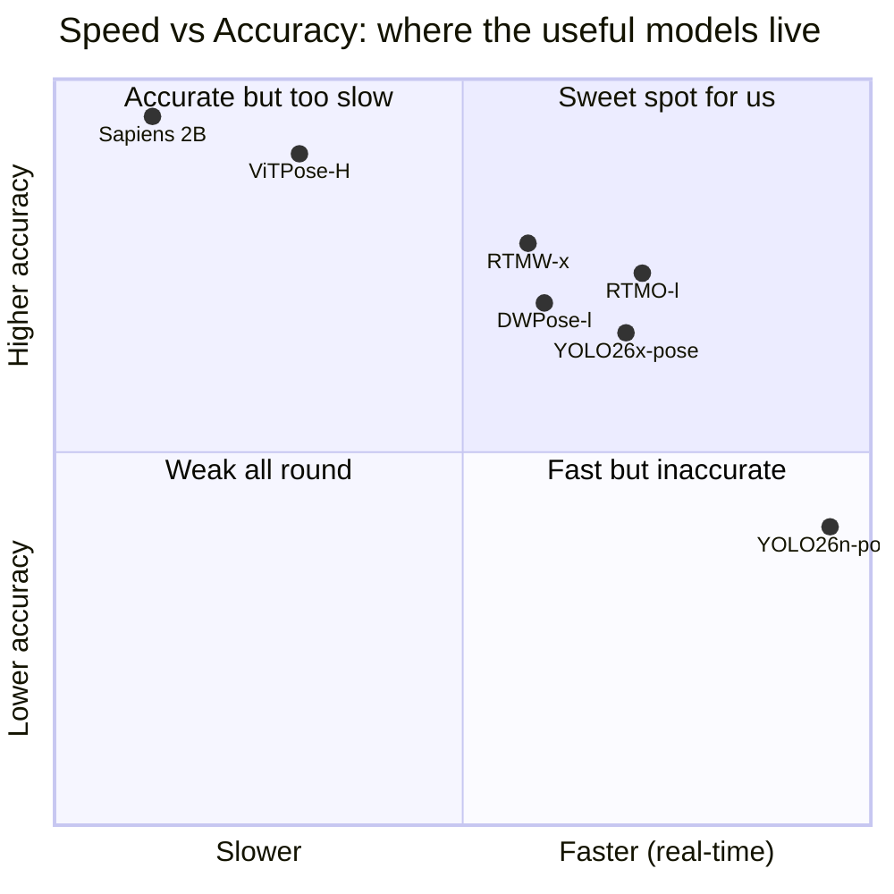
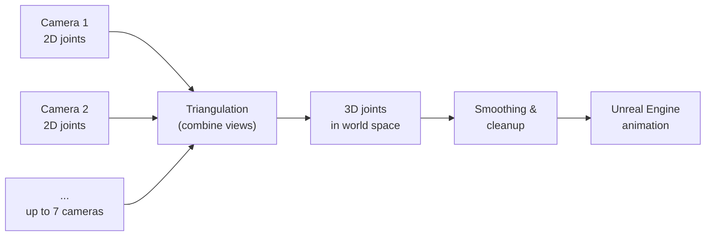

# Weeks 1 to 3: Research and Foundation

**Group 1, Quidich Innovation Labs internship.** This document explains what we did in
the first three weeks, why we did it, and how it sets up everything that follows.

---

## 1. The problem we were handed

The eventual goal of our group is **real-time 3D human pose estimation** for cricket
broadcast. A "pose" here means the positions of a person's body joints (shoulders,
elbows, knees, ankles, and so on). "3D pose" means those joints located in real-world
space, not just on a flat image.

Before we could build anything, we had to answer one question: **which pose-estimation
model should we even use?** There are dozens of them, released by Meta, Google,
academic labs, and the open-source community, and they disagree wildly on speed and
accuracy. Picking the wrong one would waste the rest of the internship.

### The key trade-off

Every pose model sits somewhere on a curve between two extremes:

- **Most accurate**: large models (for example Meta's Sapiens family) that produce
  beautiful, detailed skeletons but run far too slowly for live broadcast.
- **Fastest**: small models that run at hundreds of frames per second but miss joints,
  especially when players overlap or are partly hidden.

We do **not** want either extreme. For live cricket we want the **middle ground**: a
model fast enough for real-time use while still accurate enough that the final 3D
skeleton looks correct. That single insight shaped the whole survey.

> Note: the chart positions are an illustrative summary of the survey, not exact
> benchmark coordinates. The numbers behind them are in the tables below.

---

## 2. What we actually did

Two concrete deliverables came out of weeks 1 to 3:

1. **An audited research database** of every major pose model released after 2020,
   recording its accuracy and speed metrics with the source for each number.
2. **A benchmarking GitHub repository**: shared code and a fixed protocol so that any
   model we test later is measured the same way, on the same metrics, and the results
   are reproducible by the whole team.

The second point matters more than it sounds. Without a fixed protocol, two people
testing two models would produce numbers that cannot be compared. The repo makes every
future result trustworthy and directly comparable.

### How to read the metrics (plain-language glossary)

| Term | What it means | Why it matters |
| --- | --- | --- |
| **AP (AP50-95)** | Average Precision: how often predicted joints land close to the truth, averaged over strict-to-loose tolerances. Higher is better. | The standard accuracy score for 2D pose. |
| **MPJPE** | Mean Per Joint Position Error, in millimetres: average distance between a predicted 3D joint and its true location. Lower is better. | The standard accuracy score for 3D pose. |
| **FPS** | Frames per second the model can process. Higher is better. | Decides whether it can run live. |
| **Latency (ms)** | Time to process one frame. Lower is better. | The real-time constraint, frame by frame. |
| **Params / GFLOPs** | Model size and compute per frame. | Proxy for hardware cost and deployability. |

A recurring caveat we documented: numbers are only comparable when models are tested on
the **same dataset and hardware**. Much of our audit work was flagging where published
figures used different benchmarks (for example COCO-WholeBody's 133 keypoints versus
Sapiens v2's separate 308-keypoint test) and therefore must **not** be compared head to
head.

---

## 3. The survey: representative models

We catalogued 50+ model variants across two families: dense **whole-body** models (body
plus hands, feet, and face) and lighter **body-only** models (17 main joints). Below is
a condensed, verified slice. All figures are drawn from the full audited tables in
[full.md](full.md), each backed by an official paper, repo, or model card.

### Body-centric, real-time candidates

| Model | Accuracy (COCO AP) | Speed | Size | Why it is interesting |
| --- | --- | --- | --- | --- |
| **YOLO26x-pose** | 71.6 AP | ~82 FPS on T4 GPU (12.2 ms) | 57.6M params | Newest YOLO; easiest to deploy (ONNX/TensorRT/CoreML) |
| **RTMO-l** (one-stage) | 74.8 AP; CrowdPose-Hard 65.3 | 141 FPS on V100 | 44.8M params | Cost does not grow with number of players; strong under occlusion |
| **RTMPose-l** (top-down) | 75.8 AP | TensorRT-FP16 3.46 ms/crop | 27.7M params | Very fast per-person; mobile-friendly |
| **ViTPose-H** (transformer) | 79.1 AP | 241 FPS on A100 (batch 64) | 632M params | Accuracy ceiling for 2D body; heavy |

### Dense whole-body candidates

| Model | Accuracy (Whole-body AP) | Size | Why it is interesting |
| --- | --- | --- | --- |
| **DWPose-l** | 66.5 (384x288) | ~4.5M params | Trained to infer hidden joints; good under occlusion |
| **RTMW-x** | 70.2 (384x288) | mid-size | Best balance of whole-body detail and speed |
| **Sapiens-2B** | 74.4 | 2.16B params | Highest open whole-body accuracy; offline only |

The clearest takeaway: **dense whole-body models greatly improve suitability for cricket**
(they capture wrists at ball release, feet for no-ball calls), **but the strongest dense
models give up real-time speed** unless the pipeline is carefully staged.

---

## 4. From single camera to 3D: why we need many cameras

A single camera only sees a flat (2D) image, so it cannot know true depth. To recover
real 3D joint positions we use **several calibrated cameras** that all watch the same
player. When two or more cameras see the same joint, geometry lets us compute where that
joint really is in space. This step is called **triangulation**.

This is exactly why the cricket task uses **seven calibrated cameras**: more views mean
more robust 3D, even when some cameras have a player partly hidden.

---

## 5. Our recommendations going in

From the survey we produced a use-case-driven shortlist (full reasoning in
[Conclusions.md](Conclusions.md)). Different jobs call for different models:

| Use case | Recommended model | Reason |
| --- | --- | --- |
| **Balanced overall** | RTMW-x / RTMW-l | Whole-body detail plus practical speed; fits cricket biomechanics |
| **Heavy occlusion** | DWPose-l | Explicitly trained to infer hidden joints (bat, pads, gloves) |
| **Real-time, many players** | RTMO-l | One-stage, cost independent of player count, strong under crowding |
| **Fast first deployment (MVP)** | YOLO26x-pose | Quick to ship, broad export support, good enough accuracy |

That last row is the bridge to Week 4: when we got the real cricket data and needed a
**working pipeline fast**, we started with **YOLO26x-pose** as the minimum-viable
baseline, exactly as this table recommends. The rest is in
[02_week4_phase0_phase1.md](02_week4_phase0_phase1.md).

---

### Summary of weeks 1 to 3

- Framed the core trade-off: we need a **real-time-but-accurate middle-ground** model,
  not the fastest or the most accurate.
- Surveyed and **audited 50+ post-2020 pose models** with sourced speed and accuracy
  numbers.
- Built a **reproducible benchmarking repo** so all later work is comparable.
- Understood the **multi-camera triangulation** path from 2D to clean 3D.
- Produced a **use-case shortlist** that directly informed our Week 4 model choice.
