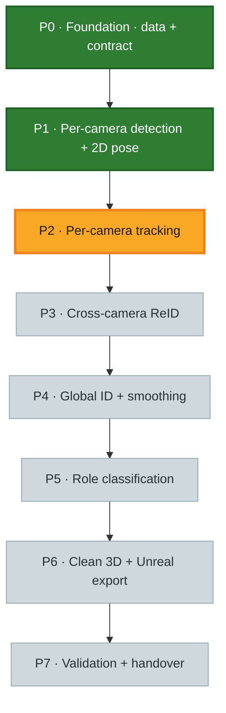
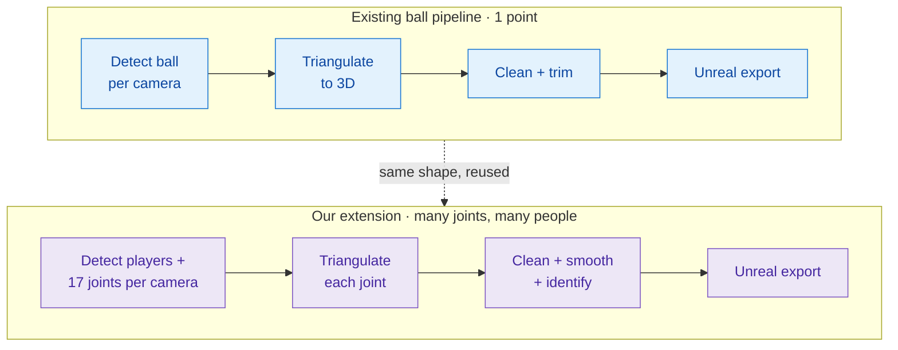
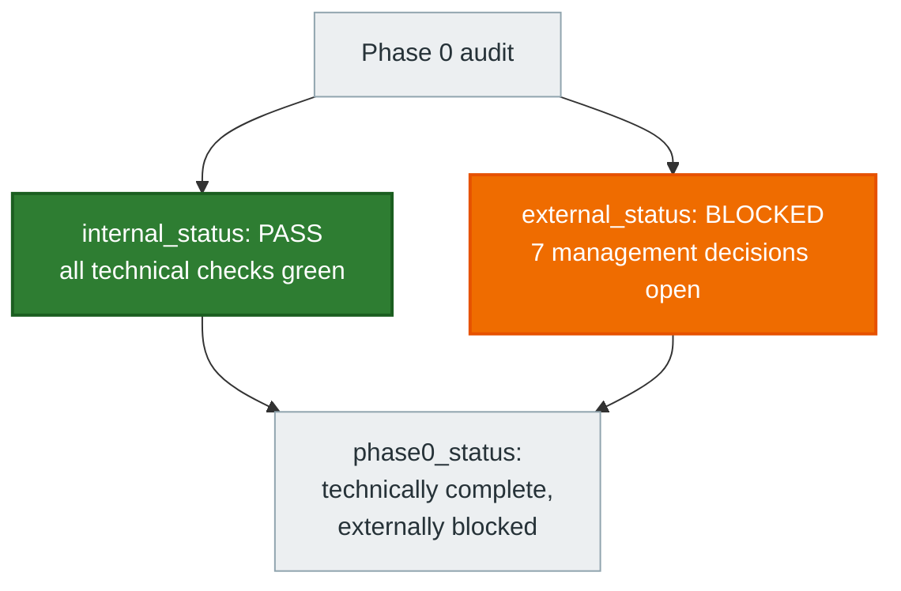
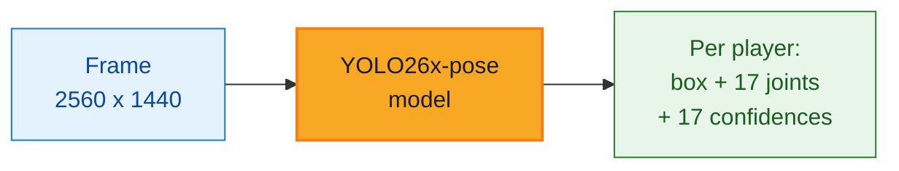
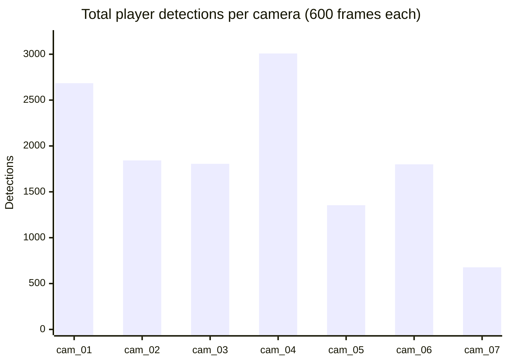
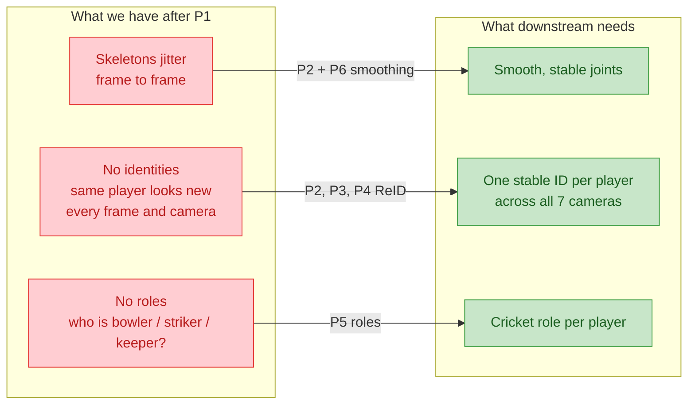

# Week 4: Phase 0 and Phase 1 (Work Completed)

**Group 1.** This is the work we built this week on the real cricket dataset. The
group's full task is split into seven phases (P0 to P7). This document covers the two we
finished, **Phase 0** (foundation) and **Phase 1** (per-camera perception).

---

## 1. The full picture first

Group 1 turns raw footage from seven cameras into one clean, identified 3D skeleton per
player that Unreal Engine can animate smoothly. That is a pipeline of seven stages. This
week we completed the first two.



Green = done this week. Yellow = next (Phase 2, covered in
[03_phase2_and_roadmap.md](03_phase2_and_roadmap.md)). Grey = later phases, presented by
teammates.

---

## 2. What we were given

A real, calibrated cricket capture, the same kind of rig Quidich already uses for DRS
ball-tracking:

| Item | Detail |
| --- | --- |
| **Cameras** | 7 synchronised, calibrated cameras (cam_01 to cam_07) |
| **Footage** | 1 delivery, 600 frames per camera, 4200 frames total |
| **Resolution** | 2560 x 1440 pixels per frame |
| **Calibration** | Bundle-adjusted intrinsics and extrinsics, projection matrices, pitch-plane config |
| **Existing pipeline** | A working ball-tracking chain: detect ball, triangulate to 3D, clean, export to Unreal |


**How the rig is set up (above):** the seven cameras (C1 to C7) ring the pitch and all
point inward at it. Each one is calibrated into a single **shared world coordinate
system** with a common origin (0,0,0) and X, Y, Z axes at the pitch. C4 looks straight
down the wicket and C1 from the opposite end; C2, C3, C5, C6 are the side-on views; C7 is
an angled side view. The two pitch ends are labelled NE and FE. This one shared coordinate
frame is exactly what lets a joint seen in several cameras be combined (triangulated) into
a single 3D point, and it is the geometry every later phase relies on.

The crucial observation: **the existing pipeline already does for one ball exactly the
shape of what we must do for many human joints.** Our job is to extend it from a single
point to full human skeletons.



---

## 3. Phase 0: Foundation Readiness

### Task
Before writing any model code, **prove the ground is solid**: that the data is complete
and synchronised, the calibration files actually load and work, and the output format we
hand to Groups 2 and 3 is agreed and frozen.

### Problem
If we skip this and assume the data is fine, a missing frame, a broken calibration file,
or a vague hand-off format surfaces weeks later as a confusing bug. It is much cheaper to
catch these up front, and to make any **management-level unknowns** (who owns the data,
what counts as "accurate enough") visible instead of buried in assumptions.

### How we solved it
We wrote an automated **readiness audit** (`scripts/phase0_audit.py`) that checks four
things and writes compact evidence files:

| Check | What it proves |
| --- | --- |
| **Dataset inventory** | All 7 cameras present, 600 frames each, frame IDs synchronised, correct 2560x1440 resolution |
| **Calibration** | Calibration files load, matrices are valid, surveyed points project correctly, existing ball reprojection is reproducible |
| **Events pipeline** | The existing ball artifact chain is present and its reprojection errors are summarised |
| **Output contract** | The JSON format we will deliver to Groups 2 and 3 is explicit and validates in code |

### Evidence and honest status
The audit produced a clear split between what is **technically done** and what is
**blocked on decisions that sit with management**:



The 7 open items are **decisions, not code gaps**, for example: who owns the validation
dataset, who produces the manual ground-truth labels, and what accuracy thresholds count
as "passing." We have surfaced and escalated these rather than guessing. This is an
intentionally honest status: the engineering side of Phase 0 is complete.

### The output contract (why it matters)
We froze the JSON each downstream group receives. Today the identity and 3D fields are
intentionally empty placeholders; later phases fill them in:

```jsonc
{
  "camera_id": "cam_01",
  "frame_index": 212334,
  "players": [{
    "bbox_xywh_px": [x, y, w, h],          // filled in Phase 1
    "pose_2d": { "keypoints_px": [...17], "confidence": [...17] },  // Phase 1
    "global_player_id": null,   // Phase 4 fills this
    "role": "unknown",          // Phase 5 fills this
    "pose_3d": null             // Phase 6 fills this
  }]
}
```

Freezing this contract now means Groups 2 and 3 can build against it in parallel, before
our later phases are finished.

---

## 4. Phase 1: Per-Camera Perception

### Task
For **every camera and every frame**, find each person (a bounding box) and estimate
their **2D pose**: 17 body joints with a confidence score for each.

Three terms, one line each:
- **Bounding box**: a rectangle around each detected person.
- **2D pose / 17 keypoints**: the on-image positions of 17 standard body joints (the
  "COCO-17" set: eyes, shoulders, elbows, wrists, hips, knees, ankles, and so on).
- **Confidence**: how sure the model is about each joint (used later to reject noise).



### Problem
The existing detector only finds the **ball**: every detection is labelled `ball`, with
no people, no joints, no tracking. Detecting multiple players and their joints, on tight
DRS crops at 4K-class resolution, is net-new work and the front-end that everything
downstream depends on.

### How we solved it
We stood up a per-camera person detector plus 2D pose using **YOLO26x-pose**, run over
the full delivery. We chose YOLO26x first deliberately, following our Week 1 to 3
shortlist: it is the **fastest path to a working baseline** (end-to-end detection plus
pose in one model, easy GPU deployment, broad export). It is our minimum-viable baseline,
not the final answer.

Run settings (for the technical audience): CUDA GPU, image size 640, batch 32,
half-precision (FP16), full-frame inference, NMS IoU 0.7, confidence 0.25.

### Evidence: what the run produced

Run `p1-yolo26x-CCPL080626M1_1_14_1`, all 7 cameras, 600 frames each:

| Metric | Value |
| --- | --- |
| **Frame records written** | 4,200 (600 x 7 cameras) |
| **Total player detections** | 13,170 |
| **End-to-end speed** | 16.6 FPS (including image decode and disk I/O) |
| **Median model inference** | 11.3 ms per frame (p95: 20.7 ms) |
| **Empty / failed frames** | 0 |
| **Status** | pass |

Detections per camera reflect how many players each view actually sees (the end-on
bowler and field cameras see the most; the tight side cam_07 sees the fewest):



Average players seen per frame ranged from **5.0** (cam_04, field view) down to **1.1**
(cam_07, tight view), which is consistent with the camera layout.

> On the 16.6 FPS figure: this is the offline batch run including disk reads, not the
> real-time ceiling. Pure model inference is ~11 ms (around 90 FPS). Live throughput is a
> later optimisation target; Phase 1's goal was correct per-frame perception, which it
> meets.

---

## 5. The honest gap (this motivates everything next)

Phase 1 detections are correct, but if you watch the rendered overlay video three
problems are obvious. These are exactly what Phases 2 to 7 exist to fix.



We demonstrate this gap with the **7-camera mosaic video** (see the demo section of
[00_presentation_script.md](00_presentation_script.md)). It shows all seven views in one
synchronised grid: detection works, but the skeletons flicker and carry no IDs. That is
the launch point for next week's Phase 2.

---

### Summary of Week 4

- **Phase 0 done**: automated readiness audit passes all technical checks; remaining
  items are escalated management decisions, not code gaps. Output contract frozen so
  Groups 2 and 3 can start in parallel.
- **Phase 1 done**: per-camera person detection plus 2D pose with YOLO26x-pose over a
  full delivery, **13,170 detections across 4,200 frames, 0 failures**, with a working
  visual QA pipeline (per-camera and mosaic videos).
- **Clear next step**: detections are correct but jittery, un-identified, and role-less.
  Phase 2 onward turns this into clean, identified, smooth 3D.
