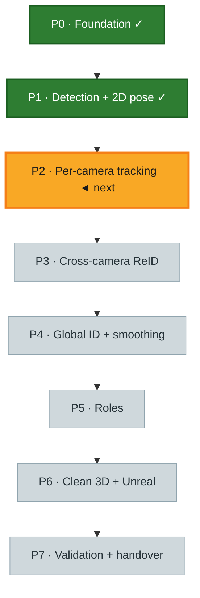
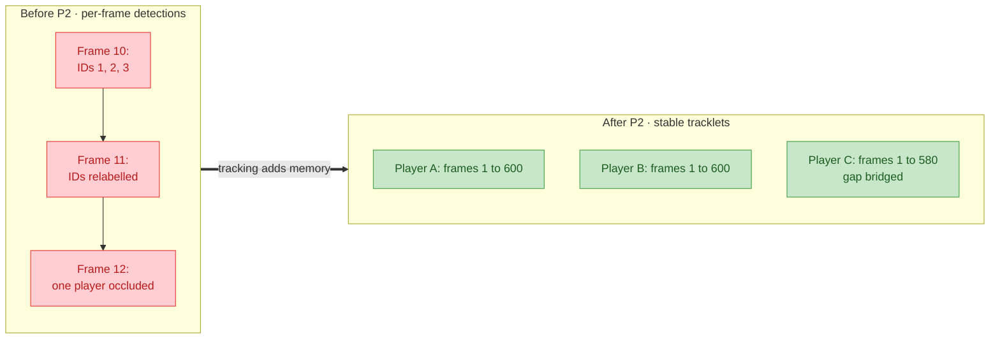
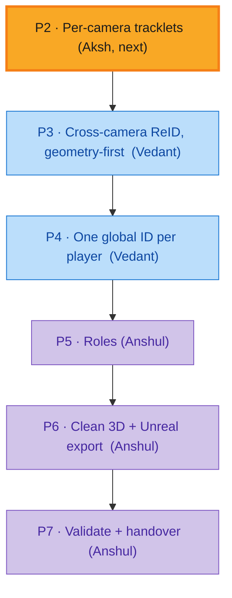
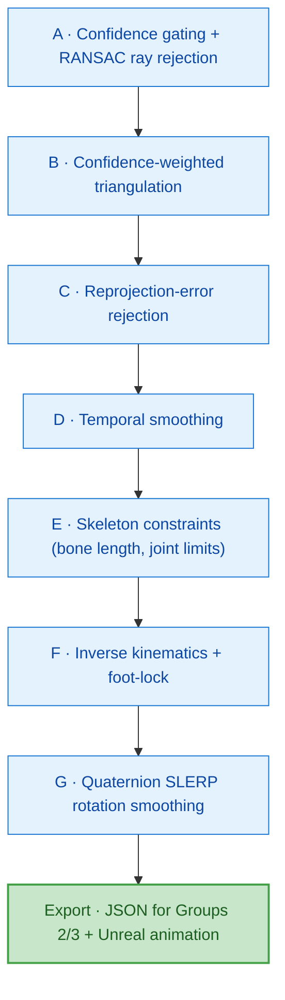

# Phase 2 and the Road Ahead

**Group 1.** This document covers **Phase 2**, our next week's work, in depth, then gives
a short roadmap of Phases 3 to 7. Phases 3 and 4 will be presented in detail by Vedant,
and Phases 5 to 7 by Anshul.

---

## 1. Where Phase 2 sits

Phase 1 gave us correct detections **per frame**, but with no memory: in each frame the
model finds people from scratch and has no idea that "person 3 in frame 10" is the same
human as "person 1 in frame 11." Phase 2 gives each camera that memory.

---

## 2. Phase 2: Per-Camera Tracking

### Task
Within a **single camera**, link a player's detections across time so the same person
keeps **one stable local track ID** through movement and brief occlusion. The output is a
set of per-camera "tracklets" (a tracklet = one person's continuous path through that
camera's frames).

### Problem
Detection alone has three failure modes that tracking must fix:

| Problem | What it looks like |
| --- | --- |
| **No memory** | IDs are reassigned every frame; the skeleton flickers |
| **Identical kits** | Same-team players look nearly identical, so appearance alone cannot tell them apart |
| **Occlusion** | A player briefly hidden (behind another player, or leaving frame) reappears as a brand-new ID |

### How we will solve it
Standard multi-object tracking, adapted to our footage. Each detection is matched to an
existing track using two signals:

1. **Motion**: a Kalman filter predicts where each tracked player should appear next; a
   detection near that prediction is likely the same person.
2. **Appearance**: an embedding (a compact visual fingerprint) helps confirm matches,
   though kits limit how much it can do on its own.
3. **Geometry prior**: the calibrated cameras let us use real-world motion plausibility
   to gate matches, which we add on top of standard trackers.

We will **benchmark** a few trackers (DeepSORT, ByteTrack / BoT-SORT class, and a
geometry-assisted variant) on our own data, using the same protocol as the rest of the
repo, and report:

- **ID switches per delivery within a camera** (lower is better): how often a single
  player wrongly changes ID.
- **Track completeness**: what fraction of a player's true path we successfully follow.

### Exit criteria
Stable per-camera tracklets for a full delivery, with intra-camera ID-switch and
completeness numbers recorded. This becomes the input to cross-camera ReID in Phase 3.

---

## 3. Roadmap: Phases 3 to 7 (brief)

Phase 2 produces stable tracks **inside each camera**. The remaining phases combine the
seven cameras, attach identities and roles, and produce smooth 3D for Unreal.

| Phase | In one sentence | Presented by |
| --- | --- | --- |
| **P3: Cross-camera ReID** | Match the same physical player across all 7 views using **geometry first** (since kits are identical), via triangulation/reprojection, epipolar lines, and a ground-plane foot test. | Vedant |
| **P4: Global ID + smoothing** | Collapse per-camera tracks and cross-camera matches into **one stable global ID per player** for the whole delivery, repairing ID switches and bridging occlusion. | Vedant |
| **P5: Roles** | Label each player with a cricket **role** (bowler, striker, non-striker, wicketkeeper, umpire, fielder) using pitch geometry and motion rules plus role priors (exactly 1 bowler, keeper behind the stumps, 2 batters). | Anshul |
| **P6: Clean 3D + Unreal** | Triangulate the joints into 3D and run a multi-stage cleanup so the skeleton is smooth enough to animate; export to the Groups 2/3 JSON and to Unreal Engine. | Anshul |
| **P7: Validation + handover** | Measure association accuracy, ID switches, and role accuracy on a blind dataset; deliver reports and the final handover. | Anshul |

**Why geometry first in P3 (the key idea):** because both teams wear near-identical kits,
appearance-based matching is unreliable. Instead we use the calibrated cameras: if a
player seen in camera A and a player seen in camera B triangulate to the **same point in
the real world** (and their feet land on the same spot on the pitch), they are the same
person. This reuses the exact reprojection check already proven in the ball pipeline.

---

## 4. The smoothness problem (Phase 6 preview)

The hardest part of the whole mandate is making the 3D skeleton **smooth enough for
Unreal**. Any jitter shows up as a twitching limb on broadcast. Multi-view triangulation
is inherently jittery: one noisy joint, one missing camera, or one bad ray makes a 3D
joint "pop" between frames.

Our answer is a staged cleanup pipeline. Each known noise source is removed by a specific
stage:

| Noise source | Removed by |
| --- | --- |
| 2D keypoint jitter | A. Confidence gating + D. Temporal smoothing |
| Triangulation outliers (one bad ray) | A. RANSAC ray rejection + C. Reprojection-error rejection |
| Missing views / occlusion | B. Confidence-weighted triangulation + F. IK fill |
| Reprojection error (calibration slack) | C. Reprojection-error rejection |
| Bone-length drift | E. Skeleton constraints (constant bone length) |
| Foot-skate (feet sliding) | F. Inverse kinematics + foot-lock |
| Rotation jitter | G. Quaternion SLERP rotation smoothing |

This is the payoff: raw, jittery, anonymous detections in, and one clean, identified,
smooth 3D skeleton out, ready for broadcast.

---

### Summary

- **Phase 2 (next week, ours):** per-camera tracking, turning per-frame detections into
  stable tracklets; benchmarked on ID switches and track completeness.
- **Phases 3 to 4 (Vedant):** geometry-first cross-camera ReID and one global ID per
  player.
- **Phases 5 to 7 (Anshul):** roles, clean 3D plus Unreal export, and validation.
- The unifying theme: **geometry from the 7 calibrated cameras** is how we both identify
  players and clean up the 3D, reusing the proven ball pipeline at every step.
