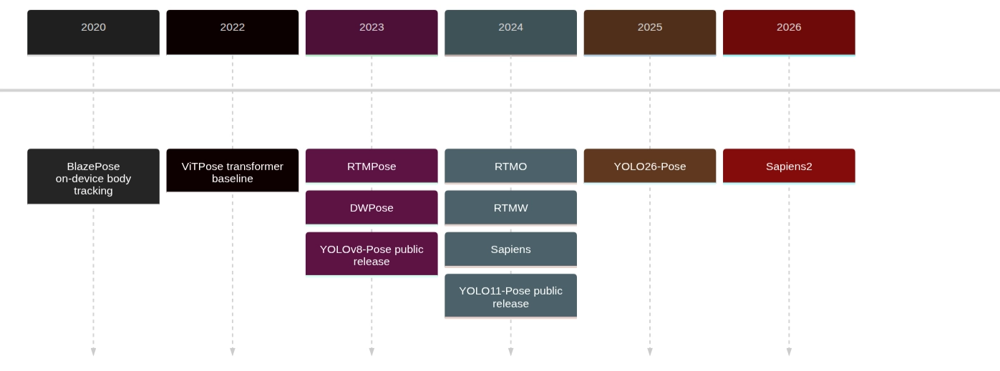
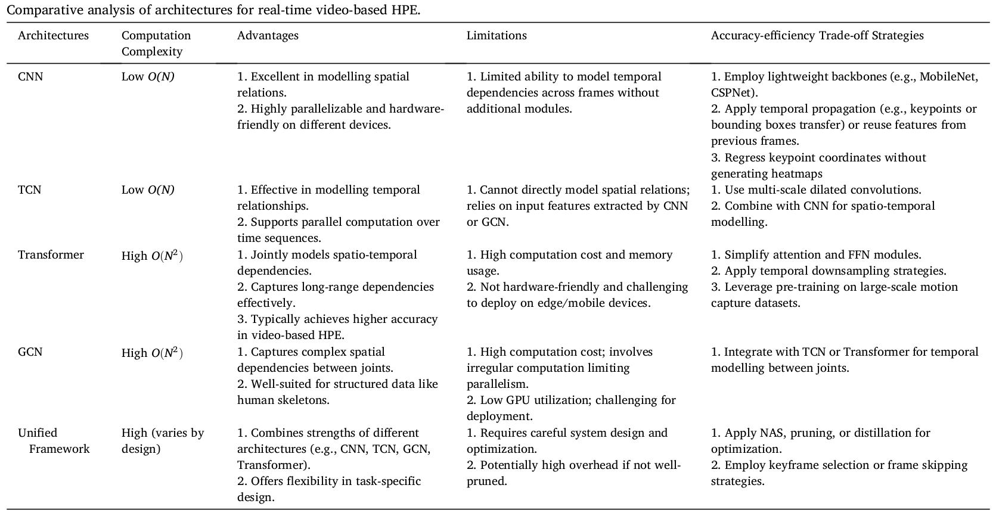

# Detailed Production-Centric Research of recent Models for Real-Time 2D & 3D HPE, HPT.

### HPE Models’ chronology; Relevant to this Report

---

# Important Terms used throughout the report: Meaning & Significance

| Term | Meaning | Significance / relative importance |
| --- | --- | --- |
| **Model / Variant** | The pose-estimation model name and specific version, size, or configuration. | Essential for comparison. Different variants can differ heavily in speed, accuracy, and deployment cost. |
| **2D / 3D native capability** | Whether the model directly predicts 2D keypoints, 3D joints, or needs extra lifting/post-processing. | Very important. Native 3D models are usually more useful for motion analysis, robotics, biomechanics, or AR, while 2D models are simpler and faster. |
| **Dataset(s) evaluated** | Benchmark datasets used to test the model, such as COCO, MPII, Human3.6M, etc. | Critical context. Metrics are only comparable when models are evaluated on the same dataset and protocol. |
| **AP50-95 / AP50 / AP75** | Average Precision metrics. AP50-95 averages performance across IoU/object-keypoint similarity thresholds; AP50 is easier; AP75 is stricter. | One of the most important accuracy measures for 2D pose estimation. AP50-95 is usually the most meaningful overall score. |
| **PCK** | Percentage of Correct Keypoints. Measures how many predicted joints fall within an acceptable distance from ground truth. | Important for pose accuracy, especially in older benchmarks. Easier to interpret than AP, but threshold choice matters. |
| **MPJPE** | Mean Per Joint Position Error, usually in millimeters. Measures average 3D joint error. | Core metric for 3D pose estimation. Lower is better. Very important when comparing 3D models. |
| **FPS on T4 / RTX3090-4090 / Apple Silicon / CPU** | Frames per second on different hardware platforms. | Very important for real-time use. A model may be accurate but unusable if FPS is too low on target hardware. |
| **Latency ms** | Time taken to process one frame or inference request, in milliseconds. | More important than FPS for real-time systems. Lower latency means faster response. |
| **Params** | Number of trainable model parameters, usually in millions. | Indicates model size. Fewer parameters usually mean easier deployment, but not always faster. |
| **GFLOPs** | Giga floating-point operations required for one forward pass. | Approximate compute cost. Useful for estimating speed and hardware requirements. |
| **Deployment formats** | Supported export/runtime formats such as PyTorch, ONNX, TensorRT, CoreML, TFLite, OpenVINO, etc. | Very important for practical use. Determines whether the model can run on web, mobile, GPU servers, Apple devices, or embedded hardware. |
| **Notes** | Extra caveats: input resolution, top-down/bottom-up method, multi-person support, training tricks, licensing, limitations. | Useful for avoiding unfair comparisons and deployment surprises. |
| **Sources** | Papers, GitHub repos, model cards, benchmark tables, or official docs used for the numbers. | Essential for trust and reproducibility. Metrics without sources are weak evidence. |

---

### Whole-body, foundation, and edge-relevant families

| Model / Variant | 2D / 3D native capability | Dataset(s) evaluated | AP50-95 / AP50 / AP75 | PCK | MPJPE | FPS on T4 / RTX3090-4090 / Apple Silicon / CPU | Latency ms | Params | GFLOPs | Deployment formats | Notes | Sources |
| --- | --- | --- | --- | --- | --- | --- | --- | --- | --- | --- | --- | --- |
| RTMW-m | 2D whole-body; monocular 3D explored in paper | Trained on Cocktail14; evaluated on COCO-WholeBody v1.0 val, 256×192 | Whole AP **58.2**; Whole AR 67.3 | NR | NR | NR | NR | NR | **4.3** (256×192) | PyTorch; **ONNX**; deployment-friendly claimed | Whole-body detail better than COCO-17 models; model-zoo row reports body/foot/face/hand sub-APs too. | [Paper](https://arxiv.org/abs/2407.08634), [MMPose algorithms](https://mmpose.readthedocs.io/en/latest/model_zoo_papers/algorithms.html), [RTMPose project](https://github.com/open-mmlab/mmpose/tree/main/projects/rtmpose) |
| RTMW-l | 2D whole-body; monocular 3D explored | Trained on Cocktail14; evaluated on COCO-WholeBody v1.0 val | 256×192: Whole AP **66.0**, Whole AR 74.6; 384×288: Whole AP **70.1**, Whole AR **78.0** | NR | NR | NR | NR | NR | **7.9** (256×192); **17.7** (384×288) | PyTorch; **ONNX**; deployment-friendly claimed | Human input accepted: use the project/model-zoo **70.1** value as the settled RTMW-l number. The paper abstract says **70.2** mAP, so keep that as a cited source conflict rather than replacing the model-zoo row. | [Paper](https://arxiv.org/abs/2407.08634), [MMPose algorithms](https://mmpose.readthedocs.io/en/latest/model_zoo_papers/algorithms.html), [Release](https://github.com/open-mmlab/mmpose/releases), [RTMPose project](https://github.com/open-mmlab/mmpose/tree/main/projects/rtmpose) |
| RTMW-x | 2D whole-body; monocular 3D explored | Trained on Cocktail14; evaluated on COCO-WholeBody v1.0 val | 256×192: Whole AP **67.2**, Whole AR 75.2; 384×288: Whole AP **70.2**, Whole AR **78.1** | NR | NR | NR | NR | NR | **13.1** (256×192); **29.3** (384×288) | PyTorch; **ONNX**; deployment-friendly claimed | Highest (rtrvd) model-zoo RTMW row; at **384×288 RTMW-x reaches Whole AP 70.2**, the basis for the release’s “>70 AP” headline. | [Paper](https://arxiv.org/abs/2407.08634), [MMPose algorithms](https://mmpose.readthedocs.io/en/latest/model_zoo_papers/algorithms.html), [Release](https://github.com/open-mmlab/mmpose/releases), [RTMPose project](https://github.com/open-mmlab/mmpose/tree/main/projects/rtmpose) |
| RTMPose-l WholeBody | 2D whole-body | COCO-WholeBody | 256×192: Whole AP **61.1**, Whole AR **70.0**; 384×288: Whole AP **64.8**, Whole AR **73.0** | NR | NR | NR / NR / NR / NR | ORT **23.41** (256×192) / **44.58** (384×288); TRT-FP16 **5.67** / **7.68** | NR | **4.52** (256×192); **10.07** (384×288) | **ONNX/TensorRT** via MMDeploy; ncnn/mobile deployment reported in paper | Source mismatch: original RTMPose abstract highlights **67.0 AP** WholeBody; MMPose/DWPose report **64.8 AP** for RTMPose-l at 384×288. | [RTMPose paper](https://arxiv.org/abs/2303.07399), [DWPose paper](https://arxiv.org/abs/2307.15880), [RTMPose project](https://github.com/open-mmlab/mmpose/tree/main/projects/rtmpose) |
| RTMPose-x WholeBody | 2D whole-body | COCO-WholeBody, 384×288 | Whole AP **65.3**; Whole AR **73.3** | NR | NR | NR | NR | NR | **18.1** (384×288) | **ONNX/TensorRT** via MMDeploy | Used as the teacher/baseline reference in DWPose and Sapiens comparison tables. | [DWPose paper](https://arxiv.org/abs/2307.15880), [Sapiens eval](https://github.com/facebookresearch/sapiens/blob/main/docs/evaluate/POSE_README.md), [RTMPose project](https://github.com/open-mmlab/mmpose/tree/main/projects/rtmpose) |
| DWPose-m | 2D whole-body | COCO-WholeBody, 256×192 | Whole AP **60.6**; Whole AR 69.5 | NR | NR | NR | NR | NR | **2.2** (256×192) | **ONNX** supported in official repo; OpenCV/ONNX branch also noted | Distillation-based whole-body model; component APs: Body **68.5**, Foot **63.6**, Face **82.8**, Hand **52.7**. Official method supervises with visible and invisible keypoints. | [Paper](https://arxiv.org/abs/2307.15880), [Repo](https://github.com/IDEA-Research/DWPose), [Sapiens eval](https://github.com/facebookresearch/sapiens/blob/main/docs/evaluate/POSE_README.md) |
| DWPose-l | 2D whole-body | COCO-WholeBody, 256×192 and 384×288 | 256×192: Whole AP **63.1**, Whole AR **71.7**; 384×288: Whole AP **66.5**, Whole AR **74.3** | NR | NR | NR | NR | NR | **4.5** (256×192); **10.1** (384×288) | **ONNX** supported in repo | Best (rtrvd) public DWPose row; strong sports relevance because training explicitly distills invisible keypoints and the source table reports both 256×192 and 384×288 contexts. | [Paper](https://arxiv.org/abs/2307.15880), [Repo](https://github.com/IDEA-Research/DWPose), [RTMPose project](https://github.com/open-mmlab/mmpose/tree/main/projects/rtmpose), [Sapiens eval](https://github.com/facebookresearch/sapiens/blob/main/docs/evaluate/POSE_README.md) |
| Sapiens-0.3B | 2D dense whole-body; depth available in family, not articulated 3D joint MPJPE | COCO-WholeBody 133; COCO-17 | COCO-WholeBody: Whole AP **62.0**, Whole AR **69.4**; COCO-17: AP **79.6**, AP50 93.0, AP75 85.7 | NR | NR | NR | NR | **0.336B** | **1.242T** | PyTorch; Lite inference path in repo | Very strong accuracy already, but still much heavier than RTM/YOLO real-time families. | [Repo](https://github.com/facebookresearch/sapiens), [Pose eval](https://github.com/facebookresearch/sapiens/blob/main/docs/evaluate/POSE_README.md), [Paper](https://arxiv.org/abs/2408.12569) |
| Sapiens-0.6B | same | COCO-WholeBody 133; COCO-17 | COCO-WholeBody: Whole AP **69.5**, Whole AR **76.3**; COCO-17: AP **81.2**, AP50 93.8, AP75 87.3 | NR | NR | NR | NR | **0.664B** | **2.583T** | PyTorch; Lite path | Strong jump over 0.3B; sports-quality whole-body candidate for near-offline analytics. | [Repo](https://github.com/facebookresearch/sapiens), [Pose eval](https://github.com/facebookresearch/sapiens/blob/main/docs/evaluate/POSE_README.md), [Paper](https://arxiv.org/abs/2408.12569) |
| Sapiens-1B | same | COCO-WholeBody 133; COCO-17 | COCO-WholeBody: Whole AP **72.7**, Whole AR **79.2**; COCO-17: AP **82.1**, AP50 94.2, AP75 88.2 | NR | NR | NR | NR | **1.169B** | **4.647T** | PyTorch; Lite path | Among the strongest openly released high-resolution whole-body performers in standard benchmarks. | [Repo](https://github.com/facebookresearch/sapiens), [Pose eval](https://github.com/facebookresearch/sapiens/blob/main/docs/evaluate/POSE_README.md), [Paper](https://arxiv.org/abs/2408.12569) |
| Sapiens-2B | same | COCO-WholeBody 133; COCO-17 | COCO-WholeBody: Whole AP **74.4**, Whole AR **81.0**; COCO-17: AP **82.2**, AP50 94.1, AP75 88.1 | NR | NR | NR | NR | **2.163B** | **8.709T** | PyTorch; Lite path | Highest (rtrvd) Sapiens-v1 COCO-WholeBody result; far from lightweight. | [Repo](https://github.com/facebookresearch/sapiens), [Pose eval](https://github.com/facebookresearch/sapiens/blob/main/docs/evaluate/POSE_README.md), [Paper](https://arxiv.org/abs/2408.12569) |
| Sapiens2-0.4B | 2D dense whole-body (308 kpts); pointmap/depth/normals/albedo in family | Held-out 308-keypoint whole-body test (paper Table 3); 1024×768 | mAP **76.9**; mAR **81.3** (308-kpt; not comparable to COCO-133) | NR | NR | NR | NR | **0.398B** | **1.260T** | PyTorch; safetensors | 2026 Sapiens v2 family; **+4 mAP** over Sapiens v1; finetuned with capture-studio 3D triangulated GT 308 keypoints (paper App. A.2). | [Paper](https://arxiv.org/abs/2604.21681), [Repo](https://github.com/facebookresearch/sapiens2), [HF collection](https://huggingface.co/facebook/sapiens2) |
| Sapiens2-0.8B | same | Held-out 308-keypoint whole-body test (paper Table 3); 1024×768 | mAP **79.4**; mAR **83.1** | NR | NR | NR | NR | **0.818B** | **2.592T** | PyTorch; safetensors | Outperforms larger Sapiens-v1 variants in the Sapiens2 paper’s own evaluation. | [Paper](https://arxiv.org/abs/2604.21681), [Repo](https://github.com/facebookresearch/sapiens2), [HF collection](https://huggingface.co/facebook/sapiens2) |
| Sapiens2-1B | same | Held-out 308-keypoint whole-body test (paper Table 3); 1024×768 | mAP **80.4**; mAR **84.0** | NR | NR | NR | NR | **1.462B** | **4.715T** | PyTorch; safetensors | Capture-studio 3D triangulated GT 308 keypoints used in finetuning — relevant to multi-view sports setups. | [Paper](https://arxiv.org/abs/2604.21681), [Repo](https://github.com/facebookresearch/sapiens2), [HF collection](https://huggingface.co/facebook/sapiens2) |
| Sapiens2-5B | same | Held-out 308-keypoint whole-body test (paper Table 3); 1024×768 | mAP **82.3**; mAR **85.3** | NR | NR | NR | NR | **5.071B** | **15.722T** | PyTorch; safetensors | Accuracy leader in the Sapiens2 whole-body table; not a real-time sports default. | [Paper](https://arxiv.org/abs/2604.21681), [Repo](https://github.com/facebookresearch/sapiens2), [HF collection](https://huggingface.co/facebook/sapiens2) |
| BlazePose GHUM Lite | 2D + relative 3D single-person body landmarks | Yoga / Dance / HIIT | mAP **45.0 / 53.6 / 53.8**; PCK@0.2 **90.2 / 92.5 / 93.5** | yes, task-specific PCK@0.2 | Native relative 3D landmarks, but MPJPE not reported in official sources | T4 NR / Pixel 3 GPU **~49 FPS** / Apple NR / Pixel 3 CPU **~44 FPS** | **20 ms** Pixel 3; **25 ms** MacBook Pro 2017 | NR | NR | TFLite / MediaPipe / on-device | Optimized for **single-person** fitness-style body tracking; model card gives **3 MB** model size. | [Docs](https://github.com/google-ai-edge/mediapipe/blob/master/docs/solutions/pose.md), [Model card](https://developers.google.com/static/ml-kit/images/vision/pose-detection/pose_model_card.pdf) |
| BlazePose GHUM Full | 2D + relative 3D single-person body landmarks | Yoga / Dance / HIIT | mAP **62.6 / 67.4 / 68.0**; PCK@0.2 **95.5 / 96.3 / 95.7** | yes | Native relative 3D, MPJPE NR | T4 NR / Pixel 3 GPU **~40 FPS** / Apple NR / Pixel 3 CPU **~18 FPS** | **25 ms** Pixel 3; **27 ms** MacBook Pro 2017 | NR | NR | TFLite / MediaPipe / on-device | Model card lists **6 MB** size. | [Docs](https://github.com/google-ai-edge/mediapipe/blob/master/docs/solutions/pose.md), [Model card](https://developers.google.com/static/ml-kit/images/vision/pose-detection/pose_model_card.pdf) |
| BlazePose GHUM Heavy | 2D + relative 3D single-person body landmarks | Yoga / Dance / HIIT | mAP **68.1 / 73.0 / 74.0**; PCK@0.2 **96.4 / 97.2 / 97.5** | yes | Native relative 3D, MPJPE NR | T4 NR / Pixel 3 GPU **~19 FPS** / Apple NR / Pixel 3 CPU **~4 FPS** | **53 ms** Pixel 3; **38 ms** MacBook Pro 2017 | NR | NR | TFLite / MediaPipe / on-device | Highest-quality BlazePose variant; model card lists **26 MB** size. | [Docs](https://github.com/google-ai-edge/mediapipe/blob/master/docs/solutions/pose.md), [Model card](https://developers.google.com/static/ml-kit/images/vision/pose-detection/pose_model_card.pdf) |

The table above combines official RTMW, RTMPose-wholebody, DWPose, Meta Sapiens, Meta Sapiens2, and Google/MediaPipe sources. The biggest practical takeaway is that **dense whole-body models radically improve task suitability for cricket**, but the strongest dense models also move away from strict real-time operation unless the pipeline is carefully staged. Note that Sapiens2 reports its own 308-keypoint benchmark, so its mAP/mAR are **not** directly comparable to the COCO-WholeBody-133 numbers in the rows above. 

### Body-centric real-time and transformer baselines

| Model / Variant | 2D / 3D native capability | Dataset(s) evaluated | AP50-95 / AP50 / AP75 | PCK | MPJPE | FPS on T4 / RTX3090-4090 / Apple Silicon / CPU | Latency ms | Params | GFLOPs | Deployment formats | Notes | Sources |
| --- | --- | --- | --- | --- | --- | --- | --- | --- | --- | --- | --- | --- |
| RTMPose-t | 2D body | COCO val2017; Body8 | COCO val2017 academic AP/AP50/AP75: **68.2 / 88.3 / 75.9** | Body8 PCK@0.1 **91.89** | NR | NR / NR / NR / NR | Project runtime table: ORT **3.20**; TRT-FP16 **1.06** (256×192) | **3.34M** | **0.36G** | PyTorch; mobile/deployment focus | Mixed-context row: COCO AP is from academic MMPose body table; Body8 PCK is from the 26-keypoint Body8 table; runtime/params are from the practical RTMPose project table. | [Paper](https://arxiv.org/abs/2303.07399), [MMPose body](https://mmpose.readthedocs.io/en/latest/model_zoo/body_2d_keypoint.html), [RTMPose project](https://github.com/open-mmlab/mmpose/tree/main/projects/rtmpose) |
| RTMPose-s | 2D body | COCO val2017; Body8 | COCO val2017 academic AP/AP50/AP75: **71.6 / 89.2 / 78.9** | Body8 PCK@0.1 **93.01** | NR | NR / NR / NR / NR | Project runtime table: ORT **4.48**; TRT-FP16 **1.39** (256×192) | **5.47M** | **0.68G** | PyTorch; mobile deployment shown in paper | Practical project context reports AP **72.2**, PCK **92.95**, and **70+ FPS on Snapdragon 865**; keep this separate from the academic COCO AP cell. | [Paper](https://arxiv.org/abs/2303.07399), [MMPose body](https://mmpose.readthedocs.io/en/latest/model_zoo/body_2d_keypoint.html), [RTMPose project](https://github.com/open-mmlab/mmpose/tree/main/projects/rtmpose) |
| RTMPose-m | 2D body | COCO val2017; Body8 | COCO val2017 academic AP/AP50/AP75: **74.6 / 89.9 / 81.7** | Body8 PCK@0.1 **94.75** | NR | NR / **430+ FPS GTX 1660 Ti** / NR / **90+ FPS CPU (i7-11700)** | Project runtime table: ORT **11.06**; TRT-FP16 **2.29** (256×192) | **13.59M** | **1.93G** | PyTorch; mobile/deployment focus | Practical project context reports AP **75.8**; paper/project report **430+ FPS on GTX 1660 Ti** and **90+ FPS** on Intel i7-11700 CPU. | [Paper](https://arxiv.org/abs/2303.07399), [MMPose body](https://mmpose.readthedocs.io/en/latest/model_zoo/body_2d_keypoint.html), [RTMPose project](https://github.com/open-mmlab/mmpose/tree/main/projects/rtmpose) |
| RTMPose-l | 2D body | COCO val2017; Body8 | COCO val2017 academic AP/AP50/AP75: **75.8 / 90.6 / 82.6** | Body8 PCK@0.1 **95.37** | NR | NR | Project runtime table: ORT **18.85**; TRT-FP16 **3.46** (256×192) | **27.66M** | **4.16G** | PyTorch | Practical project context reports AP **76.5** and PCK **94.35** at 256×192; do not merge those with the academic COCO AP table. | [Paper](https://arxiv.org/abs/2303.07399), [MMPose body](https://mmpose.readthedocs.io/en/latest/model_zoo/body_2d_keypoint.html), [RTMPose project](https://github.com/open-mmlab/mmpose/tree/main/projects/rtmpose) |
| RTMO-t | 2D body, one-stage | COCO val2017 (body7-trained config), 416×416 | body7: **57.4 / 80.3 / 61.3** (no COCO-trained -t config) | NR | NR | NR | NR | NR | NR | **ONNX** | One-stage entry model; input is **416×416** (config `rtmo-t_..._body7-416x416`). Params/speed not published for -t. | [Paper](https://arxiv.org/abs/2312.07526), [MMPose body](https://mmpose.readthedocs.io/en/latest/model_zoo/body_2d_keypoint.html), [RTMO project](https://github.com/open-mmlab/mmpose/tree/main/projects/rtmo) |
| RTMO-s | 2D body, one-stage | COCO val2017 (body7 & COCO configs), 640×640 | body7: **68.6 / 87.9 / 74.4**; COCO-trained: **67.7 / 87.8 / 73.7** | NR | NR | **~112 FPS V100** (ORT) | **8.9** (V100, ORT) | **9.9M** | NR | **ONNX** | Better for crowded scenes than top-down RTMPose; one-stage runtime does not scale with #people. | [Paper](https://arxiv.org/abs/2312.07526), [MMPose body](https://mmpose.readthedocs.io/en/latest/model_zoo/body_2d_keypoint.html), [RTMO project](https://github.com/open-mmlab/mmpose/tree/main/projects/rtmo) |
| RTMO-m | 2D body, one-stage | COCO val2017 (body7 & COCO configs), 640×640 | body7: **72.6 / 89.9 / 79.0**; COCO-trained: **70.9 / 89.0 / 77.8** | NR | NR | **~81 FPS V100** (ORT) | **12.4** (V100, ORT) | **22.6M** | NR | **ONNX** | Strong middle ground for multi-person sports footage. | [Paper](https://arxiv.org/abs/2312.07526), [MMPose body](https://mmpose.readthedocs.io/en/latest/model_zoo/body_2d_keypoint.html), [RTMO project](https://github.com/open-mmlab/mmpose/tree/main/projects/rtmo) |
| RTMO-l | 2D body, one-stage | COCO val2017 (body7 & COCO configs), 640×640; CrowdPose | body7: **74.8 / 91.1 / 81.3**; COCO-trained: **72.4 / 89.9 / 78.8**; CrowdPose AP **73.2**, Hard **65.3** | NR | NR | **141 FPS V100** (paper); ~52 fps @640 ORT | **19.1** (V100, ORT) | **44.8M** | NR | **ONNX** | Excellent occlusion behaviour (CrowdPose Hard 65.3); body7 numbers are the headline 74.8 AP set. | [Paper](https://arxiv.org/abs/2312.07526), [MMPose body](https://mmpose.readthedocs.io/en/latest/model_zoo/body_2d_keypoint.html), [RTMO project](https://github.com/open-mmlab/mmpose/tree/main/projects/rtmo) |
| YOLOv8n-pose | 2D body, one-stage | COCO Keypoints | **50.4 / 80.1 / NR** | NR | NR | T4 NR / RTX NR / Apple NR / **7.6 FPS CPU** | CPU **131.8 ms**; A100 **1.18 ms** | **3.3M** | **9.2B** | **ONNX / TensorRT / CoreML** | Strong export ecosystem; default pretrained head is 17-keypoint COCO body only. | [YOLOv8 card](https://huggingface.co/Ultralytics/YOLOv8), [Export docs](https://docs.ultralytics.com/modes/export) |
| YOLOv8s-pose | 2D body | COCO Keypoints | **60.0 / 86.2 / NR** | NR | NR | CPU **4.3 FPS** | CPU **233.2 ms**; A100 **1.42 ms** | **11.6M** | **30.2B** | **ONNX / TensorRT / CoreML** | Good small production baseline if Ultralytics tooling is preferred. | [YOLOv8 card](https://huggingface.co/Ultralytics/YOLOv8), [Export docs](https://docs.ultralytics.com/modes/export) |
| YOLOv8m-pose | 2D body | COCO Keypoints | **65.0 / 88.8 / NR** | NR | NR | CPU **2.2 FPS** | CPU **456.3 ms**; A100 **2.00 ms** | **26.4M** | **81.0B** | **ONNX / TensorRT / CoreML** | Accuracy begins to approach stronger body-only baselines, but without dense whole-body output. | [YOLOv8 card](https://huggingface.co/Ultralytics/YOLOv8), [Export docs](https://docs.ultralytics.com/modes/export) |
| YOLOv8l-pose | 2D body | COCO Keypoints | **67.6 / 90.0 / NR** | NR | NR | CPU **1.3 FPS** | CPU **784.5 ms**; A100 **2.59 ms** | **44.4M** | **168.6B** | **ONNX / TensorRT / CoreML** | Large, but still body-only. | [YOLOv8 card](https://huggingface.co/Ultralytics/YOLOv8), [Export docs](https://docs.ultralytics.com/modes/export) |
| YOLOv8x-pose | 2D body | COCO Keypoints | **69.2 / 90.2 / NR** | NR | NR | CPU **0.6 FPS** | CPU **1607.1 ms**; A100 **3.73 ms** | **69.4M** | **263.2B** | **ONNX / TensorRT / CoreML** | Strongest (rtrvd) YOLOv8-pose accuracy. | [YOLOv8 card](https://huggingface.co/Ultralytics/YOLOv8), [Export docs](https://docs.ultralytics.com/modes/export) |
| YOLO11n-pose | 2D body | COCO Keypoints | **50.0 / 81.0 / NR** | NR | NR | **588.2 FPS T4** / NR / NR / **19.1 FPS CPU** | T4 **1.7 ms**; CPU **52.4 ms** | **2.9M** | **7.6B** | **ONNX / TensorRT / CoreML** | Better speed/accuracy efficiency than YOLOv8n-pose in official docs. | [YOLO11 card](https://huggingface.co/Ultralytics/YOLO11), [Pose docs](https://docs.ultralytics.com/tasks/pose), [Export docs](https://docs.ultralytics.com/modes/export) |
| YOLO11s-pose | 2D body | COCO Keypoints | **58.9 / 86.3 / NR** | NR | NR | **384.6 FPS T4** / NR / NR / **11.0 FPS CPU** | T4 **2.6 ms**; CPU **90.5 ms** | **9.9M** | **23.2B** | **ONNX / TensorRT / CoreML** | Better operator ergonomics than RTM-family, less detail than whole-body models. | [YOLO11 card](https://huggingface.co/Ultralytics/YOLO11), [Pose docs](https://docs.ultralytics.com/tasks/pose), [Export docs](https://docs.ultralytics.com/modes/export) |
| YOLO11m-pose | 2D body | COCO Keypoints | **64.9 / 89.4 / NR** | NR | NR | **204.1 FPS T4** / NR / NR / **5.3 FPS CPU** | T4 **4.9 ms**; CPU **187.3 ms** | **20.9M** | **71.7B** | **ONNX / TensorRT / CoreML** | Solid real-time body tracker when export simplicity matters more than biomechanical granularity. | [YOLO11 card](https://huggingface.co/Ultralytics/YOLO11), [Pose docs](https://docs.ultralytics.com/tasks/pose), [Export docs](https://docs.ultralytics.com/modes/export) |
| YOLO11l-pose | 2D body | COCO Keypoints | **66.1 / 89.9 / NR** | NR | NR | **156.2 FPS T4** / NR / NR / **4.0 FPS CPU** | T4 **6.4 ms**; CPU **247.7 ms** | **26.2M** | **90.7B** | **ONNX / TensorRT / CoreML** | Accuracy close to RTMO-l on body-only tasks, but no official CrowdPose hard-split evidence (rtrvd). | [YOLO11 card](https://huggingface.co/Ultralytics/YOLO11), [Pose docs](https://docs.ultralytics.com/tasks/pose), [Export docs](https://docs.ultralytics.com/modes/export) |
| YOLO11x-pose | 2D body | COCO Keypoints | **69.5 / 91.1 / NR** | NR | NR | **82.6 FPS T4** / NR / NR / **2.0 FPS CPU** | T4 **12.1 ms**; CPU **488.0 ms** | **58.8M** | **203.3B** | **ONNX / TensorRT / CoreML** | Highest (rtrvd) YOLO11 pose accuracy. | [YOLO11 card](https://huggingface.co/Ultralytics/YOLO11), [Pose docs](https://docs.ultralytics.com/tasks/pose), [Export docs](https://docs.ultralytics.com/modes/export) |
| YOLO26n-pose | 2D body | COCO Keypoints | **57.2 / 83.3 / NR** | NR | NR | **555.6 FPS T4** / NR / NR / **24.8 FPS CPU** | T4 **1.8 ms**; CPU **40.3 ms** | **2.9M** | **7.5B** | **ONNX / TensorRT / CoreML** | Official docs suggest a strong efficiency jump over earlier Ultralytics pose variants. | [COCO-Pose docs](https://docs.ultralytics.com/datasets/pose/coco), [YOLO26 paper](https://arxiv.org/abs/2606.03748), [Export docs](https://docs.ultralytics.com/modes/export) |
| YOLO26s-pose | 2D body | COCO Keypoints | **63.0 / 86.6 / NR** | NR | NR | **370.4 FPS T4** / NR / NR / **11.7 FPS CPU** | T4 **2.7 ms**; CPU **85.3 ms** | **10.4M** | **23.9B** | **ONNX / TensorRT / CoreML** | Good deployability, still limited to body-17 keypoints. | [COCO-Pose docs](https://docs.ultralytics.com/datasets/pose/coco), [YOLO26 paper](https://arxiv.org/abs/2606.03748), [Export docs](https://docs.ultralytics.com/modes/export) |
| YOLO26m-pose | 2D body | COCO Keypoints | **68.8 / 89.6 / NR** | NR | NR | **200.0 FPS T4** / NR / NR / **4.6 FPS CPU** | T4 **5.0 ms**; CPU **218.0 ms** | **21.5M** | **73.1B** | **ONNX / TensorRT / CoreML** | High-throughput body tracker. | [COCO-Pose docs](https://docs.ultralytics.com/datasets/pose/coco), [YOLO26 paper](https://arxiv.org/abs/2606.03748), [Export docs](https://docs.ultralytics.com/modes/export) |
| YOLO26l-pose | 2D body | COCO Keypoints | **70.4 / 90.5 / NR** | NR | NR | **153.8 FPS T4** / NR / NR / **3.6 FPS CPU** | T4 **6.5 ms**; CPU **275.4 ms** | **25.9M** | **91.3B** | **ONNX / TensorRT / CoreML** | Official docs report pose mAP50-95 and mAP50 only; AP75/PCK/MPJPE are not reported. | [COCO-Pose docs](https://docs.ultralytics.com/datasets/pose/coco), [YOLO26 paper](https://arxiv.org/abs/2606.03748), [Export docs](https://docs.ultralytics.com/modes/export) |
| YOLO26x-pose | 2D body | COCO Keypoints, 640 | **71.6 / 91.6 / NR** | NR | NR | **~82 FPS T4** / NR / NR / **1.8 FPS CPU** | T4 **12.2 ms**; CPU **565.4 ms** | **57.6M** (fused/E2E) | **201.7B** | **ONNX / TensorRT / CoreML** (+ broad export) | Highest YOLO26-pose accuracy; params/FLOPs are post-`model.fuse()`. A non-E2E paper candidate (71.7/91.0/12.4 ms) is unverified — see post-table note. | [Pose docs](https://docs.ultralytics.com/tasks/pose), [COCO-Pose docs](https://docs.ultralytics.com/datasets/pose/coco), [YOLO26 paper](https://arxiv.org/abs/2606.03748), [Export docs](https://docs.ultralytics.com/modes/export) |
| ViTPose-S | 2D body, top-down transformer | COCO val (256×192) | **73.8 / 90.3 / 81.6** | MPII PCKh NR (S not in repo MPII table) | NR | **1432 fps A100** (bs64) / NR / NR / NR | NR | **22M** | **5.3G** | PyTorch | Lightweight transformer baseline; throughput from ViTPose paper Table 9. | [ViTPose paper](https://arxiv.org/abs/2204.12484), [ViTPose++ paper](https://arxiv.org/abs/2212.04246), [Repo](https://github.com/ViTAE-Transformer/ViTPose) |
| ViTPose-B | 2D body, top-down transformer | COCO; MPII; OCHuman | **75.8 / 90.5 / 82.9** | MPII PCKh **93.3** | NR | **944 fps A100** (bs64) / NR / NR / NR | NR | **86M** | **17.1G** | PyTorch | Multi-task OCHuman (GT boxes) AP/AR **88.0 / 89.6**. | [ViTPose paper](https://arxiv.org/abs/2204.12484), [ViTPose++ paper](https://arxiv.org/abs/2212.04246), [Repo](https://github.com/ViTAE-Transformer/ViTPose) |
| ViTPose-L | 2D body, top-down transformer | COCO; MPII; OCHuman | **78.3 / 91.4 / 85.0** | MPII PCKh **94.0** | NR | **411 fps A100** (bs64) / NR / NR / NR | NR | **307M** | **59.8G** | PyTorch | Multi-task OCHuman (GT boxes) AP/AR **90.9 / 92.2**. | [ViTPose paper](https://arxiv.org/abs/2204.12484), [ViTPose++ paper](https://arxiv.org/abs/2212.04246), [Repo](https://github.com/ViTAE-Transformer/ViTPose) |
| ViTPose-H | 2D body, top-down transformer | COCO; MPII; OCHuman | **79.1 / 91.7 / 85.5** | MPII PCKh **94.1** | NR | **241 fps A100** (bs64) / NR / NR / NR | NR | **632M** | **122.9G** | PyTorch | Multi-task OCHuman (GT boxes) AP/AR **90.9 / 92.3**. | [ViTPose paper](https://arxiv.org/abs/2204.12484), [ViTPose++ paper](https://arxiv.org/abs/2212.04246), [Repo](https://github.com/ViTAE-Transformer/ViTPose) |
| ViTPose-G | 2D body, top-down transformer | COCO+AIC+MPII (576×432); OCHuman; COCO test-dev | COCO val **81.0**; COCO test-dev **80.9** (single) / **81.1** (ensemble) | MPII PCKh **94.3** | NR | NR | NR | ~**1B** | NR | PyTorch | Accuracy flagship (ViTAE-G + Bigdet detector); OCHuman (GT boxes) **93.3 / 94.3**. Not a real-time baseline. | [Repo](https://github.com/ViTAE-Transformer/ViTPose), [ViTPose++ paper](https://arxiv.org/abs/2212.04246) |

**Figures found during research but left unverified (not used in the tables above):**

- **ViTPose FPS 936 / 393 / 126 / 67** — appeared in an earlier draft attributed to [arXiv 2510.12660](https://arxiv.org/abs/2510.12660), but that paper (low-cost HMR via hierarchical backbones) does **not** contain these numbers. The tables instead use the official ViTPose A100 (batch-64) throughput (S 1432 / B 944 / L 411 / H 241 fps) from [ViTPose paper](https://arxiv.org/abs/2204.12484) Table 9.
- **ViTPose MPII PCKh 88.4 / 90.9 / 92.8 / 93.0** and single-task **OCHuman ~57–67 AP** — these come from a different (single-task / detector) protocol and could not be verified per-variant; the tables use the repo’s multi-task, GT-box numbers.
- **YOLO26x-pose non-E2E "71.7 / 91.0 / 12.4 ms T4"** — could not be tied to a concrete paper table; the row uses the official fused/E2E docs values (incl. **57.6M** params, not the draft’s 59.0M).
- **Sapiens2 per-variant Hugging Face card URLs** and the "11K/10K test-set size" label — unconfirmed; the rows cite the [Sapiens2 paper](https://arxiv.org/abs/2604.21681), [repo](https://github.com/facebookresearch/sapiens2), and the `facebook/sapiens2` HF collection instead.

---

# Comparitive Analysis of Architectures for Real-Time HPE

Source: [Neurocomputing Nov 2025, Real-time human pose estimation and tracking on monocular videos: A systematic literature review](https://www.sciencedirect.com/science/article/pii/S0925231225019812)
